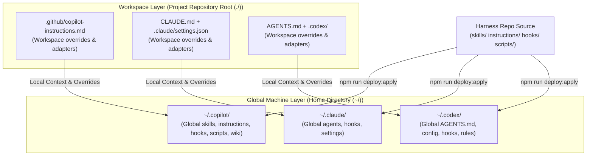

# Megingjord Harness Architecture

Megingjord is a governance-first AI agent harness designed to provide robust, cross-runtime compliance, skills propagation, and local operational safety. This document details the core architectural layers, deployment topology, and governance flow.

---

## 1. Multi-Layer Deployment Model (Two-Tier)

Megingjord operates on a strict **two-tier architecture**: a machine-level **Global Layer** and a repo-level **Workspace Layer**. This separation ensures that all projects share a common compliance baseline while retaining the flexibility to specify project-specific overrides.



### The Global Layer
The Global Layer is installed once per machine (using `npm run deploy:apply`) and is shared across all local developer repositories.
* **GitHub Copilot Chat (`~/.copilot/`)**: Houses core skills, global instructions, hook scripts, and compiled wiki databases.
* **Claude Code (`~/.claude/`)**: Standardizes custom agents, global hooks, and command settings.
* **Codex (`~/.codex/`)**: Centralizes the `AGENTS.md` and default rule schemas.

### The Workspace Layer
The Workspace Layer resides inside the individual target project's repository. These files are checked into Git, establishing a transparent history of project-level context.
* Local files extend or override global rules (e.g. project name, tech stack, workspace-specific commands).
* On conflicts, global security and compliance rules take precedence unless explicitly delegated by a registered governance baton.

---

## 2. Multi-Runtime Parity

A core architectural goal of Megingjord is **runtime parity**. Standardizing developer-agent behavior across multiple execution environments prevents configuration drift and cognitive overhead.

```
                  ┌─────────────────────────────────────┐
                  │      Unified Harness Manifest       │
                  │ (inventory/governance-manifest.json) │
                  └──────────────────┬──────────────────┘
                                     │
                 ┌───────────────────┼───────────────────┐
                 ▼                   ▼                   ▼
        ┌─────────────────┐ ┌─────────────────┐ ┌─────────────────┐
        │  GitHub Copilot │ │   Claude Code   │ │      Codex      │
        │   Instructions  │ │    CLAUDE.md    │ │    AGENTS.md    │
        └─────────────────┘ └─────────────────┘ └─────────────────┘
```

The harness compiler (`npm run governance:adapters:emit`) ingests a single central manifest and automatically generates target-specific shims for every supported engine. Copilot, Claude Code, and Codex are supported as equal first-class citizens, sharing a unified compliance footprint.

---

## 3. Governance Baton Model

Megingjord enforces a strict Agile-linked role validation cycle, coordinating operations through four distinct batons:

1. **Manager (Role: Manager)**: Conducts initial research, defines goals, captures tickets (Epic, story, task), and determines architectural scope.
2. **Collaborator (Role: Collaborator)**: Executes the development work, modifies files in isolated sandboxes, and implements the required acceptance criteria.
3. **Admin (Role: Admin)**: Automates quality verification, runs test suites, manages credentials securely, and handles PR staging.
4. **Consultant (Role: Consultant)**: Conducts adversarial red-team analyses, identifies operational risks, and finalizes post-mortem evaluations.

This ensures comprehensive operational governance and end-to-end traceability across every phase of the development lifecycle.
