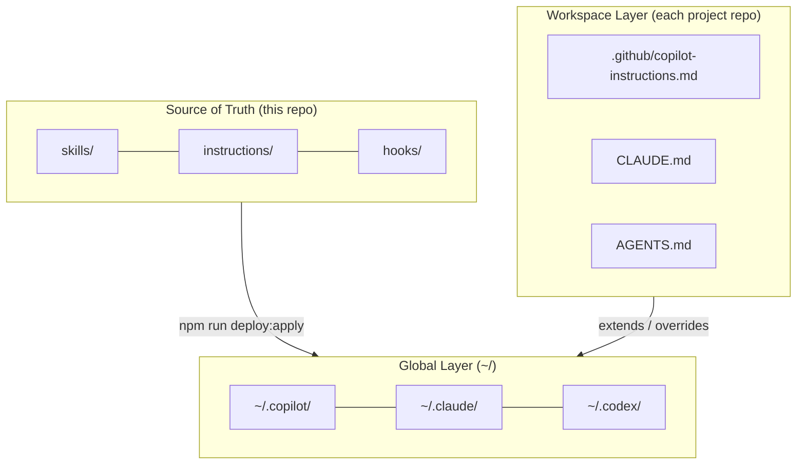

# Megingjord Harness Architecture

Megingjord is a **governance-first AI agent harness** providing cross-runtime
compliance, skills propagation, and local operational safety for developer AI
workflows across GitHub Copilot, Claude Code, and Codex.

## Document map

| Topic                                                    | Detail                                                                       |
| -------------------------------------------------------- | ---------------------------------------------------------------------------- |
| Two-tier layer model (global / workspace)                | [`docs/architecture-layer-model.md`](docs/architecture-layer-model.md)       |
| Baton governance (Manager→Collaborator→Admin→Consultant) | [`docs/architecture-baton-model.md`](docs/architecture-baton-model.md)       |
| Multi-runtime parity (Copilot / Claude Code / Codex)     | [`docs/architecture-runtime-parity.md`](docs/architecture-runtime-parity.md) |
| Routing, fleet, cascade dispatch                         | [`docs/architecture-routing.md`](docs/architecture-routing.md)               |
| Deployment, Layer-2 coordination, sync commands          | [`docs/architecture-deployment.md`](docs/architecture-deployment.md)         |
| Governance CI, wiki system, dashboard                    | [`docs/architecture-governance.md`](docs/architecture-governance.md)         |
| Contributor-facing subsystem index                       | [`docs/ARCHITECTURE.md`](docs/ARCHITECTURE.md)                               |

## Core architectural principles

1. **Governance over convenience** — CI gates enforce baton order, signing, and
   ticket-first workflow for every change; violations block merge
2. **Source-of-truth discipline** — never edit deployed runtimes directly;
   all changes flow from this repo outward via deploy commands
3. **Runtime parity** — Copilot, Claude Code, and Codex are equal first-class
   citizens; no runtime gets preferential treatment
4. **Zero-cost default** — free-cloud (Gemini) and fleet (Ollama/Tailscale)
   before any paid provider; override only when justified
5. **No external infra required** — GitHub-native Layer-2 coordination works
   without Cloudflare when `MEGINGJORD_HAMR_ENABLED` is unset

## Two-tier model (overview)

## Harness Goal Constitution

**G1 Governance > G2 Quality > G3 Zero Cost > G4 Privacy > G5 Portability >
G6 Resilience > G7 Throughput > G8 Observability > G9 Interoperability > G10 Maintainability**

Record rationale in ticket/PR evidence whenever a lower-priority goal wins.

## Scope and constraints

- ≤100 lines per file (lint-enforced for checked paths); split into linked files for more
- No build step; all JS uses CommonJS modules loaded at runtime
- JSON for structured data; Markdown for prose
- One live worktree per agent session (concurrent session safety)
