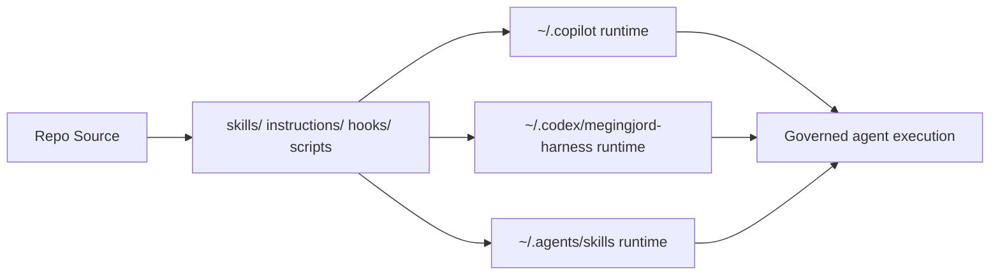

# Megingjord Harness


[](LICENSE)
[](https://nodejs.org)
[](plugin.json)
[](AGENTS.md)

**Megingjord** is a governance-first AI agent harness with skills, hooks, agents, runtime scripts, and a Karpathy-style LLM wiki.

## Architecture at a glance



## Why it is robust

- Multi-runtime deployment model with dry-run/apply scripts
- Governance baton model: Manager → Collaborator → Admin → Consultant
- Fleet-aware routing, telemetry, and policy enforcement
- Static dashboard with operations + governance visibility
- LLM wiki integration for reusable institutional knowledge

## Quick start

```bash
npm run setup
npm start
npm run lint
npm test
npm run deploy:both:apply
```

## Public trust surfaces

- [Code of Conduct](CODE_OF_CONDUCT.md)
- [Contributing Guide](CONTRIBUTING.md)
- [Security Policy](SECURITY.md)
- [Support](SUPPORT.md)
- [License](LICENSE)

## Runtime mapping

| Source | Runtime target |
|---|---|
| skills/ | ~/.copilot/skills + ~/.agents/skills |
| instructions/ | ~/.copilot/instructions |
| hooks/ | ~/.copilot/hooks + ~/.codex/megingjord-harness/hooks |
| scripts/global/ | ~/.copilot/scripts + ~/.codex/megingjord-harness/scripts |
| .codex/ | ~/.codex/AGENTS.md + config.toml + hooks.json + rules/ |
| wiki/ | ~/.copilot/wiki + ~/.codex/megingjord-harness/wiki |

## Issue flows

- [Bug report](https://github.com/chf3198/megingjord-harness/issues/new?template=bug-report.yml)
- [Feature request](https://github.com/chf3198/megingjord-harness/issues/new?template=feature_request.md)
- [Discussions](https://github.com/chf3198/megingjord-harness/discussions)

> Formerly DevEnv Ops. Codex name rejected due product conflict; Aegis rejected due broad name reuse.
