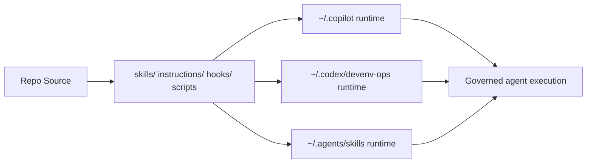

# Megingjord Harness


[](LICENSE)
[](https://nodejs.org)
[](plugin.json)
[](AGENTS.md)
[](https://github.com/chf3198/megingjord-harness/actions/workflows/quality-gates.yml)
[](https://scorecard.dev/viewer/?uri=github.com/chf3198/megingjord-harness)

**Megingjord** is a governance-first AI agent harness with skills, hooks, agents, runtime scripts, and a Karpathy-style LLM wiki. It operates as a control plane for AI coding agent runtimes — governing Copilot, Claude Code, and Codex the way Kubernetes governs containers: deploying configuration, enforcing policy, and maintaining desired workflow state across all three simultaneously.

## Architecture at a glance



## Why it is robust

- Multi-runtime deployment model with dry-run/apply scripts
- Governance baton model: Manager → Collaborator → Admin → Consultant
- Fleet-aware routing, telemetry, and policy enforcement
- Confidence-aware telemetry separates exact vs estimated Copilot usage with report caveats
- Static dashboard with operations + governance visibility
- LLM wiki integration for reusable institutional knowledge
- Accessibility + UX baseline checks aligned to WCAG 2.2 and Core Web Vitals

## How it works — two-tier model

Installing Megingjord in a project seeds two independent layers:

**Global layer** — lives in your home directory, shared by all projects:

| Runtime | Path | What lives there |
|---|---|---|
| GitHub Copilot Chat | `~/.copilot/` | skills, instructions, hooks, scripts, wiki |
| Claude Code | `~/.claude/` | commands, agents, hooks, settings |
| Codex | `~/.codex/` | AGENTS.md, config, hooks, rules |

One `npm run deploy:apply` and every project on the machine inherits the full
governance toolkit — skills, routing, telemetry, wiki — for all three runtimes.

**Workspace layer** — checked into each project repo, workspace-specific:

| Extension | File(s) | Purpose |
|---|---|---|
| Copilot | `.github/copilot-instructions.md` | workspace override + adapter |
| Claude Code | `CLAUDE.md`, `.claude/settings.json` | workspace override + adapter |
| Codex | `AGENTS.md`, `.codex/` | workspace override + adapter |

Workspace files extend or override the global layer. Global governance wins by
default; local files add project-specific context and commands.

**Multi-project reuse**: `npm run deploy:apply` is idempotent. Multiple projects
share one global skill and governance layer while each keeps its own baton
history, workspace wiki, and local overrides.

**Multi-runtime parity**: A skill, hook, or governance rule written once deploys
to all three runtimes — Copilot, Claude Code, and Codex are equal first-class
citizens.

**Zero-Cloudflare by default**: Cross-agent coordination (mailbox, bundles,
telemetry, async dispatch) uses GitHub-native primitives out of the box — no
Cloudflare account or `wrangler deploy` required. Set `MEGINGJORD_HAMR_ENABLED=1`
to opt into the accelerated HAMR Cloudflare Worker for higher-throughput paths.
See [`docs/howto/github-native-layer2.md`](docs/howto/github-native-layer2.md).

See [`docs/howto/installation.md`](docs/howto/installation.md) for the full
install walkthrough, including adding a second project.

## Ownership Semantics Rollout

Execution role labels represent the active baton holder only.
Waiting and terminal states must not carry execution role labels.

See [docs/howto/baton-workflow.md](docs/howto/baton-workflow.md) for board filters,
no-code remediation lane constraints, and the operator rollout checklist.

## Quick start

```bash
npm run setup
npm start
npm run lint
npm test
npm run deploy:both:apply
```

No Cloudflare account needed. Cross-agent coordination works immediately via
GitHub-native primitives. To enable the HAMR accelerated path after deploying
the Worker: add `MEGINGJORD_HAMR_ENABLED=1` to your `.env`.

## Env-backed credentials

- Copy `.env.example` to `.env` for local resource credentials.
- Tavily MCP must keep the secret only in `TAVILY_API_KEY`; do not inline Tavily keys in MCP URLs or tracked config.
- Verify env-backed Tavily wiring with `npm run governance:credentials-env`.
- Register Tavily MCP across Copilot/Codex/Claude surfaces with `npm run tavily:mcp:register:apply`.
- Run deterministic Tavily smoke checks with `npm run tavily:smoke` (or live reachability via `npm run tavily:smoke:live`).
- Security ownership and review cadence for Tavily flows: `docs/workflow/tavily-security-ownership.md`.

## Research-first gate notes

- Research-first Epic detection is label-first: `phase-gate:research-first` on `type:epic` tickets.
- `AC-R*` body matching remains a legacy fallback during migration and is slated for removal after #1888 enforcement follow-on completes.
- Phase-1 MANAGER_HANDOFF checks use `phase-gate:phase-1` by default and can be overridden with `PHASE_ONE_LABEL` for validation runs.
- First code edits on ticket branches require a qualifying `PLANNING_CONSENSUS` pass artifact on the linked issue (`hooks/consensus-policy.json` defaults). Use `MEGINGJORD_PLANNING_CONSENSUS_OVERRIDE=1` only as an audited escape hatch.

## Scripts

<!-- docs packageScripts -->
| Script | Command |
|---|---|
| `ac-suggest` | `node scripts/global/ac-suggest.js` |
| `ac-suggest:replay-eval` | `node scripts/global/ac-suggest-replay-eval.js` |
| `ac-suggest:test` | `node --test tests/ac-suggest.spec.js` |
| `adr:build` | `log4brains build` |
| `adr:new` | `log4brains adr new` |
| `adr:preview` | `log4brains preview` |
| `agent:coord:remote` | `node scripts/global/agent-coord-remote.js` |
| `agent:tier-c` | `node scripts/global/tier-c-guard.js` |
| `anneal:closeout-advisory` | `node scripts/global/open-pr-closeout-scan.js` |
| `anneal:detect` | `node scripts/global/workflow-anneal-detect.js` |
| `anneal:goal-sensor` | `node scripts/global/anneal-goal-sensor.js` |
| `anneal:graph` | `node scripts/global/anneal-graph.js` |
| `anneal:review` | `node scripts/global/anneal-review.js` |
| `anneal:rotate` | `node scripts/global/anneal-log-rotate.js` |
| `anneal:schedule-health` | `node scripts/global/anneal-schedule-health.js` |
| `auth:audit` | `node scripts/global/authorization-audit.js` |
| `auth:profile` | `node scripts/global/authorization-profile.js` |
| `auth:profile:context` | `node scripts/global/authorization-profile-context.js` |
| `capability:probe` | `node scripts/global/capability-probe.js` |
| `capability:show` | `node scripts/global/capability-show.js` |
| `catalog:check` | `node scripts/global/harness-feature-catalog.js` |
| `catalog:check:test` | `node --test tests/harness-feature-catalog.spec.js` |
| `catalog:reconcile` | `node scripts/global/harness-catalog-reconciler.js` |
| `catch-empty` | `bash scripts/global/catch-empty-lint.sh .github/workflows` |
| `check:closeout` | `node scripts/global/open-pr-closeout-check.js` |
| `cleanup:branches` | `node scripts/global/branch-cleanup-plan.js` |
| `collaborator:preflight` | `node scripts/global/collaborator-preflight.js` |
| `consensus:panel` | `node scripts/global/cross-family-consensus.js` |
| `consensus:receipt-check` | `node scripts/global/baton-authority/consensus-receipt-check.js` |
| `consensus:test` | `node --test tests/signer-independence-cross-family-3532.spec.js tests/stress-cross-family-receipt-3532.spec.js` |
| `cost-report` | `node scripts/global/cost-report.js` |
| `cost:baseline` | `node scripts/global/cost-baseline.js` |
| `cost:token-report` | `node scripts/global/token-spend-report.js` |
| `cursor:hooks-emit` | `node scripts/global/cursor-hooks-emit.js --root .` |
| `deploy` | `bash scripts/deploy.sh --target both && node scripts/global/xteam-mcp-register.js --target copilot --root . && node scripts/global/xteam-mcp-register.js --target codex --root .` |
| `deploy:all` | `bash scripts/deploy.sh --target all && node scripts/global/xteam-mcp-register.js --target all --root .` |
| `deploy:all:apply` | `bash scripts/deploy.sh --apply --target all && node scripts/global/xteam-mcp-register.js --target all --root . --apply` |
| `deploy:antigravity` | `bash scripts/deploy.sh --target antigravity && node scripts/global/xteam-mcp-register.js --target antigravity --root .` |
| `deploy:antigravity:apply` | `bash scripts/deploy.sh --apply --target antigravity && node scripts/global/xteam-mcp-register.js --target antigravity --root . --apply` |
| `deploy:apply` | `bash scripts/deploy.sh --apply --target both && node scripts/global/xteam-mcp-register.js --target copilot --root . --apply && node scripts/global/xteam-mcp-register.js --target codex --root . --apply` |
| `deploy:atomic` | `node scripts/global/deploy-atomic.js` |
| `deploy:both` | `bash scripts/deploy.sh --target both && node scripts/global/xteam-mcp-register.js --target copilot --root . && node scripts/global/xteam-mcp-register.js --target codex --root .` |
| `deploy:both:apply` | `bash scripts/deploy.sh --apply --target both && node scripts/global/xteam-mcp-register.js --target copilot --root . --apply && node scripts/global/xteam-mcp-register.js --target codex --root . --apply` |
| `deploy:claude` | `bash scripts/deploy.sh --target claude && node scripts/global/xteam-mcp-register.js --target claude --root .` |
| `deploy:claude:apply` | `bash scripts/deploy.sh --apply --target claude && node scripts/global/xteam-mcp-register.js --target claude --root . --apply` |
| `deploy:codex` | `bash scripts/deploy.sh --target codex && node scripts/global/xteam-mcp-register.js --target codex --root .` |
| `deploy:codex:apply` | `bash scripts/deploy.sh --apply --target codex && node scripts/global/xteam-mcp-register.js --target codex --root . --apply` |
| `deploy:cursor` | `bash scripts/deploy.sh --target cursor && node scripts/global/xteam-mcp-register.js --target cursor --root .` |
| `deploy:cursor:apply` | `bash scripts/deploy.sh --apply --target cursor && node scripts/global/xteam-mcp-register.js --target cursor --root . --apply` |
| `deploy:manifest` | `node scripts/global/deploy-manifest.js` |
| `deploy:manifest:antigravity` | `node scripts/global/deploy-manifest.js antigravity` |
| `deploy:manifest:claude` | `node scripts/global/deploy-manifest.js claude` |
| `deploy:manifest:codex` | `node scripts/global/deploy-manifest.js codex` |
| `deploy:manifest:copilot` | `node scripts/global/deploy-manifest.js copilot` |
| `deploy:manifest:cursor` | `node scripts/global/deploy-manifest.js cursor` |
| `deploy:verify` | `node scripts/global/verify-deploy.js` |
| `deploy:verify:antigravity` | `node scripts/global/verify-deploy.js antigravity` |
| `deploy:verify:claude` | `node scripts/global/verify-deploy.js claude` |
| `deploy:verify:codex` | `node scripts/global/verify-deploy.js codex` |
| `deploy:verify:copilot` | `node scripts/global/verify-deploy.js copilot` |
| `deploy:verify:cursor` | `node scripts/global/verify-deploy.js cursor` |
| `deps:aggregate` | `node scripts/global/dep-graph-aggregate.js` |
| `deps:augment` | `node scripts/global/dep-graph-augment.js` |
| `deps:render` | `node scripts/global/dep-graph-render.js` |
| `deps:review` | `node scripts/global/dep-proposals-review.js` |
| `dispatch:progress:test` | `node --test tests/dispatch-progress.spec.js tests/cascade-observability.spec.js` |
| `doc-coverage:replay-eval` | `node scripts/global/megalint/doc-coverage-diff-replay-eval.js` |
| `doc-coverage:replay-eval:test` | `node --test tests/doc-coverage-diff-replay-eval.spec.js tests/doc-coverage-diff-wiring.spec.js tests/doc-coverage-diff-stress.spec.js` |
| `doc-graph` | `node scripts/global/doc-graph-builder.js` |
| `doc-plane:lint` | `node scripts/global/doc-plane-boundary-lint.js` |
| `docs:anchors` | `node scripts/global/docs-anchors.js` |
| `docs:compile` | `node scripts/docs-compile.js` |
| `docs:exec` | `node scripts/global/docs-exec.js` |
| `docs:health` | `node scripts/global/docs-health-detector.js` |
| `docs:lint` | `node scripts/docs-lint.js` |
| `epic-3162:test` | `npx playwright test tests/resolve-inventory.spec.js tests/inventory-portability.spec.js tests/fleet-setup-handlers.spec.js tests/fleet-inventory-contract.spec.js` |
| `epic:sync` | `node scripts/global/actuator-epic-sync.js` |
| `fixtures:regen:cursor` | `node scripts/global/fixtures-regen-cursor.js` |
| `flaw-capture:replay-eval` | `node scripts/global/flaw-capture-replay-eval.js` |
| `fleet-advisor:contract:test` | `node --test tests/fleet-advisor-report.spec.js tests/fleet-advisor-report-contract.spec.js` |
| `fleet-advisor:lint:test` | `node --test tests/fleet-advisor-lint.spec.js tests/fleet-advisor-rule-coverage.spec.js` |
| `fleet-advisor:obs:test` | `node --test tests/fleet-advisor-observability.spec.js tests/fleet-advisor-throughput-contract.spec.js` |
| `fleet-advisor:report` | `node scripts/global/fleet-advisor-report.js` |
| `fleet-advisor:rules-doc` | `node scripts/global/fleet-advisor-rules-doc.js` |
| `fleet-advisor:rules-doc:check` | `node scripts/global/fleet-advisor-rules-doc.js --check` |
| `fleet-advisor:stress` | `node --test tests/stress-fleet-advisor-lint.spec.js` |
| `fleet-advisor:throughput-bench` | `node --test tests/fleet-advisor-throughput-contract.spec.js` |
| `fleet-tool-use:eval` | `node --test tests/fleet-tool-use-harness.spec.js` |
| `fleet-tool-use:stress` | `node --test tests/stress-fleet-tool-use-harness.spec.js` |
| `fleet:backend-select:test` | `node --test tests/fleet-backend-select.spec.js tests/stress-fleet-fallback.spec.js` |
| `fleet:escalation-policy:test` | `node --test tests/fleet-escalation-policy.spec.js tests/stress-escalation-premium-guard.spec.js` |
| `format` | `prettier --write .prettierrc.json package.json CONTRIBUTING.md .github/workflows/lint.yml lint-configs/README.md lint-configs/ci-lint.yml lint-configs/eslint.config.devenv.js scripts/lint-readability.js scripts/global/install-readability-toolchain.js` |
| `format:check` | `prettier --check .prettierrc.json package.json CONTRIBUTING.md .github/workflows/lint.yml lint-configs/README.md lint-configs/ci-lint.yml lint-configs/eslint.config.devenv.js scripts/lint-readability.js scripts/global/install-readability-toolchain.js` |
| `friction:test` | `node --test tests/friction-event.spec.js` |
| `friction:test:py` | `python3 -m unittest tests.hooks.test_friction_event` |
| `fsm:wasm:build` | `node scripts/global/baton-fsm/build-wasm.js` |
| `fsm:wasm:check` | `node scripts/global/baton-fsm/build-wasm.js --check` |
| `fsm:wasm:test` | `node --test tests/baton-fsm-wasm-integrity.spec.js` |
| `gate-corpus:verify` | `node scripts/global/gate-corpus-deploy-plan.js` |
| `git-state:drift` | `node scripts/global/git-state-drift-sensor.js` |
| `git:conflict-predict` | `node scripts/global/git-conflict-predict.js` |
| `git:conflict-predict:test` | `node --test tests/git-conflict-predict.spec.js` |
| `git:freshness-check` | `node scripts/global/git-freshness-check.js` |
| `git:freshness-check:test` | `node --test tests/git-freshness-check.spec.js` |
| `goals:regen` | `node scripts/global/goals-contract-generate.js` |
| `gov:extract` | `node scripts/global/rule-card-extractor.js --all > /tmp/rule-cards.json` |
| `gov:parity` | `node scripts/global/megalint/parity-validator.js` |
| `governance:actuator-transitions:test` | `node --test tests/actuator-transitions.spec.js` |
| `governance:adapters:emit` | `node scripts/global/governance-adapter-emit.js` |
| `governance:adapters:test` | `node scripts/global/governance-adapter-emit.spec.js` |
| `governance:anneal-decision-audit` | `node scripts/global/anneal-decision-audit.js` |
| `governance:anneal-decision-detector:test` | `node --test tests/anneal-decision-detector.spec.js` |
| `governance:audit` | `node scripts/global/governance-audit.js` |
| `governance:baton-latency:test` | `node --test tests/baton-latency-report.spec.js` |
| `governance:collab-handoff-rebase:test` | `node --test tests/collab-handoff-rebase-freshness.spec.js` |
| `governance:compatibility:matrix` | `node scripts/global/governance-compatibility-matrix.js` |
| `governance:completion-claim-truth:test` | `node --test tests/completion-claim-truth.spec.js` |
| `governance:coordinator-cleanup` | `node scripts/global/coordinator-label-cleanup.js` |
| `governance:credentials-env` | `node scripts/global/credentials-env-guard.js` |
| `governance:cross-team-check` | `node scripts/global/cross-team-contract-check.js` |
| `governance:cross-team-check:test` | `node --test tests/cross-team-contract-check.spec.js` |
| `governance:cross-team-lease-dispatch:test` | `node --test tests/cross-team-lease-dispatch.spec.js` |
| `governance:delegation-lint` | `node scripts/global/delegation-phrase-lint.js` |
| `governance:dispatcher-set-labels:test` | `node --test tests/github-dispatcher-set-labels.spec.js` |
| `governance:drift` | `node scripts/global/governance-drift-classifier.js --json` |
| `governance:drift-sweep` | `node scripts/global/governance-drift-sweep.js --scan` |
| `governance:drift-sweep:test` | `node --test tests/governance-drift-sweep.spec.js` |
| `governance:duplicate-check` | `node scripts/global/ticket-duplicate-guard.js --scan` |
| `governance:duplicate-check:test` | `node --test tests/ticket-duplicate-guard.spec.js` |
| `governance:epic` | `node scripts/global/epic-evidence.js` |
| `governance:epic-auto-tick:test` | `node --test tests/epic-task-list-auto-tick.spec.js` |
| `governance:epic-parent-resolve:test` | `node --test tests/epic-parent-resolve.spec.js` |
| `governance:epics` | `node scripts/global/epic-close-validator.js` |
| `governance:escalation-coverage` | `node scripts/global/escalation-coverage-gate.js` |
| `governance:escalation-coverage:test` | `node --test tests/escalation-coverage-gate.spec.js` |
| `governance:generate` | `node scripts/global/governance-generate.js` |
| `governance:ghs-feedback-loop:test` | `node --test tests/ghs-feedback-loop.spec.js` |
| `governance:goal-tier-resolver:test` | `python3 -m unittest tests.hooks.test_goal_tier_resolver` |
| `governance:hamr-bypass-workflow:test` | `node --test tests/hamr-bypass-lint-workflow.spec.js` |
| `governance:hook-parity` | `node scripts/global/hook-parity-check.js` |
| `governance:hook-parity:test` | `node --test tests/hook-parity-check.spec.js` |
| `governance:hooks:test` | `python3 -m unittest discover -s tests/hooks -p 'test_*.py'` |
| `governance:instructional-coverage` | `node scripts/global/instructional-coverage-audit.js` |
| `governance:instructional-coverage:test` | `node --test tests/instructional-coverage-audit.spec.js` |
| `governance:issue-transition-dispatch:test` | `node --test tests/issue-transition-dispatch.spec.js` |
| `governance:lease-heartbeat` | `node scripts/global/worktree-lease-heartbeat.js` |
| `governance:lease-heartbeat:test` | `node --test tests/worktree-lease-heartbeat.spec.js` |
| `governance:list-tickets` | `node scripts/global/ticket-presenter.js` |
| `governance:list-tickets:test` | `node --test tests/ticket-presenter.spec.js` |
| `governance:load-local-env:test` | `npx playwright test tests/load-local-env.spec.js` |
| `governance:manifest:test` | `node scripts/global/governance-manifest-validate.spec.js` |
| `governance:manifest:validate` | `node scripts/global/governance-manifest-validate.js` |
| `governance:model-diversity-replay` | `node scripts/global/model-diversity-replay-eval.js` |
| `governance:model-diversity-replay:test` | `node --test tests/model-diversity-replay-eval.spec.js` |
| `governance:no-sync-http` | `node scripts/global/no-sync-http-handlers.js` |
| `governance:operator-ownership:eval` | `node scripts/global/operator-ownership-eval.js` |
| `governance:operator-ownership:test` | `node --test tests/operator-ownership-rules.spec.js tests/delegation-phrase-lint.spec.js tests/operator-ownership-eval.spec.js tests/runtime-side-effect-guard.spec.js` |
| `governance:orchestrator-parity` | `node scripts/global/orchestrator-governance-parity.js --json` |
| `governance:orchestrator-parity:test` | `node --test tests/orchestrator-governance-parity.spec.js` |
| `governance:parity:test` | `node scripts/global/governance-parity.spec.js` |
| `governance:pre-commit-docs-check` | `node scripts/global/pre-commit-docs-check.js` |
| `governance:pre-commit-docs-check:test` | `node --test tests/pre-commit-docs-check.spec.js` |
| `governance:pre-pr-gate` | `node scripts/global/pre-pr-gate.js` |
| `governance:pre-pr-gate:test` | `node --test tests/pre-pr-gate.spec.js` |
| `governance:price-cap` | `node scripts/global/provider-price-cap-gate.js` |
| `governance:price-cap:test` | `node --test tests/provider-price-cap-gate.spec.js` |
| `governance:reconcile` | `node scripts/global/ticket-reconcile.js --json` |
| `governance:review-promotion-eval` | `node scripts/global/model-diversity-replay-eval.js && node scripts/global/second-opinion-replay-eval.js` |
| `governance:review-score` | `node scripts/global/review-score-classifier.js` |
| `governance:review-score:test` | `node --test tests/review-score-classifier.spec.js` |
| `governance:role-baton-audit` | `node scripts/global/role-baton-audit.js` |
| `governance:role-baton-linter` | `node scripts/global/role-baton-linter.js` |
| `governance:role-baton-linter:test` | `node --test tests/role-baton-linter.spec.js` |
| `governance:rule-parity` | `node scripts/global/governance-rule-parity.js` |
| `governance:rule-parity:test` | `node --test tests/governance-rule-parity.spec.js` |
| `governance:runtime-guard:test` | `node --test tests/runtime-side-effect-guard.spec.js` |
| `governance:second-opinion-replay` | `node scripts/global/second-opinion-replay-eval.js` |
| `governance:second-opinion-replay:test` | `node --test tests/second-opinion-replay-eval.spec.js` |
| `governance:second-opinion-runner` | `node scripts/global/second-opinion-runner.js` |
| `governance:second-opinion-runner:test` | `node --test tests/second-opinion-runner.spec.js` |
| `governance:second-opinion-tier3:test` | `node --test tests/second-opinion-tier3-trigger.spec.js` |
| `governance:soak-language` | `node scripts/global/megalint/soak-language-guard.js` |
| `governance:soak-language:test` | `node --test tests/soak-language-guard.spec.js` |
| `governance:status-cardinality` | `node scripts/global/label-lint-status-cardinality.js` |
| `governance:status-cardinality:test` | `node --test tests/label-lint-status-cardinality.spec.js` |
| `governance:sync-check` | `node scripts/global/governance-sync-check.js` |
| `governance:ticket-redundancy:test` | `node --test tests/validate-ticket-redundancy.spec.js` |
| `governance:tokens` | `node scripts/global/governance-token-lint.js` |
| `governance:validate-config-schemas-workflow:test` | `node --test tests/validate-config-schemas-workflow.spec.js` |
| `governance:verify` | `node scripts/global/governance-verify.js --json` |
| `governance:weekly` | `node scripts/global/governance-weekly-report.js` |
| `governance:wiki-catalog:test` | `node --test tests/validate-wiki-catalog.spec.js` |
| `governance:wiki-metrics:test` | `node --test tests/wiki-metrics.spec.js` |
| `governance:worktree-intercept:test` | `node --test tests/worktree-write-intercept.spec.js` |
| `governance:worktree-inventory` | `node scripts/global/worktree-inventory.js` |
| `governance:worktree-lock:test` | `node --test tests/worktree-active-session-lock.spec.js` |
| `governance:worktrees` | `node scripts/global/worktree-governance-audit.js --json` |
| `hamr:activate` | `bash scripts/global/hamr-activate.sh` |
| `hamr:batch-route:test` | `node --test tests/batch-route-async.spec.js` |
| `hamr:batch-router` | `node scripts/global/anthropic-batch-router.js` |
| `hamr:batch-validate` | `node scripts/global/batch-validator.js` |
| `hamr:cache-emit` | `node scripts/global/cache-stats-emit.js` |
| `hamr:cache-gate` | `node scripts/global/cache-hit-gate.js` |
| `hamr:cache-gate:test` | `node --test tests/cache-hit-gate-eligibility.spec.js` |
| `hamr:cache-push` | `node scripts/global/cache-stats-push.js` |
| `hamr:compress` | `node scripts/global/constitution-compressor.js` |
| `hamr:deploy` | `bash scripts/global/hamr-deploy.sh` |
| `hamr:doctor` | `node scripts/global/hamr-doctor.js` |
| `hamr:epic-3008:test` | `npx playwright test tests/hamr-tool-policy.spec.js tests/governance-evidence-bridge.spec.js tests/hamr-offload-kpi.spec.js tests/cascade-context-integration.spec.js tests/hamr-epic-parity.spec.js` |
| `hamr:evidence-bridge` | `node -e "const b=require('./scripts/global/governance-evidence-bridge');const i=process.argv[1];b.writeSnapshot(i,[])"` |
| `hamr:evidence-diag` | `node -e "const d=require('./scripts/global/governance-evidence-diag');console.log(JSON.stringify(d.diagnoseEvidence(process.argv[1],[])))"` |
| `hamr:fleet-cascade-gate` | `node scripts/global/fleet-cascade-gate.js` |
| `hamr:fleet-cascade-gate:test` | `node --test tests/fleet-cascade-gate.spec.js` |
| `hamr:governance-bundle-push` | `node scripts/global/governance-bundle-push.js` |
| `hamr:health` | `node scripts/global/substrate-health.js` |
| `hamr:health-push` | `node scripts/global/substrate-health-push.js` |
| `hamr:install-cron` | `bash scripts/global/install-cron.sh` |
| `hamr:log-rotate` | `node scripts/global/log-rotate.js` |
| `hamr:multi-judge:test` | `node --test tests/multi-judge-prompts.spec.js tests/multi-judge-variance.spec.js tests/multi-judge-orchestrator.spec.js` |
| `hamr:offload-kpi` | `node scripts/global/hamr-offload-kpi.js` |
| `hamr:offload-kpi:test` | `npx playwright test tests/hamr-offload-kpi.spec.js tests/hamr-epic-parity.spec.js` |
| `hamr:policy-overrides` | `node scripts/global/cascade-policy-overrides.js` |
| `hamr:premium-budget:test` | `node --test tests/premium-budget-governor.spec.js` |
| `hamr:rule-gate` | `node scripts/global/rule-coverage-gate.js` |
| `hamr:skill-views` | `node scripts/global/skill-views-derive.js` |
| `hamr:spillover` | `node scripts/global/header-spillover.js` |
| `hamr:sticky-route` | `node scripts/global/sticky-route.js` |
| `hamr:sync-verify` | `node scripts/global/hamr-sync-verify.js` |
| `hamr:teardown` | `bash scripts/global/hamr-teardown.sh` |
| `hamr:tool-policy:test` | `npx playwright test tests/hamr-tool-policy.spec.js` |
| `hamr:tool-proxy` | `node scripts/global/hamr-tool-proxy.js` |
| `harness:add-runtime` | `node scripts/global/harness-add-runtime.js` |
| `harness:doctor` | `node scripts/global/harness-fleet-doctor.js` |
| `harness:self-test` | `node scripts/global/harness-self-test.js` |
| `harness:self-test:capability` | `node scripts/global/harness-self-test.js --capability` |
| `harness:self-test:regression` | `node scripts/global/harness-self-test.js --regression` |
| `harness:self-test:test` | `node --test tests/harness-self-test-runner.spec.js tests/harness-self-test-reporters.spec.js tests/harness-self-test-telemetry.spec.js tests/harness-self-test.spec.js` |
| `harness:setup` | `node scripts/global/harness-setup.js` |
| `health` | `node scripts/health-check.js` |
| `help:topic` | `node scripts/help-topic.js` |
| `hooks:install` | `bash scripts/global/install-hooks.sh` |
| `hooks:pre-push` | `node scripts/global/pre-push-gates.js` |
| `instructions:split-classify` | `node scripts/global/instructions-split-classifier.js` |
| `inventory:history-scrub:plan` | `node scripts/global/inventory-history-scrub.js` |
| `inventory:history-scrub:verify` | `node scripts/global/inventory-history-scrub.js --verify` |
| `inventory:portability-check` | `node scripts/global/inventory-portability-check.js` |
| `issue:transition` | `node scripts/global/issue-transition.js` |
| `it-ops:usage-report` | `node scripts/global/it-bypass-usage-report.js` |
| `label:provision` | `node scripts/global/label-provision.js` |
| `lint` | `node scripts/lint.js` |
| `lint:all` | `npm run lint:js && npm run lint:py && npm run lint:sh && npm run lint:md && npm run lint:decisions` |
| `lint:coverage-metric` | `node scripts/global/lint-coverage-metric.js` |
| `lint:decisions` | `node scripts/global/decisions-md-validator.js` |
| `lint:js` | `eslint -c lint-configs/eslint.config.devenv.js --max-warnings 9999 dashboard/js scripts/global scripts/wiki` |
| `lint:md` | `markdownlint-cli2 '**/*.md' '!node_modules/**' '!scripts/xteam-mcp/node_modules/**' '!.claude/**' '!research/**' '!wiki/wisdom/global/sources/**' '!wiki/wisdom/global/syntheses/**' '!raw/**' '!.dashboard/**' '!CHANGELOG-archive.md' '!tickets/**' '!planning/**' '!generated/**' '!tests/fixtures/governance/golden/**' '!tests/fixtures/changelog-fragments-invalid/**' '!wiki/work-log/**' '!wiki/code/**'` |
| `lint:py` | `ruff check --config lint-configs/ruff.devenv.toml hooks/scripts/` |
| `lint:readability` | `node scripts/lint-readability.js` |
| `lint:readability:ci` | `node scripts/lint-readability.js --max-warnings=486` |
| `lint:readability:diff` | `node scripts/lint-readability.js --changed-only --max-warnings=486` |
| `lint:router` | `node scripts/lint-router.js` |
| `lint:sh` | `find scripts -name '*.sh' -exec shellcheck --severity=warning {} +` |
| `mailbox:flush` | `node scripts/global/mailbox-outbox.js flush` |
| `mailbox:poll` | `node scripts/global/mailbox-client.js poll` |
| `mailbox:send` | `node scripts/global/mailbox-client.js send` |
| `mcp:project-state` | `node scripts/global/mcp-project-state.js` |
| `mcp:register` | `node scripts/global/xteam-mcp-register.js --target all --root . --apply` |
| `memory:dedup` | `node scripts/global/memory-dedup-lint.js` |
| `memory:read-route` | `node scripts/global/read-router.js` |
| `memory:route` | `node scripts/global/memory-write-router.js` |
| `merge-evidence:snapshot` | `node scripts/global/merge-evidence-snapshot.js` |
| `output:clip` | `node scripts/global/output-clipper.js` |
| `parity:baseline:update` | `node scripts/global/megalint/parity-lowering-guard.js --update-baseline` |
| `parity:guard` | `node scripts/global/megalint/parity-lowering-guard.js` |
| `parity:matrix` | `node scripts/global/harness-parity-matrix.js` |
| `parity:replay-eval` | `node scripts/global/harness-parity-replay-eval.js` |
| `prefix:cache-report` | `node scripts/global/prefix-cache.js` |
| `prepare` | `bash scripts/install-git-hooks.sh` |
| `prompt-artifact:lint` | `node scripts/global/megalint/prompt-artifact-lint.js` |
| `prose-link:check` | `node scripts/global/megalint/prose-link-check.js` |
| `qa:cache` | `node scripts/global/governance-qa-cache.js` |
| `quality:parity` | `node scripts/global/quality-parity-report.js --json` |
| `rag:search` | `node scripts/global/rag-search.js` |
| `readability:diff:test` | `node --test tests/readability-diff-gate.spec.js` |
| `readability:snapshot` | `bash scripts/readability-snapshot.sh` |
| `repo:scope` | `node scripts/global/repo-scope.js` |
| `resident:budget` | `node scripts/global/resident-budget.js` |
| `review:bypass-gate:test` | `node --test tests/review-bypass-gate.spec.js` |
| `review:cli-parity:test` | `node --test tests/review-cli-parity.spec.js` |
| `review:cost-telemetry:test` | `node --test tests/review-cost-telemetry.spec.js` |
| `review:privacy-gate:test` | `node --test tests/review-privacy-gate.spec.js` |
| `review:stakes-router:test` | `node --test tests/review-stakes-router.spec.js` |
| `rotation:check` | `node scripts/global/hamr-rotation-check.js` |
| `router:cascade` | `node scripts/global/cascade-dispatch.js` |
| `router:dispatch` | `node scripts/global/task-router-dispatch.js` |
| `router:free` | `node scripts/global/free-router.js` |
| `router:smoke` | `node scripts/global/task-router-smoke.js` |
| `router:weekly` | `node scripts/global/model-routing-weekly-report.js` |
| `routing:baseline` | `node scripts/global/routing-baseline-report.js` |
| `routing:calibrate` | `node scripts/global/cascade-calibrate.js` |
| `routing:fallback-report` | `node scripts/global/routing-fallback-report.js` |
| `routing:fleet-cost-report` | `node scripts/global/fleet-dev-cost-report.js` |
| `routing:free-cloud-report` | `node scripts/global/free-cloud-usage-report.js` |
| `routing:freshness` | `node scripts/global/matrix-freshness.js` |
| `routing:reconcile` | `node scripts/global/token-telemetry-reconcile.js --json` |
| `routing:refresh` | `node scripts/global/routing-refresh.js --update-matrix` |
| `routing:report` | `node scripts/global/routing-baseline-report.js --days 7` |
| `routing:telemetry` | `node scripts/global/token-telemetry-report.js --json` |
| `runtime-descriptor:check` | `node scripts/global/runtime-descriptor.js` |
| `runtime-descriptor:check:test` | `node --test tests/runtime-descriptor-contract.spec.js` |
| `runtime:worktree` | `bash scripts/agent-worktree.sh` |
| `setup` | `npm install && echo '✅ megingjord ready — run: npm start'` |
| `signing:bootstrap` | `node scripts/global/crypto-signing-bootstrap.js` |
| `start` | `node scripts/dashboard-server.js` |
| `state:offload` | `node scripts/global/state-offload-client.js` |
| `stress` | `MEGINGJORD_STRESS_TIER=A node scripts/global/stress-orchestrator.js` |
| `stress:anneal` | `node --test tests/stress-anneal-decision.spec.js` |
| `stress:baton-e2e` | `node --test tests/baton-e2e.spec.js` |
| `stress:bounded` | `MEGINGJORD_STRESS_TIER=C node scripts/global/stress-orchestrator.js` |
| `stress:completion-claim-truth` | `node --test tests/stress-completion-claim-truth.spec.js` |
| `stress:epic-close` | `node --test tests/stress-epic-close-guard.spec.js` |
| `stress:evidence-check` | `node scripts/global/stress-evidence-check.js` |
| `stress:evidence-check:test` | `node --test tests/stress-evidence-check.spec.js` |
| `stress:full` | `MEGINGJORD_STRESS_TIER=D node scripts/global/stress-orchestrator.js` |
| `stress:load-local-env` | `node --test tests/stress-load-local-env.spec.js` |
| `stress:post-merge-sweep` | `node --test tests/stress-post-merge-sweep.spec.js` |
| `stress:realism` | `MEGINGJORD_STRESS_TIER=B node scripts/global/stress-orchestrator.js` |
| `stress:rebase` | `node --test tests/stress-rebase-discipline.spec.js` |
| `stress:role-baton` | `node --test tests/stress-role-baton-linter.spec.js` |
| `stress:surface-audit` | `node scripts/global/stress-surface-audit.js` |
| `stress:surface-audit:test` | `node --test tests/stress-surface-audit.spec.js` |
| `stress:test` | `node scripts/global/stress-runner.js` |
| `stress:wiki-metrics:test` | `node --test tests/stress-wiki-metrics.spec.js` |
| `stress:wiki-mirror` | `node --test tests/stress-wiki-mirror-issue.spec.js` |
| `stress:wiki-reconcile` | `node --test tests/stress-wiki-reconcile.spec.js` |
| `stress:worktree` | `node --test tests/stress-worktree-isolation.spec.js` |
| `stuck-state:replay-eval` | `node scripts/global/stuck-state-replay-eval.js` |
| `sync` | `bash scripts/sync.sh` |
| `sync:all` | `bash scripts/sync.sh --target all` |
| `sync:all:dry` | `bash scripts/sync.sh --dry-run --target all` |
| `sync:antigravity` | `bash scripts/deploy.sh --target antigravity` |
| `sync:antigravity:apply` | `bash scripts/deploy.sh --apply --target antigravity` |
| `sync:both` | `bash scripts/sync.sh --target both` |
| `sync:both:dry` | `bash scripts/sync.sh --dry-run --target both` |
| `sync:claude` | `bash scripts/sync.sh --target claude` |
| `sync:claude:dry` | `bash scripts/sync.sh --dry-run --target claude` |
| `sync:codex` | `bash scripts/sync.sh --target codex` |
| `sync:codex:dry` | `bash scripts/sync.sh --dry-run --target codex` |
| `sync:cursor` | `bash scripts/deploy.sh --target cursor` |
| `sync:cursor:apply` | `bash scripts/deploy.sh --apply --target cursor` |
| `sync:dry` | `bash scripts/sync.sh --dry-run` |
| `synthesis:init` | `node scripts/global/synthesis-init.js` |
| `synthesis:snapshot` | `node scripts/global/synthesis-snapshot.js` |
| `synthesis:status` | `node scripts/global/broker-synthesis-status.js` |
| `tavily:mcp:register` | `node scripts/global/tavily-mcp-register.js --target all` |
| `tavily:mcp:register:apply` | `node scripts/global/tavily-mcp-register.js --target all --apply` |
| `tavily:phase1:test` | `node --test tests/tavily-budget-governor.spec.js tests/tavily-search-router.spec.js tests/tavily-safety-harness.spec.js tests/tavily-mcp-register.spec.js tests/tavily-smoke.spec.js` |
| `tavily:smoke` | `node scripts/global/tavily-smoke.js` |
| `tavily:smoke:live` | `node scripts/global/tavily-smoke.js --live` |
| `test` | `node scripts/global/split-test-runner.js` |
| `test-floor:check` | `node scripts/global/test-floor-classifier.js` |
| `test-floor:replay-eval` | `node scripts/global/test-floor-replay-eval.js` |
| `test:collaborator-input-shape` | `node --test tests/collaborator-handoff-input-shape.spec.js` |
| `test:compatibility` | `node --test tests/orchestrator-compatibility.spec.js` |
| `test:headed` | `npx playwright test --headed` |
| `test:post-merge-sweep` | `node --test tests/post-merge-sweep.spec.js` |
| `test:quality` | `npx playwright test tests/google-quality.spec.js` |
| `test:sse-load` | `node scripts/tools/sse-load-test.js` |
| `ticket:create` | `node scripts/global/ticket-create.js` |
| `toolchain:readability:install` | `node scripts/global/install-readability-toolchain.js` |
| `validate:compat` | `node scripts/validate-plugin-compat.js` |
| `validate:triage` | `node scripts/validate-plugin-triage.js` |
| `wiki:anneal` | `node scripts/wiki/anneal.js` |
| `wiki:auto-update` | `node scripts/wiki/auto-update-pipeline.js` |
| `wiki:compile-doc` | `node scripts/wiki/compile-doc.js` |
| `wiki:drift` | `node scripts/wiki/drift-detector.js` |
| `wiki:health` | `node scripts/wiki/wiki-health-detector.js` |
| `wiki:ingest` | `node scripts/wiki/ingest.js` |
| `wiki:ingest:code` | `node scripts/wiki/ingest-code.js` |
| `wiki:lint` | `node scripts/wiki/lint.js` |
| `wiki:reindex` | `node scripts/wiki/reindex.js` |
| `wiki:replay-eval` | `node scripts/wiki/replay-eval-harness.js` |
| `wiki:search` | `node scripts/wiki/search.js` |
| `worktree:bootstrap` | `bash scripts/worktree-bootstrap-node-modules.sh` |
| `worktree:lifecycle` | `node scripts/global/worktree-lifecycle-gate.js --session-diagnosis` |
| `worktree:provision` | `node scripts/global/worktree-provision.js` |
| `worktree:start` | `bash scripts/worktree-session-start.sh` |
| `worktree:teardown` | `node scripts/global/worktree-teardown-actuate.js` |
<!-- /docs -->
## Token telemetry reconciliation configuration

- Run `npm run routing:reconcile` to generate `logs/token-telemetry-reconcile.json`.
- Default thresholds: `drift_pct=0.15`, `drift_pct_fail=0.35`, `min_samples=3`.
- OpenRouter aggregate usage is auto-probed when `OPENROUTER_API_KEY` is set.
- Anthropic/LiteLLM aggregate usage can be enabled with `ANTHROPIC_USAGE_URL` and `LITELLM_USAGE_URL` (plus keys).
- OpenAI-compatible providers should be logged generically unless a narrower adapter
  is known.
- Codex VS Code sessions are first-class routing consumers, but do not assume they
  expose per-request token totals; reconcile route metadata with aggregate OpenAI
  usage or configured Codex OpenTelemetry exports.

## Public trust surfaces

- [Code of Conduct](CODE_OF_CONDUCT.md)
- [Contributing Guide](CONTRIBUTING.md)
- [Security Policy](SECURITY.md)
- [Support](SUPPORT.md)
- [License](LICENSE)

## Runtime mapping

| Source          | Runtime target                                         |
| --------------- | ------------------------------------------------------ |
| skills/         | ~/.copilot/skills + ~/.agents/skills                   |
| instructions/   | ~/.copilot/instructions                                |
| hooks/          | ~/.copilot/hooks + ~/.codex/devenv-ops/hooks           |
| scripts/global/ | ~/.copilot/scripts + ~/.codex/devenv-ops/scripts       |
| .codex/         | ~/.codex/AGENTS.md + config.toml + hooks.json + rules/ |
| wiki/           | ~/.copilot/wiki + ~/.codex/devenv-ops/wiki             |

## Issue flows

- [Bug report](https://github.com/chf3198/megingjord-harness/issues/new?template=bug-report.yml)
- [Feature request](https://github.com/chf3198/megingjord-harness/issues/new?template=feature_request.md)
- [Discussions](https://github.com/chf3198/megingjord-harness/discussions)

> Formerly DevEnv Ops. Codex name rejected due product conflict; Aegis rejected due broad name reuse.

## /xteam — cross-runtime synthesis slash command

Kick off cross-team R&D synthesis across all 4 AI runtimes with a single slash command. After [installing the MCP server per runtime](docs/howto/xteam-mcp-install.md), type `/xteam <epic-N>` or `/xteam-create <description>` in any team's chat.

See [docs/howto/cross-team-rd-synthesis.md](docs/howto/cross-team-rd-synthesis.md) for the full workflow.

## Cross-team R&D synthesis

For Epics that benefit from multi-team independent perspectives, see [How-to: Run a cross-team R&D synthesis](docs/howto/cross-team-rd-synthesis.md). One-line kickoff: `npm run synthesis:init -- --epic <N>`. Canonical protocol at [instructions/cross-team-rd-synthesis.instructions.md](instructions/cross-team-rd-synthesis.instructions.md). Tier-1 by default; HAMR R2 mailbox is the Tier-2 optimization.

- Fleet dispatch substrate (multi-host $0 routing, capability registry, ROI): [docs/howto/fleet-dispatch-substrate.md](docs/howto/fleet-dispatch-substrate.md)
