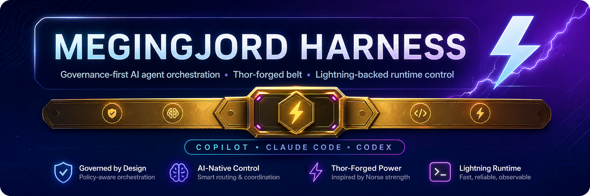
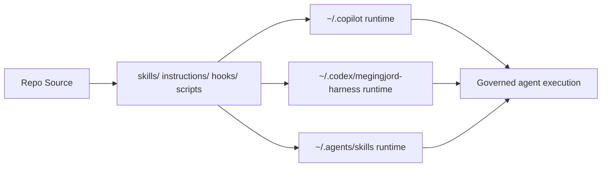

# Megingjord Harness



[](LICENSE)
[](https://nodejs.org)
[](plugin.json)
[](AGENTS.md)
[](https://github.com/chf3198/megingjord-harness/actions/workflows/quality-gates.yml)
[](https://scorecard.dev/viewer/?uri=github.com/chf3198/megingjord-harness)

**Megingjord** is a governance-first AI agent harness with skills, hooks, agents, runtime scripts, and a Karpathy-style LLM wiki.

## Architecture at a glance



## Why it is robust

- Multi-runtime deployment model with dry-run/apply scripts
- Governance baton model: Manager → Collaborator → Admin → Consultant
- Fleet-aware routing, telemetry, and policy enforcement
- Confidence-aware telemetry separates exact vs estimated Copilot usage with report caveats
- Static dashboard with operations + governance visibility
- LLM wiki integration for reusable institutional knowledge
- Accessibility + UX baseline checks aligned to WCAG 2.2 and Core Web Vitals

## Quick start

```bash
npm run setup
npm start
npm run lint
npm test
npm run deploy:both:apply
```

## Scripts

<!-- docs packageScripts -->
| Script | Command |
|---|---|
| `adr:build` | `log4brains build` |
| `adr:new` | `log4brains adr new` |
| `adr:preview` | `log4brains preview` |
| `agent:coord:remote` | `node scripts/global/agent-coord-remote.js` |
| `agent:tier-c` | `node scripts/global/tier-c-guard.js` |
| `capability:probe` | `node scripts/global/capability-probe.js` |
| `capability:show` | `node scripts/global/capability-show.js` |
| `cost-report` | `node scripts/global/cost-report.js` |
| `cost:baseline` | `node scripts/global/cost-baseline.js` |
| `deploy` | `bash scripts/deploy.sh` |
| `deploy:apply` | `bash scripts/deploy.sh --apply` |
| `deploy:both` | `bash scripts/deploy.sh --target both` |
| `deploy:both:apply` | `bash scripts/deploy.sh --apply --target both` |
| `deploy:claude` | `bash scripts/deploy.sh --target claude` |
| `deploy:claude:apply` | `bash scripts/deploy.sh --apply --target claude` |
| `deploy:codex` | `bash scripts/deploy.sh --target codex` |
| `deploy:codex:apply` | `bash scripts/deploy.sh --apply --target codex` |
| `docs:anchors` | `node scripts/global/docs-anchors.js` |
| `docs:compile` | `node scripts/docs-compile.js` |
| `docs:exec` | `node scripts/global/docs-exec.js` |
| `docs:lint` | `node scripts/docs-lint.js` |
| `format` | `prettier --write .prettierrc.json package.json CONTRIBUTING.md .github/workflows/lint.yml lint-configs/README.md lint-configs/ci-lint.yml lint-configs/eslint.config.devenv.js scripts/lint-readability.js scripts/global/install-readability-toolchain.js` |
| `format:check` | `prettier --check .prettierrc.json package.json CONTRIBUTING.md .github/workflows/lint.yml lint-configs/README.md lint-configs/ci-lint.yml lint-configs/eslint.config.devenv.js scripts/lint-readability.js scripts/global/install-readability-toolchain.js` |
| `governance:drift` | `node scripts/global/governance-drift-classifier.js --json` |
| `governance:epic` | `node scripts/global/epic-evidence.js` |
| `governance:epics` | `node scripts/global/epic-close-validator.js` |
| `governance:no-sync-http` | `node scripts/global/no-sync-http-handlers.js` |
| `governance:reconcile` | `node scripts/global/ticket-reconcile.js --json` |
| `governance:verify` | `node scripts/global/governance-verify.js --json` |
| `governance:weekly` | `node scripts/global/governance-weekly-report.js` |
| `governance:worktrees` | `node scripts/global/worktree-governance-audit.js --json` |
| `health` | `node scripts/health-check.js` |
| `help:topic` | `node scripts/help-topic.js` |
| `issue:transition` | `node scripts/global/issue-transition.js` |
| `lint` | `node scripts/lint.js` |
| `lint:all` | `npm run lint:js && npm run lint:py && npm run lint:sh && npm run lint:md` |
| `lint:js` | `eslint -c lint-configs/eslint.config.devenv.js --max-warnings 9999 dashboard/js scripts/global scripts/wiki` |
| `lint:md` | `markdownlint-cli2 '**/*.md' '!node_modules/**' '!research/**' '!wiki/sources/**' '!wiki/syntheses/**' '!raw/**' '!.dashboard/**' '!CHANGELOG-archive.md' '!tickets/**'` |
| `lint:py` | `ruff check --config lint-configs/ruff.devenv.toml hooks/scripts/` |
| `lint:readability` | `node scripts/lint-readability.js` |
| `lint:readability:ci` | `node scripts/lint-readability.js --max-warnings=400` |
| `lint:router` | `node scripts/lint-router.js` |
| `lint:sh` | `find scripts -name '*.sh' -exec shellcheck {} +` |
| `prepare` | `bash scripts/install-git-hooks.sh` |
| `rag:search` | `node scripts/global/rag-search.js` |
| `readability:snapshot` | `bash scripts/readability-snapshot.sh` |
| `repo:scope` | `node scripts/global/repo-scope.js` |
| `router:cascade` | `node scripts/global/cascade-dispatch.js` |
| `router:dispatch` | `node scripts/global/task-router-dispatch.js` |
| `router:free` | `node scripts/global/free-router.js` |
| `router:smoke` | `node scripts/global/task-router-smoke.js` |
| `router:weekly` | `node scripts/global/model-routing-weekly-report.js` |
| `routing:baseline` | `node scripts/global/routing-baseline-report.js` |
| `routing:calibrate` | `node scripts/global/cascade-calibrate.js` |
| `routing:report` | `node scripts/global/routing-baseline-report.js --days 7` |
| `setup` | `npm install && echo '✅ megingjord ready — run: npm start'` |
| `start` | `node scripts/dashboard-server.js` |
| `state:offload` | `node scripts/global/state-offload-client.js` |
| `sync` | `bash scripts/sync.sh` |
| `sync:both` | `bash scripts/sync.sh --target both` |
| `sync:both:dry` | `bash scripts/sync.sh --dry-run --target both` |
| `sync:claude` | `bash scripts/sync.sh --target claude` |
| `sync:claude:dry` | `bash scripts/sync.sh --dry-run --target claude` |
| `sync:codex` | `bash scripts/sync.sh --target codex` |
| `sync:codex:dry` | `bash scripts/sync.sh --dry-run --target codex` |
| `sync:dry` | `bash scripts/sync.sh --dry-run` |
| `test` | `npx playwright test` |
| `test:headed` | `npx playwright test --headed` |
| `test:quality` | `npx playwright test tests/google-quality.spec.js` |
| `ticket:create` | `node scripts/global/ticket-create.js` |
| `toolchain:readability:install` | `node scripts/global/install-readability-toolchain.js` |
| `validate:compat` | `node scripts/validate-plugin-compat.js` |
| `validate:triage` | `node scripts/validate-plugin-triage.js` |
| `wiki:anneal` | `node scripts/wiki/anneal.js` |
| `wiki:ingest` | `node scripts/wiki/ingest.js` |
| `wiki:lint` | `node scripts/wiki/lint.js` |
| `wiki:search` | `node scripts/wiki/search.js` |
| `worktree:start` | `bash scripts/worktree-session-start.sh` |
<!-- /docs -->

This table is auto-generated from `package.json` by `npm run docs:compile` (#796). Do not edit by hand inside the fenced region — CI fails when README diverges from sources.

## Public trust surfaces

- [Code of Conduct](CODE_OF_CONDUCT.md)
- [Contributing Guide](CONTRIBUTING.md)
- [Security Policy](SECURITY.md)
- [Support](SUPPORT.md)
- [License](LICENSE)

## Runtime mapping

| Source | Runtime target |
|---|---|
| skills/ | ~/.copilot/skills + ~/.agents/skills |
| instructions/ | ~/.copilot/instructions |
| hooks/ | ~/.copilot/hooks + ~/.codex/megingjord-harness/hooks |
| scripts/global/ | ~/.copilot/scripts + ~/.codex/megingjord-harness/scripts |
| .codex/ | ~/.codex/AGENTS.md + config.toml + hooks.json + rules/ |
| wiki/ | ~/.copilot/wiki + ~/.codex/megingjord-harness/wiki |

## Issue flows

- [Bug report](https://github.com/chf3198/megingjord-harness/issues/new?template=bug-report.yml)
- [Feature request](https://github.com/chf3198/megingjord-harness/issues/new?template=feature_request.md)
- [Discussions](https://github.com/chf3198/megingjord-harness/discussions)

> Formerly DevEnv Ops. Codex name rejected due product conflict; Aegis rejected due broad name reuse.
