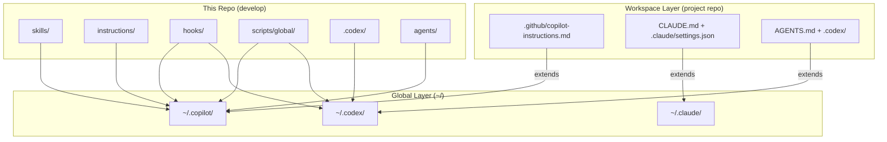

# Architecture — Two-Tier Layer Model

The harness separates concerns into two independent deployment layers. This
separation ensures every project shares a common governance baseline while
retaining full flexibility for workspace-level overrides.

## Global layer (`~/.*`)

Installed once per machine via `npm run deploy:apply`. Shared across all repos.

```
~/.copilot/
├── skills/         ← from skills/ (universals compiled; personal deployed locally)
├── instructions/   ← from instructions/
├── hooks/          ← from hooks/
├── scripts/        ← from scripts/global/
├── agents/         ← from agents/
└── wiki/           ← compiled from wiki/

~/.claude/
├── agents/         ← Claude Code custom agent definitions
├── hooks/          ← Claude Code pre/post-tool hooks
└── settings.json   ← Merged with workspace .claude/settings.json

~/.codex/
├── AGENTS.md       ← from .codex/AGENTS.md
├── config.toml     ← from .codex/config.toml
├── hooks.json      ← from .codex/hooks.json
└── rules/          ← from .codex/rules/
```

## Workspace layer (project repo root)

Committed into each target project. Provides project-specific context and
optional overrides of the global layer.

| File                              | Runtime        | Role                                                    |
| --------------------------------- | -------------- | ------------------------------------------------------- |
| `.github/copilot-instructions.md` | GitHub Copilot | Project adapter; extends global                         |
| `CLAUDE.md`                       | Claude Code    | Project adapter; extends global                         |
| `AGENTS.md`                       | Codex          | Project adapter; extends global                         |
| `.claude/settings.json`           | Claude Code    | Tool permissions; merged with `~/.claude/settings.json` |

**Conflict resolution**: global security and governance rules always take
precedence over workspace overrides, unless a governance baton explicitly
delegates an exception for that project.

## Mermaid — full layer topology



## Deploy flow and conflict rules

```
1. Edit source on a feature branch → PR → baton gates → merge to main
2. npm run deploy:apply          (Copilot + wiki)
   npm run deploy:codex:apply    (Codex)
   npm run deploy:both:apply     (both at once)
3. Verify skill/script in target runtime
4. NEVER edit ~/.copilot/ or ~/.codex/ or ~/.claude/ directly
```

| Scenario                                       | Result                       |
| ---------------------------------------------- | ---------------------------- |
| Workspace adds skill not in global             | Active for that project only |
| Workspace overrides global instruction         | Workspace value wins         |
| Global security rule conflicts with workspace  | Global wins always           |
| Both workspace and global define the same hook | Both run; global first       |
