# Anneal Pattern Graph — 2026-05-09

> Auto-generated by `scripts/global/anneal-graph.js` — Epic #1133
> Nodes = recurring patterns | Edges = co-occurrence in incidents.jsonl

```mermaid
graph TD
  changelog_merge_conflict["CHANGELOG.md merge conflicts #1132"]
  branch_name_validation_reject["Branch-name validation rejections"]
  lint_file_exceed_100_lines["File exceeds 100-line harness limit"]
  evidence_block_timeout_race["Evidence completeness 60s race cond"]
  admin_signer_non_independence["Admin signer non-independence viola"]
  precommit_hook_amend_instead_commit["Pre-commit hook failure → amend-onl"]
  operator_handle_registry_alias_variance["Signature variance (operator handle"]
  worktree_governance_violation["Worktree governance violations"]
```

## Pattern Inventory (8 total)

- **changelog_merge_conflict**: CHANGELOG.md merge conflicts — `Per-ticket fragments + auto merge (see #1132)`
- **branch_name_validation_reject**: Branch-name validation rejections — `Add pre-push hook; improve CI error`
- **lint_file_exceed_100_lines**: File exceeds 100-line harness limit — `Refactor file into smaller modules; verify new_pattern handling above 100 lines`
- **evidence_block_timeout_race**: Evidence completeness 60s race condition — `Increase race-detection timeout to 90s; add telemetry for timing skew`
- **admin_signer_non_independence**: Admin signer non-independence violation — `Route PR approval to different admin; enforce via baton-gates.yml`
- **precommit_hook_amend_instead_commit**: Pre-commit hook failure → amend-only pattern — `Improve hook error messages; add pre-push check to catch before amend`
- **operator_handle_registry_alias_variance**: Signature variance (operator handle vs registry alias) — `Standardize operator identity in AGENTS.md; add team-model-signing lint`
- **worktree_governance_violation**: Worktree governance violations — `Enforce via git worktree governance audit; create rescue worktree if collision`
