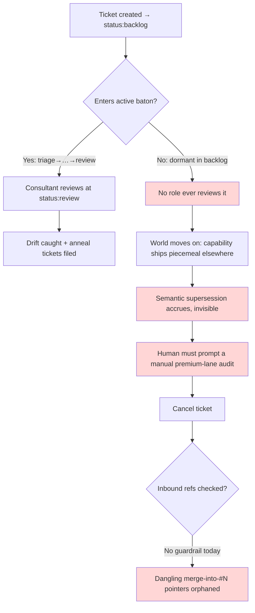
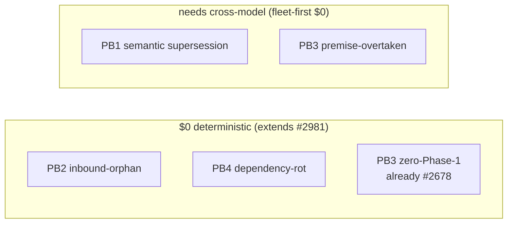
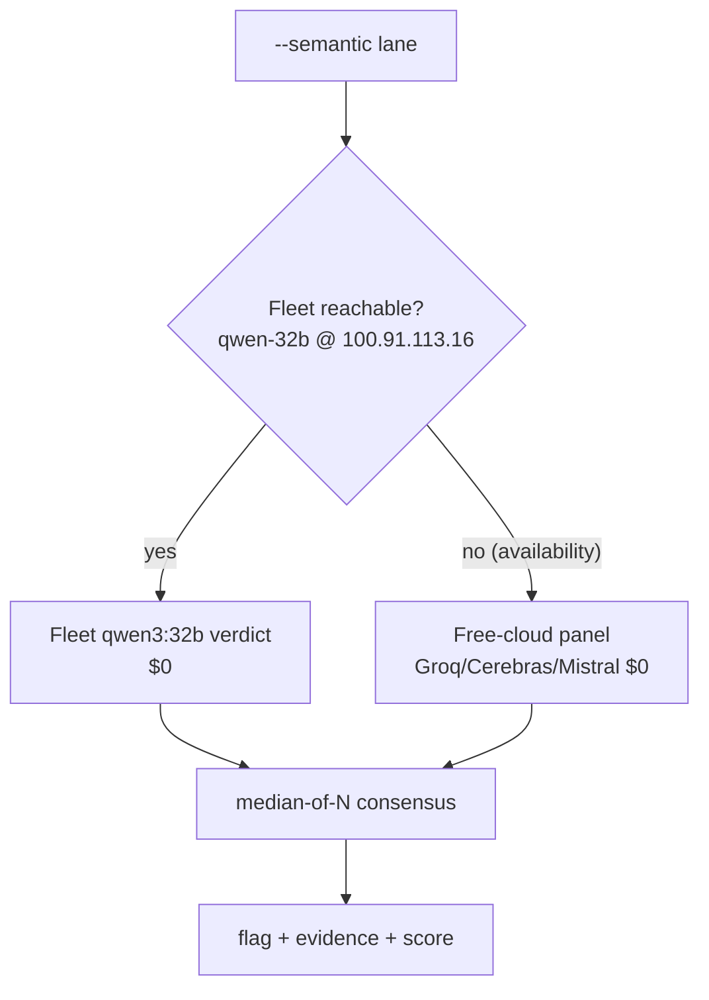
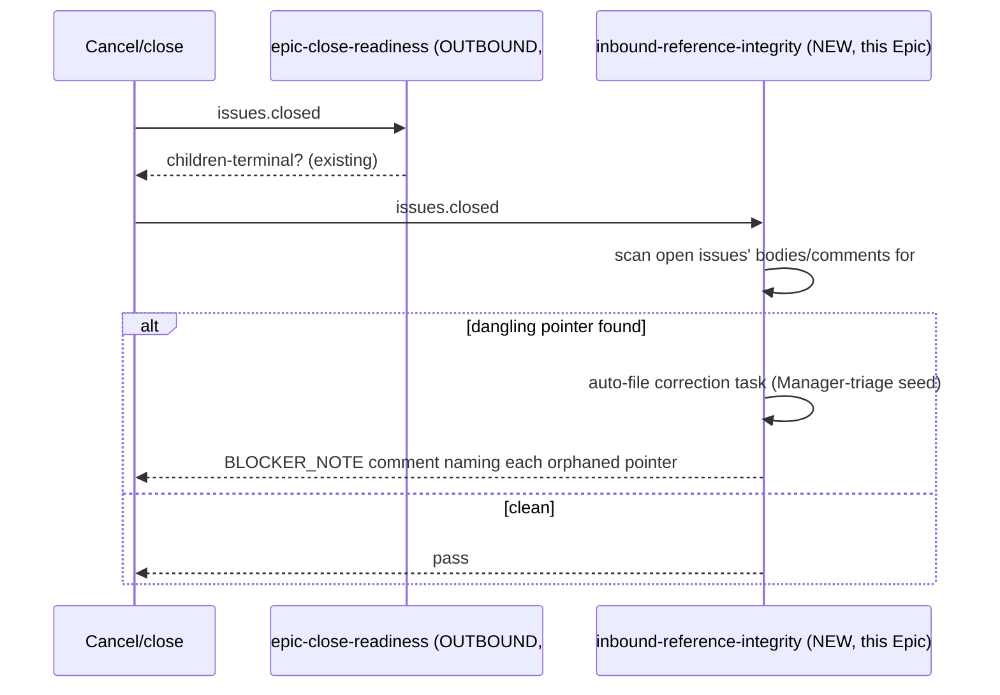
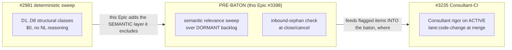
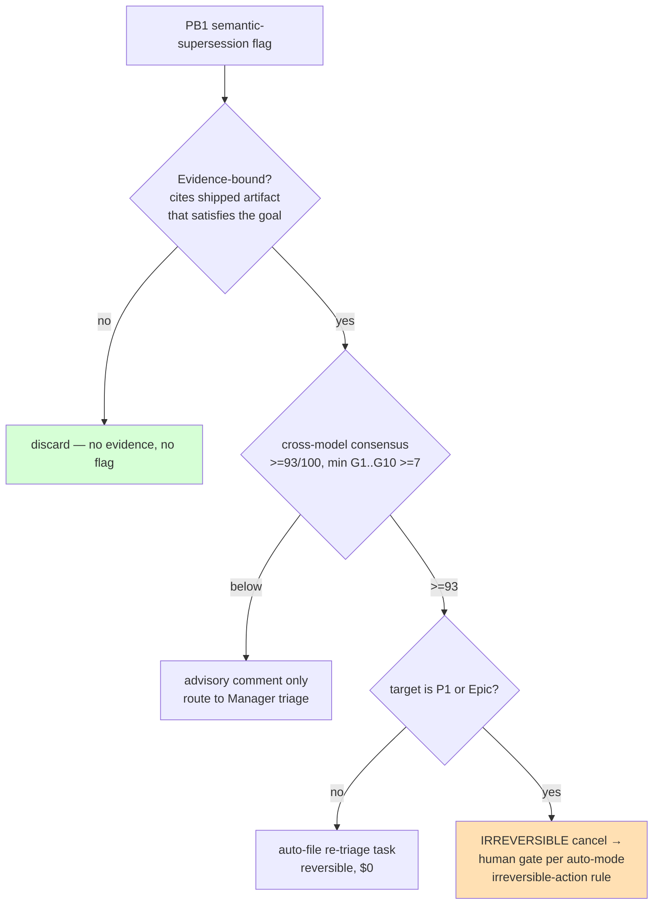

# Phase-0 Research — Pre-Baton Backlog Semantic-Drift + Inbound-Orphan Guardrail

> **Ticket:** #3399 (Phase-0 of research-first Epic #3398)
> **Date:** 2026-06-30 · **Lane:** `lane:docs-research` · **Strategy:** `peer-review`
> **Author role:** Collaborator (analyst) · **Signed-by:** Orla Harper · **Team&Model:** claude-code:opus@local

## 0. Problem in one diagram

The harness has a structural authority gap: a ticket that **never enters the baton** is
**never reviewed by any role**, so semantic drift (the goal got satisfied elsewhere) and
inbound-reference orphans (someone points *at* this ticket) accrue invisibly until a human
prompts a manual audit.

**Concrete recurrence (this is ≥2-in-window → Tier-2 anneal, not a one-off):** Epic #1899 sat
`status:backlog` ~6 weeks while its scoped capability shipped through `role-red-team-critique`,
`cross-family-review`/#2511, the Red-Team Reviewer agent, `fleet-review-required.js`/#2192, and
`megalint/*` validators. Cancelling it orphaned the inbound "merge into #1899" pointers on #2093
and #3069 (inbound-mention to 1899 on #2093 verified live). Manual premium-lane backlog audits
recurred 2026-06-12 (#2981), 06-27, 06-29, and 06-30 — each doing work a guardrail should own.

---

## 1. AC-R1 — Pre-baton drift-class taxonomy

Four classes, each tagged by the **minimum machinery** needed to detect it. "Deterministic"
means structural signals already available to a $0 string/graph pass; "needs-cross-model" means
the verdict requires natural-language judgment ("is goal X satisfied by artifacts Y,Z?").

| # | Class | What it is | Detection | This-session example |
|---|---|---|---|---|
| **PB1** | **Semantic supersession** | A dormant backlog ticket's goal is already satisfied by shipped artifacts under *other* tickets. | **needs-cross-model** (the "is it the same goal?" judgment is NL; the candidate-set filter is deterministic) | #1899 superseded by red-team skills + #2192 gate + megalint |
| **PB2** | **Inbound-orphan** | A ticket is referenced as a survivor / merge-target / dependency by *other* live items; closing/cancelling it dangles those pointers. | **deterministic** (regex over inbound bodies/comments at close-time) | "merge into #1899" on #2093 / #3069 dangled on cancel |
| **PB3** | **Stale research-first** | A `phase-gate:research-first` Epic whose Phase-0 children are all closed but Phase-1 never authored, OR whose research premise is overtaken by events. | **hybrid**: zero-Phase-1 is deterministic (already #2678); *premise-overtaken* is needs-cross-model | (guards against the #2661 silent-close class re-manifesting semantically) |
| **PB4** | **Dependency-rot** | A backlog ticket `blocked by #N` where #N is already closed/cancelled (block cleared, nobody re-triaged), or depends on a deleted/renamed artifact. | **deterministic** (resolve `blocked by #N` → check #N terminal state) | dangling `blocked by` survives close events today |

**Why this set and not more:** PB1/PB2 are the two classes with live this-session casualties and are
the Epic's named slice. PB3/PB4 are included because the same dormant-backlog scan surface detects
them for near-zero marginal cost (PB4 fully deterministic, PB3's deterministic half already partly
shipped in #2678) — but **only PB1 (and PB3-premise) actually require the paid-risk cross-model lane**;
PB2/PB4 stay $0. This keeps the cross-model budget minimal (G3).

---

## 2. AC-R2 — Relevance-pass siting decision + cost model

### Decision: **extend #2981 `governance-drift-sweep.js` with an opt-in cross-model lane**, dispatched on a **scheduled routine**; do NOT build a parallel skill.

Three candidate sites were weighed:

| Option | Pros | Cons | Verdict |
|---|---|---|---|
| **A. New standalone skill** | clean separation | duplicates the ticket-list + label-parse + report scaffold `governance-drift-sweep.js` already owns; two drift surfaces drift apart (the irony) | ✗ rejected (G10) |
| **B. Extend #2981 sweeper, opt-in lane** | reuses `listOpenTickets` + `classifyIssue` + report writer; one drift surface; deterministic classes stay $0, cross-model is a flag | must keep the cross-model lane strictly opt-in so the default `--scan` stays $0 | ✓ **chosen** |
| **C. Active-baton hook (#3235 path)** | reuses Consultant CI | wrong jurisdiction — pre-baton tickets never reach the active-baton gate | ✗ rejected (the gap itself) |

**Siting detail.** `governance-drift-sweep.js#classifyIssue` already emits structural classes
`D1..D8` over `listOpenTickets()`, including `D5` (backlog child of an active Epic) and `D6`
(dormant Epic w/o `EPIC_REVIEW`). The candidate filter for PB1 is *exactly* the dormant-backlog
subset this function already isolates. Add:
- a deterministic `D9` (PB2 inbound-orphan) and `D10` (PB4 dependency-rot) to the default $0 scan;
- an **opt-in `--semantic` flag** that, for the dormant-backlog candidate set only, dispatches a
  cross-model relevance verdict and emits `PB1`/`PB3s` flags. Default `--scan` never calls a model.

### Cost model — fleet-first $0 (hard constraint)

- **Primary:** fleet `qwen3:32b` / `qwen2.5-coder:32b` on `100.91.113.16:11434` — **$0**, already the
  high-stakes rater per project practice.
- **Availability failover:** fleet down → **free-cloud $0 panel** (Groq-llama, Cerebras, Mistral) via
  `free-cloud-dispatch.js`, per the #2619/#2621 cost-ascending mandate. **Never** steps to paid Haiku
  on a fleet *availability* outage.
- **Budget envelope:** candidate set = dormant backlog only (tens of tickets, not thousands). One
  verdict per candidate per run, scheduled (e.g. weekly cron), median-of-N for the numeric noise
  (per `consensus_rater_noise_aggregation`). Estimated paid-$ avoided vs. the recurring premium-lane
  human audit it replaces is the G3 win — logged like `free-cloud-usage-report.js` does.

#### G7 Throughput — scalability bound (candidate-set is the lever)

The cross-model cost is **not** O(all backlog). Only PB1/PB3s (the needs-cross-model classes) ever
call a model, and only over the **dormant-backlog subset** the #2981 classifier already isolates
(D5/D6) — PB2/PB4 are deterministic $0 and carry the structural majority. For a backlog that grows
unexpectedly large, the sweep applies (a) a per-run candidate **cap** (`--max-candidates N`, oldest-
first), (b) **content-hash memoization** so an unchanged dormant ticket is not re-rated until its body
or the shipped-artifact set changes, and (c) batched dispatch. So per-run model calls stay bounded by
the cap, not by total backlog size — the median-of-N panel never becomes the bottleneck.

#### G4 Privacy — redaction before dispatch (mandatory)

Every candidate's text (title + body only — never diffs, tokens, or secrets) is passed through
`scripts/global/log-redaction.js#redactString` (Anthropic/OpenAI keys, GitHub PAT, JWT, email, IPv4
patterns) **before** any fleet or free-cloud dispatch. The dispatch payload is the redacted goal
statement + the shipped-artifact identifiers, not raw ticket internals. This is a hard precondition of
the `--semantic` lane, not an afterthought.

#### G5 Portability / G6 Resilience — tier-graceful degradation (no hard fail)

Substrate availability is not assumed. The lane degrades, never crashes: fleet down →
free-cloud $0 panel → **if ALL model substrates are unavailable or blocked, the semantic lane
silently degrades to deterministic-only** (PB2/PB4 still run at $0; PB1/PB3s simply emit no new flags
that run). Evidence this is real, not hypothetical: **this session's own consensus run hit a live
`groq` Cloudflare-1010 UA block and free-tier TPM limits** — the fleet local path was the resilient
fallback. No single vendor (or the fleet host) is a hard dependency; the deterministic floor always
remains.

---

## 3. AC-R3 — Inbound-reference integrity check

### Reference-form catalog (what to scan for, in *other* live items, pointing at the closing ticket #N)

| Form | Regex sketch | Semantics | Auto-correction |
|---|---|---|---|
| `merge into #N` / `merged into #N` / `fold into #N` | `/(?:merge[d]?\|fold)\s+into\s+#N\b/i` | #N was the designated survivor of a merge | re-route the pointer to #N's actual successor, or flag for re-home |
| `blocked by #N` / `blocks #N` | `/block(?:ed\|s)?\s+(?:by\s+)?#N\b/i` | dependency edge | if #N cancelled, the block is void → re-triage the blocked item |
| `survivor: #N` / `canonical: #N` / `supersedes #N` | `/(?:survivor\|canonical\|supersed\w+)[:\s]+#N\b/i` | designation note | designation invalidated → file correction |
| `Refs Epic #N` / `Parent: #N` (child-side) | existing close-readiness regexes | structural parentage | re-home children before close (overlaps #3350 outbound, see §4) |

### Hook point: the `issues.closed` Action — a sibling to `epic-close-readiness-check.js`

`epic-close-readiness-check.js` already fires on `issues.closed` and validates **outbound** edges
(are my children terminal?). It does **zero inbound** scanning. The inbound check is a structurally
identical sibling that, on the same event, runs an inbound scan: *"who points at the ticket being
closed, and is that pointer now dangling?"*

### Auto-correction-task spec
On a dangling-pointer hit, emit a **Manager-triage seed** ticket (not report-only):
`title: "Re-home orphaned reference to #N from #M"`, body cites each `#M` + the exact reference
line, labels `type:task` `status:backlog` `area:governance` `anneal:tier-2`, and a schema-v3
`incidents.jsonl` event `pattern_id: inbound-reference-orphan`. This satisfies Epic AC2 + AC3
(detection routes into the baton).

---

## 4. AC-R4 — Consultant-authority extension, reconciled with #3235 and #2981

The structural authority gap: the Consultant baton is **per-ticket, at `status:review` only**.
Dormant backlog tickets never reach review → Consultant has **no jurisdiction**. Two reconciliation
constraints:

- **vs. #2981 (deterministic structural sweep):** #2981 explicitly excludes NL reasoning. This Epic
  is the **semantic layer above it** — same sweeper host (§2), new opt-in lane. No duplication.
- **vs. #3235 (active-baton Consultant-CI):** #3235 applies Consultant rigor to **active**
  `lane:code-change` batons at merge. This Epic is the **pre-baton complement**: it does not review
  active batons; it *creates* baton items (triage seeds) from pre-baton drift, which #3235 then
  governs normally once they enter the active flow. Boundary is clean: #3235 = in-baton, #3398 = pre-baton.

**Authority model (no new role):** the periodic semantic sweep is **Consultant-delegated automation**,
not a new human/role. It produces *advisory flags with cited evidence*; a flag becoming an actual
cancel of a P1/Epic item requires the §5 safety gate. Routine reversible flags (file a re-triage
task) need no human — they route to Manager via the standard Tier-2 anneal path. This respects the
operator-identity contract (client = design/UAT only; routine dev decisions → fleet oracle).

---

## 5. AC-R5 — False-supersede safety model

**Axiom: a wrong cancel is worse than a missed flag.** Detection is cheap and reversible; an
erroneous cancel of live work is expensive and (for the ticket's momentum) destructive. The model
is therefore asymmetric — easy to *flag*, hard to *irreversibly act*.

Four layered safeties:
1. **Evidence-binding** — a flag MUST cite the specific shipped artifact(s) that satisfy the dormant
   ticket's goal (the #1899 evidence = the red-team skills + #2192 gate). No evidence → no flag.
2. **Consensus threshold** — `>=93/100` cross-model + `min(G1..G10) >= 7`, median-of-N draws to
   damp rater noise. Below threshold → advisory only, never an action.
3. **Reversibility tier** — reversible actions (file a re-triage task, post an advisory) are
   autonomous; **irreversible** actions (cancel of a P1/Epic item) require a **human gate**, the same
   rule the auto-mode classifier enforces for irreversible local deletion ([[epic_3352_worktree_teardown]]).
4. **Precision calibration** — promotion advisory→blocking is **replay-eval-gated** against a labeled
   backlog-drift corpus at precision ≥0.85 (no calendar threshold, per `soak_language_default`).

---

## 6. AC-R6 — Consensus + closeout

Cross-model consensus result and Consultant closeout are recorded in the #3399 comment trail
(fleet-first $0 panel; target ≥93/100, min(G1..G10) ≥7). See the `CROSS_MODEL_CONSENSUS` and
`CONSULTANT_CLOSEOUT` comments on #3399.

---

## 7. Phase-1 child decomposition (recommendation — Manager authors after this closes ≥93)

| Child | Deliverable | Class | Lane | Cost |
|---|---|---|---|---|
| **C1** | `backlog-relevance-sweep` — opt-in `--semantic` lane on `governance-drift-sweep.js`; PB1/PB3s flags w/ shipped-artifact evidence | PB1, PB3s | code-change | fleet-first $0 |
| **C2** | `inbound-reference-integrity` — `issues.closed` sibling Action + auto-correction-task | PB2 | code-change | $0 deterministic |
| **C3** | auto-route flagged items into baton (Manager-triage seed + Tier-2 anneal), not report-only | all | code-change | $0 |
| **C4** | Wiki-B mirror refresh on **non-PR** state changes (the stale `wiki/work-log/tickets/1899.md` casualty) | — | code-change | $0 |
| **C5** | promotion path advisory→blocking, replay-eval-gated against a labeled backlog-drift corpus | — | code-change | $0 |

Plus a $0 deterministic `D10` dependency-rot (PB4) folded into C2's scan.

**Advisory→blocking promotion** for the whole Epic is replay-eval-gated at precision ≥0.85, never
calendar-gated.

---

## 8. Goal-lens justification

- **G1 Governance + G2 Quality (lead):** undetected backlog drift lets stale/contradictory tickets
  misdirect work; the #2093 dangling pointer is a concrete G1 hit.
- **G3 Zero-Cost (hard constraint):** the relevance pass MUST be fleet-first $0 — the entire point is
  to stop burning premium tokens on human-prompted audits. Failover is free-cloud $0, never paid.
- **G6 Resilience:** autonomous detection removes the single point of failure (a human remembering to
  audit).
- **G8 Observability:** flagged drift becomes a tracked baton item + `incidents.jsonl` event, not an
  invisible accrual.
- **G4 Privacy:** cross-model dispatch sends only redacted ticket titles/bodies (already in GitHub);
  `log-redaction.js#redactString` is a hard precondition of the `--semantic` lane (§2) — no secrets/
  diffs/tokens leave the host.
- **G5 Portability / G6 Resilience:** no single vendor or the fleet host is a hard dependency — the
  lane degrades fleet → free-cloud → deterministic-only floor (§2), proven against this session's live
  groq Cloudflare-1010 block.
- **G7 Throughput:** model calls are bounded by a per-run candidate cap + content-hash memoization over
  the dormant subset (§2), not by total backlog size.
- **G8 Observability:** every flag, advisory, and auto-correction-task emission writes a schema-v3
  `~/.megingjord/incidents.jsonl` event (`pattern_id: backlog-semantic-supersession` / `inbound-reference-orphan`)
  and the sweep extends `governance-drift-sweep.js`'s existing `logs/governance-drift-sweep.json` report —
  drift becomes a tracked, queryable signal, never a silent accrual.
- **G9 Interoperability:** the guardrail's outputs are plain GitHub artifacts (a triage-seed Issue + a
  JSONL event), so all four runtimes (Claude Code / Copilot / Codex / Antigravity) consume them through
  the same baton with no per-team adapter — the enforcement core stays runtime-agnostic like
  `epic-close-readiness-check.js`.
- **G10 Maintainability:** extending the **single** #2981 sweeper (one drift surface, one ticket-list +
  classify + report scaffold) instead of forking a parallel skill is the deliberate maintainability
  choice — it prevents two drift surfaces from themselves drifting apart.

---

## 9. References

- Origin: #1899 (cancelled 2026-06-30) · casualties #2093, #3069 (orphaned pointers, corrected)
- Extends: #2981 `governance-drift-sweep.js` (deterministic structural sweep — adds the excluded semantic layer)
- Boundary: #3235 (active-baton Consultant-CI) · #3350 `epic-close-readiness-check.js` (outbound close-readiness)
- Client autonomy directive: #3391 / #3392 (minimize human interaction)
- Patterns: `consensus_rater_noise_aggregation`, `soak_language_default`, `free_consensus_panel_substrates`
