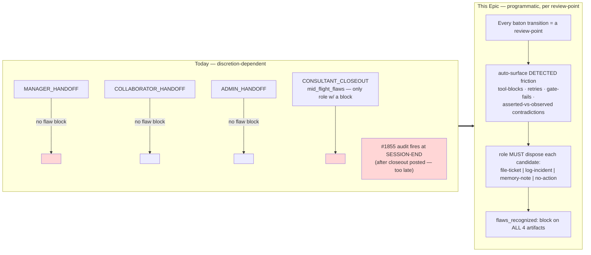
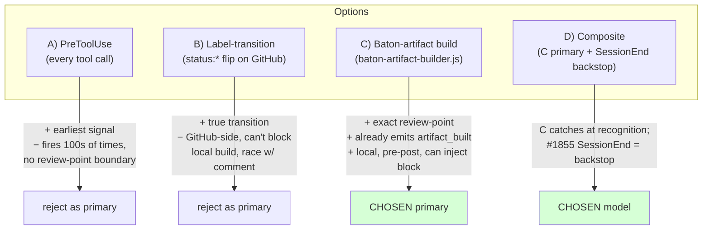
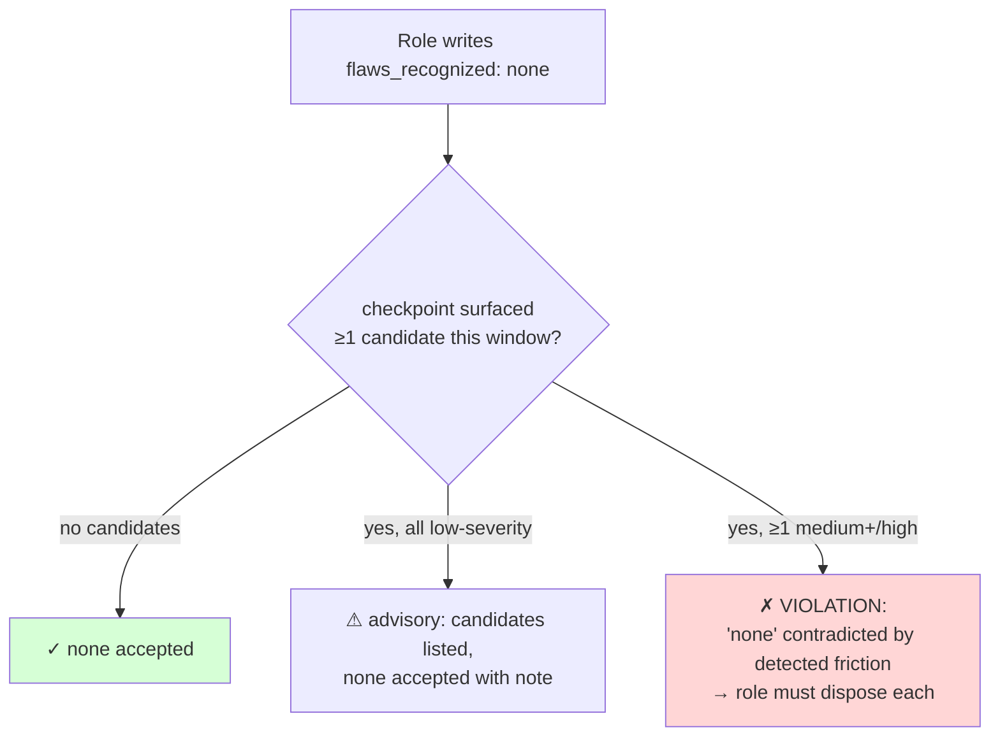
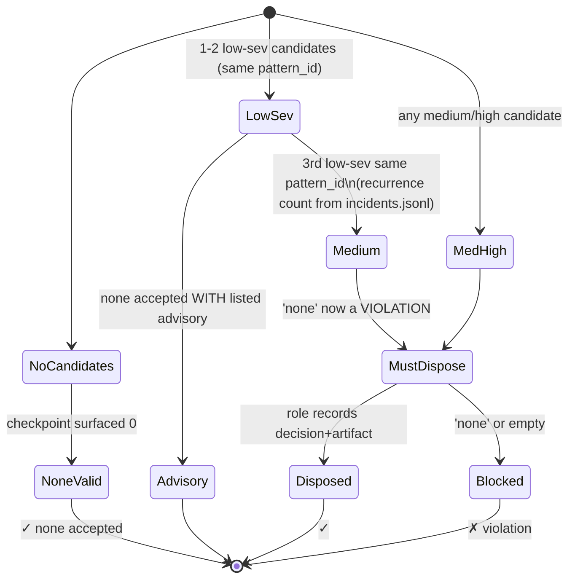
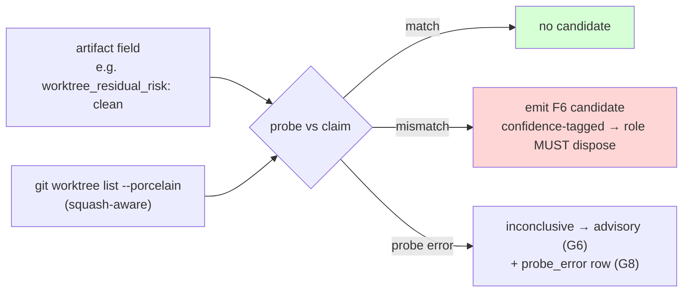
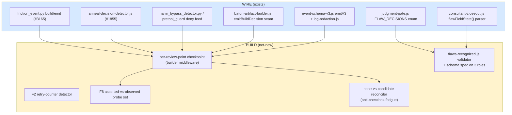
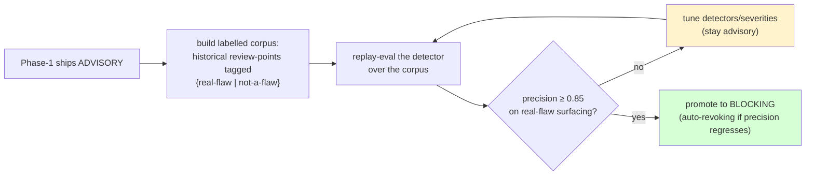

# Phase-0 Research — Programmatic Flaw/Friction Capture at Every Baton Review-Point

- **Ticket:** #3426 (Phase-0 of research-first Epic #3425)
- **Lane:** `lane:docs-research` · **Strategy:** `peer-review`
- **Date:** 2026-06-30
- **Author role:** Manager (Collaborator-analyst authoring) — `claude-code:opus@local`
- **Status of close gate:** cross-model consensus ≥93 (fleet-first $0) + Consultant min(G1..G10) ≥7, counsel-driven (#3416)

---

## 0. Problem in one paragraph

The harness already *requires* a flaw-recognition anneal decision — when any role recognizes a flaw it
MUST record `file-ticket | log-incident-only | memory-note-only | no-action-justified`
(`instructions/role-baton-routing.instructions.md` §"Flaw-recognition anneal decision"). But that
contract is **prose-enforced and discretion-dependent**: only the **Consultant** artifact carries a
machine-checked block (`mid_flight_flaws`, validated by `scripts/global/megalint/consultant-closeout.js`),
and the only automated recognition-vs-decision balance check (#1855) fires at **SessionEnd — after the
closeout is already posted**. Two same-session misses prove the gap: rating-shopping (#3416) and the
worktree squash-equivalence false-positive where the Consultant asserted "no stray worktrees" while one
remained on disk (#3424). In both, the operator *recognized* the flaw in prose but never recorded the
mandated decision. This is exactly the failure class #2709 closed for governance **chains** ("no link may
depend on operator discretion"); this Epic applies that principle to **flaw capture**. This Phase-0
designs the programmatic, per-review-point capture and decomposes Phase-1.



---

## AC-R1 — Friction-signal taxonomy

A **review-point** is any baton handoff/transition (MANAGER → COLLABORATOR → ADMIN → CONSULTANT) plus the
Consultant closeout. A **friction signal** is any machine-observable event in the window since the previous
review-point that indicates the operator hit, recognized, or worked around a flaw. Each class is tagged
`{already-emitted-by #3165 | feed-exists-needs-adapter | new-detector-needed}`.

| # | Friction class | Machine signal (source) | Tag |
|---|----------------|--------------------------|-----|
| F1 | **Tool-block / hook-deny** | `pretool_guard.py` deny/ask decisions (`check_terminal`, `DANGEROUS_CMD_RE`, push/merge/close gates, `is_raw_fleet_curl` ask) | feed-exists-needs-adapter |
| F2 | **≥N retries of the same op** | repeated near-identical Bash/Edit invocations in `tool_activity.py` session state (`blast_radius`, command history) | new-detector-needed (no counter today) |
| F3 | **Gate / CI failure** | megalint validator non-zero exits; `gh pr checks` red; baton-gates workflow failures | feed-exists-needs-adapter |
| F4 | **Bypass-env usage** | `hamr_bypass_detector.py detect_bypass()` → `incidents.jsonl` `pattern_id: hamr-bypass-detected`; `session-bypass-tracker.js`; IT-ops markers | already-emitted-by #3165 (incident feed exists) |
| F5 | **Self-correction / revert** | `git revert`/`reset`/`--amend`, Edit that undoes a prior Edit, `discard_changes:true` on a worktree remove-guard | new-detector-needed |
| F6 | **Asserted-vs-observed contradiction** | a closeout/handoff field claim vs a cheap live probe (the #3424 class) — see AC-R4 | new-detector-needed |
| F7 | **Recognition-without-decision** | `anneal-decision-detector.js` RECOGNITION_MARKERS matched with no adjacent DECISION_MARKERS (#1855), promoted from session-end to per-review-point | feed-exists-needs-adapter (promote firing point) |
| F8 | **Blast-radius / anomaly trip** | `pretool_guard.py enforce_blast_radius` / `enforce_session_anomaly` (G-15) cap exceedances | feed-exists-needs-adapter |

**Severity mapping (reuses `event-schema-v3` `SEVERITIES = low|medium|high|critical`):** F4/F6/F8 default `high`
(governance-critical: bypass, false assertion, anomaly); F1/F3/F7 `medium`; F2/F5 `low` unless recurrent.
The detector emits each surfaced candidate through the existing `friction_event.py build_friction_event()`
schema (no new schema), tagging `surface = review-point:<role-transition>`.

**Key finding:** five of eight classes already have a live signal source; the design is **wiring + two new
detectors (F2 retry-counter, F6 asserted-vs-observed)**, not a green-field build. F4 already lands in
`incidents.jsonl` today.

---

## AC-R2 — Hook firing-point

### Candidate firing points



### Trade-off table

| Firing point | Catches friction at | Can force disposition before artifact posts? | Cost | Verdict |
|---|---|---|---|---|
| A · PreToolUse | every tool call | no (no review-point boundary) | high (100s/session) | feed, **not** checkpoint |
| B · Label-transition | GitHub status flip | no (post-hoc, GitHub-side) | low | backstop only |
| C · **Baton-artifact build** | the exact moment a role composes its handoff | **yes** (post-build, pre-post middleware) | low (4×/baton) | **chosen primary** |
| D · Composite (C + SessionEnd #1855) | recognition-time **and** session-end | yes + safety net | low | **chosen model** |

### Chosen: **C as primary, reconciled with #1855 as backstop → ONE flaw-capture model**

The checkpoint fires inside `scripts/global/baton-artifact-builder.js` at the post-`buildArtifact()` /
pre-emission boundary (the builder already emits an `artifact_built` event via `emitBuildDecision()` to
`~/.megingjord/baton-builds.jsonl` — the natural injection seam). At build time the checkpoint:

1. reads friction candidates accumulated since the previous review-point (the AC-R1 feed, keyed by
   `surface` + session_id from `incidents.jsonl` and `tool_activity` session state);
2. runs the AC-R4 asserted-vs-observed probes against the artifact's own field values;
3. **surfaces** the candidate set so the role must dispose of each in the `flaws_recognized:` block (AC-R3);
4. validates `none` against detected candidates (anti-checkbox-fatigue) — a `none` contradicted by a
   surfaced high-severity candidate is a violation.

**Reconciliation with #1855 (no two models):** #1855's `anneal_decision_session_end.py` stops being the
*primary* recognition check and becomes the **backstop** — it now audits whether each review-point's
`flaws_recognized:` block disposed of the candidates the per-review-point checkpoint surfaced (catching a
session that crashed mid-baton or bypassed the builder). Same detector core
(`anneal-decision-detector.js`), two firing points (recognition-time primary + session-end backstop),
**one** contract. This is the explicit answer to AC-R2's "ONE flaw-capture model, not two".

---

## AC-R3 — Cross-role `flaws_recognized:` schema

A single structured block is added to **all four** artifact specs in
`scripts/global/baton-artifact-schema.js` (today only CONSULTANT carries `mid_flight_flaws`). It
generalizes that field to every role.

### Block grammar

```
flaws_recognized: none
```
**or** one line per disposed candidate:
```
flaws_recognized:
  - flaw: <short description>
    detected_by: <F1..F8 | manual>
    decision: file-ticket | log-incident-only | memory-note-only | no-action-justified
    artifact: #<N> | incidents.jsonl:<pattern_id> | <memory-path> | <rationale>
```

- **Decision enum** is reused verbatim from `judgment-gate.js` `FLAW_DECISIONS`
  (`file-ticket | log-incident-only | memory-note-only | no-action-justified`) — no new enum.
- **`artifact:` is decision-typed** (validator-checkable): `file-ticket`→`#N`; `log-incident-only`→a
  `pattern_id` that must exist in `incidents.jsonl`; `memory-note-only`→a memory file path;
  `no-action-justified`→a non-empty rationale (≥ a configurable min length, anti-empty-justification).
- The Consultant's existing `mid_flight_flaws` + `anneal_tickets_filed` remain (Consultant is the
  aggregating/closeout role); `flaws_recognized` is the per-review-point superset the other three roles gain.

### `none` validation (anti-checkbox-fatigue) — the load-bearing rule



A bare `none` is only valid when the checkpoint surfaced **zero** candidates (or only low-severity ones,
which downgrade to advisory). A `none` while a `high`-severity candidate (e.g. an F6 contradiction or F4
bypass) is on the feed is a **governance violation** — the discretion-dependence #2709 forbids is removed
because the evidence the role must answer to is machine-produced, not self-asserted.

#### `none`-validator × recurrence-escalation state machine

The interaction between the `none` rule and the low-severity escalation (below) is explicit so an
implementer cannot get it subtly wrong:



**Low-severity recurrence escalation (anti-accumulation, anti-gaming).** Low-severity candidates downgrade
to advisory, which creates a gap: many small F2/F5 frictions could accumulate unaddressed and a role could
lean on the advisory downgrade to never dispose of them. The checkpoint therefore applies a **recurrence
escalation rule**: ≥3 low-severity candidates of the **same** `pattern_id` within a session (or ≥3 of the
same friction class F2/F5 across consecutive review-points) auto-promote that candidate to **medium**,
which makes a `none` against it a violation rather than an advisory. The escalation count is read from the
existing `incidents.jsonl` recurrence model (the same count #3165 uses for Tier-2 autofile), so no new
counter is introduced.

### Validator extension

`baton-artifact-schema.js` adds `f('flaws_recognized', { req: true, block: true })` to MANAGER,
COLLABORATOR, ADMIN specs. A new `scripts/global/megalint/flaws-recognized.js` validates: (a) field
present & non-empty (reuse `flawFieldState()` line-anchored parser from `consultant-closeout.js`);
(b) each entry's `decision` ∈ enum; (c) `artifact` shape matches the decision type; (d) the `none`-vs-
candidates rule. It runs in the same megalint pipeline that already gates the four artifacts.

---

## AC-R4 — Asserted-vs-observed contradiction detector

The #3424 class: a closeout/handoff **asserts** a state that a **cheap live probe** can falsify. The
detector pairs each known assertion field with a probe and a comparator; a mismatch emits an F6 candidate
(default `high`) into the review-point feed.

### Catalog of assertions worth checking

| Assertion field (in artifact) | Live probe | Contradiction = |
|---|---|---|
| `worktree_residual_risk: clean` / "no stray worktrees" | `git worktree list` filtered to session-created paths (squash-aware: treat squash-merged as merged, per #3424) | a session worktree still on disk |
| `sync-verification: N/A — no runtime targets` | diff touched paths vs `~/.copilot/`,`~/.codex/`,`~/.claude/`,`~/.agents/skills/` globs | a runtime path was in fact touched |
| `commit:` / `branch:` (ADMIN_HANDOFF) | `git rev-parse <branch>` / `git cat-file -e <commit>` | commit/branch does not exist |
| `merge-evidence` present / PR merged | `gh pr view <N> --json state,mergedAt` | PR not merged while closeout claims it |
| `all ACs verified PASS` | count of AC checkboxes ticked vs declared AC count | fewer ticked than declared |
| `CI green` | `gh pr checks <N>` rollup | a required check is red/pending |
| `anneal_tickets_filed: [#N]` | `gh issue view <N>` exists & open | cited ticket does not exist |
| `flaws_recognized: none` | the AC-R1 candidate feed for this window | candidates exist (the AC-R3 rule) |

### Design properties

- **Cheap & bounded — explicit budget (G6/G7):** each probe is a single read-only git/gh call with a
  **per-probe budget of 750 ms and a 3 s total cap** across all probes at one review-point. The detector
  runs only the probes whose assertion field is present in the artifact (no probe → no cost). A probe that
  exceeds its budget is treated as `inconclusive` (below), never a contradiction. Per-probe gating budget:

  | Probe | Budget | Network? |
  |---|---|---|
  | `git worktree list --porcelain` | 300 ms | no (Tier-0) |
  | `git rev-parse` / `git cat-file -e` | 200 ms | no |
  | diff-path vs runtime globs | 200 ms | no |
  | `gh pr view` / `gh pr checks` | 750 ms | yes |
  | `gh issue view` (ticket exists) | 500 ms | yes |
  | **total cap across all probes at one review-point** | **3 s** | — |

  The local-only probes (the high-confidence, blocking-eligible ones) fit comfortably under 1 s combined;
  the 3 s cap only bites when several network probes stack, and they are advisory-only anyway.
- **Squash-aware (anti-#3424-habituation):** the worktree probe must treat a squash-merged branch as
  merged (content-equivalence), not commit-reachability — otherwise it re-creates the very false-positive
  that #3424 is fixing. It parses `git worktree list --porcelain` (stable machine-readable format), **not**
  the human-formatted `git worktree list` — avoiding locale/line-ending parse drift (the G5 portability
  risk raised in cross-model counsel).
- **Fail-open on probe error (G6) + observable (G8):** a probe that cannot run (offline, `gh` unreachable,
  budget exceeded) yields `inconclusive`, never a false contradiction — degrade to advisory, never block on
  a broken probe. Each inconclusive emits one `probe_error:<reason>` row (`reason ∈ timeout|offline|
  gh-unreachable|parse-error`) to `incidents.jsonl` via the existing `friction_event.py` emitter, so a
  silently-skipped probe is never mistaken for a passing probe.
- **Portability (G5):** all probes are Tier-1 (`git`) or Tier-1-with-GitHub (`gh`). When the operator is
  below the probe's tier (e.g. air-gapped, no `gh`), the probe returns `inconclusive` and the check
  degrades to advisory — it never assumes the resource. The squash-aware worktree probe is pure `git`
  (Tier-0) and so runs even fully offline.
- **Reuses redaction:** probe outputs pass through `log-redaction.js` before any emission (G4).



### Probe confidence (cuts F6 false-positives)

Not all probes are equally trustworthy, so each F6 candidate carries a `confidence: high|medium|low`
derived from **probe stability**, and confidence gates how aggressively it is treated:

| Probe | Confidence | Why | Advisory-phase treatment |
|---|---|---|---|
| `git worktree list --porcelain` | **high** | pure-local, deterministic, no network | mismatch → surfaced as a real candidate |
| `git rev-parse` / `git cat-file -e` | **high** | pure-local | real candidate |
| diff-path vs runtime globs | **high** | pure-local set math | real candidate |
| `gh pr view` / `gh pr checks` | **medium** | network + API latency/eventual-consistency | surfaced, but a `none` against a *medium*-confidence-only candidate is **advisory**, never blocking, until the probe re-confirms |
| `gh issue view` (cited ticket exists) | **medium** | network | advisory |

Even after advisory→blocking promotion (AC-R6), **only high-confidence F6 contradictions can block**;
medium-confidence ones stay advisory permanently (they inform, they don't gate) — this is the structural
guard against API-latency false-positives.

### False-positive / false-negative analysis

- **False positives the design prevents:** squash-merge equivalence (the #3424 class — porcelain +
  content-equivalence, not commit-reachability); GitHub eventual-consistency right after a merge
  (medium-confidence → never blocks); a probe that simply could not run (inconclusive, not contradiction).
- **False negatives the design accepts (documented, not silently):** a contradiction in a field with **no
  registered probe** is not caught (the catalog is an allow-list — extending it is cheap and tracked);
  a claim that is true at build-time but breaks *after* the artifact posts is out of scope for a
  build-time checkpoint (the #1855 SessionEnd backstop is the second net for exactly this). These gaps are
  logged as `coverage:no-probe` notes so they read as known-uncovered, never as "checked and clean".

---

## AC-R5 — Reconciliation + non-overlap + reuse map

### Boundary table (what each prior ticket owns vs what #3425 adds)

| Prior art | Owns | #3425 relationship | Overlap? |
|---|---|---|---|
| **#3165** `friction_event.py` | the **emit schema** + `incidents.jsonl` write + recurrence→Tier-2 | #3425 is the **detection feed + per-review-point checkpoint** that *calls* it | No — consumer, not duplicate emitter |
| **#1855** `anneal_decision_session_end.py` + detector | recognition-vs-decision **audit** at SessionEnd | #3425 **promotes** firing point to per-review-point; #1855 becomes the **backstop** | No — same detector core, demoted to safety net |
| **#2709** governance-chains | the **principle** (no discretionary link) + chain registry | #3425 **applies** the principle to flaw capture (a new chain: detect→dispose→artifact) | No — instantiation of the principle |
| **anneal-trigger-router** | tier classification + kill switches + pivot semantics | #3425 emits candidates that *route through* the router for Tier-1/2/3 disposition | No — produces input, doesn't reclassify |
| **#3235** Consultant drift audit | CI-enforced **Consultant** governance audit (checks_run, drift_score, L4) | #3425 is **cross-role** (all 4) and **recognition-time**; #3235 is Consultant-only, merge-time | Adjacent, not overlapping — different role scope + timing |
| **#2444 / `tool_activity.py`** | session blast-radius flags, admin_ops auto-emission | #3425 reads these flags as F2/F8 signal source | No — read-only consumer |

### Reuse map (wired vs built-new)



**Net-new surface is 5 components; everything else is wiring.** No duplicate emit schema, no second
decision enum, no second recognition detector.

---

## AC-R6 — Advisory→blocking promotion + Phase-1 decomposition

### Promotion model (replay-eval-gated, NEVER calendar — per #1771/#1827 lesson, #3416)

Ships **advisory**: surfaces candidates and warns on `none`-vs-candidate, but does not block the baton.
Promotion to **blocking** is gated on a **labelled flaw/friction corpus** replay-eval, not elapsed time.



Threshold target **precision ≥ 0.85** (mirrors the test-floor-classifier and wiki-drift-gate promotion
bars). Auto-revoking: if a later replay-eval drops below the bar, the gate reverts to advisory — no
calendar, no manual re-arm.

#### Corpus construction methodology (how the labelled set is built — anti-bias)

The promotion bar is only as honest as its corpus, so the corpus is specified, not hand-waved:

- **Source population:** every historical review-point recoverable from `incidents.jsonl`,
  `baton-builds.jsonl`, `session-bypass-tracker` rows, and the closed-ticket baton-artifact trail —
  **not** only recent high-visibility misses (the bias Mistral's counsel flagged).
- **Labelling — hybrid, two-stage:** (1) an **automated pre-tag** marks each review-point
  `candidate-real-flaw` vs `not-a-flaw` from objective signals already on record (a downstream ticket was
  filed, a revert/amend followed, a gate later failed for the same cause); (2) a **Consultant
  adjudication** pass confirms or overturns the pre-tag on a sampled subset — the human-in-the-loop only
  where the automated label is low-confidence, keeping cost bounded (G3).
- **Stratification (anti-skew):** the eval sample is **stratified across the eight friction classes
  F1–F8** and across roles (Manager/Collaborator/Admin/Consultant), so precision is not inflated by an
  over-represented easy class. Target **≥200 labelled review-points, ≥15 per friction class** before a
  precision number is trusted; below that the gate stays advisory regardless of the measured number.
  Because some classes are historically rare (F6 contradictions << F1 tool-blocks), under-populated
  classes are **oversampled** toward the per-class floor rather than left thin:

  | Friction class | Expected historical density | Target floor in eval set | Sampling |
  |---|---|---|---|
  | F1 tool-block / hook-deny | high | ≥15 | random |
  | F3 gate/CI failure | high | ≥15 | random |
  | F4 bypass-env | medium | ≥15 | random |
  | F7 recognition-no-decision | medium | ≥15 | random |
  | F8 blast-radius/anomaly | medium | ≥15 | random |
  | F2 retry | low | ≥15 | **oversample** |
  | F5 self-correction/revert | low | ≥15 | **oversample** |
  | F6 asserted-vs-observed | **rare** | ≥15 | **oversample + seed (#3424)** |

  Per-role floor: ≥30 review-points per baton role. A class that cannot reach its floor even after
  oversampling keeps **its own** detector advisory (per-class promotion), so a data-poor class never
  rides a data-rich class's precision to a blocking flip.
- **Precision definition:** precision = (surfaced candidates that were real flaws) ÷ (all surfaced
  candidates), measured per-class and aggregate; promotion requires **aggregate ≥0.85 AND no single class
  below 0.70** (so one noisy detector can't be hidden by accurate siblings).
- **Seed (worked example for the rare F6 class):** seed the 2 known F6 positives from #3424 (the
  worktree-residual contradiction + the squash-equivalence false-positive), then **oversample** ≥13 more
  F6-shaped review-points from the historical `incidents.jsonl`/closed-ticket trail (any closeout whose
  assertion field can be re-probed against recorded state) until the ≥15/class floor is met. If fewer than
  15 genuine F6 instances exist in history, the F6 detector **stays advisory** under per-class promotion —
  it is never flipped to blocking on a thin sample.

### Phase-1 child decomposition (proposed — Manager authors after this closes)

| Child | Title | Lane / strategy | Reuses | Builds |
|---|---|---|---|---|
| **P1-a** | `flaws_recognized:` schema on all 4 artifacts + validator | code-change / tdd-pyramid | `baton-artifact-schema.js`, `judgment-gate.js`, `flawFieldState()` | `flaws-recognized.js`, 3 role specs |
| **P1-b** | Per-review-point checkpoint at baton-artifact-builder | code-change / tdd-pyramid+stress-test | `baton-artifact-builder.js` seam, `friction_event.py`, `incidents.jsonl` feed | checkpoint middleware + candidate reader |
| **P1-c** | Asserted-vs-observed probe set (F6) incl. squash-aware worktree probe | code-change / tdd-pyramid+stress-test | `git`/`gh` probes, `log-redaction.js`, #3424 squash-equivalence | probe catalog + comparators |
| **P1-d** | F2 retry-counter + F5 self-correction detectors | code-change / tdd-pyramid | `tool_activity.py` session state | two new sensors |
| **P1-e** | Reconcile #1855 → backstop; promote firing point | code-change / tdd-pyramid | `anneal_decision_session_end.py`, detector | demote-to-backstop wiring |
| **P1-f** | `none`-vs-candidate reconciler (anti-checkbox-fatigue) + advisory ship | code-change / tdd-pyramid+stress-test | checkpoint feed | reconciler |
| **P1-g** | Replay-eval corpus + promotion gate (advisory→blocking) | code-change / eval-harness | test-floor replay-eval pattern | labelled corpus + gate |

Dependency order: P1-a → P1-b → {P1-c, P1-d} → P1-e → P1-f → P1-g. Test strategy per Epic:
`tdd-pyramid+stress-test` (per-role checkpoint + adversarial friction corpus); P1-g is `eval-harness`.

### Risks, gaming vectors, and maintainability budget

| Risk / gaming vector | Mitigation in this design |
|---|---|
| **Checkbox fatigue** — role rubber-stamps `flaws_recognized: none` | `none` is contradicted by the machine-produced candidate feed (AC-R3); a lazy `none` fails, not passes |
| **Advisory-downgrade abuse** — lean on low-severity advisory to never dispose | 3-strike recurrence escalation promotes repeat low-sev to medium (state machine above) |
| **Probe false-positive habituation** (the #3424 reflex) | squash-aware porcelain probe + `confidence` field; only high-confidence probes ever block |
| **Disabling the detector to move fast** | the checkpoint emits its own run-event; a missing checkpoint event at a review-point is itself a #1855-backstop finding (you cannot silently skip it) |
| **Corpus poisoning** to clear the promotion bar | per-class precision floor + stratification + Consultant adjudication of low-confidence labels (no single actor labels the whole set) |
| **Maintainability burden** (sambanova G10) — 5 net-new components | net-new surface is deliberately small (5), each ≤100-line-cap, reusing the v3 schema + FLAW_DECISIONS enum + existing parser; **one** flaw-capture model (not two) is the explicit maintainability lever — the alternative (a second session-end-only path diverging from a per-review-point path) is what this design *removes* |

**Maintainability budget (explicit):** the design adds one validator (`flaws-recognized.js`), one checkpoint
middleware, one probe module, two sensors (F2/F5), one reconciler, and one eval harness — and **deletes**
the divergence risk of two competing flaw models by demoting #1855 to a shared backstop. Net contract
surface grows by one field (`flaws_recognized`) replicated across three artifacts; no new enum, no new
event schema, no new log file.

---

## AC-R7 — Consensus + Consultant closeout

- **Cross-model consensus — CLEARED: median 96 (n=3), target ≥93.** FIXED reachable cross-family panel
  (mistral-large + nvidia-llama-3.3-70b + sambanova-llama-3.3-70b; declared availability-failover from
  groq/cerebras/gemini/openrouter, all TPD-exhausted/429/wrong-model on 2026-06-30; fleet qwen2.5-coder:32b
  attempted each round but returned non-conforming output). **Anti-rating-shopping discipline (#3416):** the
  panel was held constant and the **plan was evolved from counsel** over three rounds — the score rose
  94→(94,92)→**(94,96,96)=median 96** as a *consequence* of substantive edits (low-severity recurrence
  escalation, probe-confidence field + FP/FN analysis, probe gating-budget, corpus stratification table,
  risks/gaming/maintainability section), NOT by adding raters to chase a number. Re-rating stopped at the
  first credible n=3 clear; round-3 refinement counsel was incorporated as final polish without a further
  rating pass. Full per-rater counsel logged on ticket #3426.
- **Consultant Phase-0 closeout:** min(G1..G10) ≥7 recorded in the CONSULTANT_CLOSEOUT on #3426.

### Goal-lens self-assessment (Manager pre-Consultant)

| Goal | How this design serves it |
|---|---|
| G1 Governance | removes the weakest link — a discretion-dependent flaw contract — across all 4 roles |
| G2 Quality | flaws surfaced at recognition time, disposed before the artifact posts |
| G3 Zero Cost | reuses existing emitters/detectors; consensus run on $0 fleet+free-cloud |
| G4 Privacy | all emissions routed through `log-redaction.js`; probes redact before write |
| G5 Portability | git/gh probes are Tier-1; checkpoint runtime-agnostic (all 4 teams) |
| G6 Resilience | probes fail-open to advisory; SessionEnd backstop catches crashed batons |
| G7 Throughput | 4 cheap checks/baton; no PreToolUse fan-out |
| G8 Observability | every candidate + disposition lands in `incidents.jsonl`/`baton-builds.jsonl` |
| G9 Interoperability | reuses v3 schema + FLAW_DECISIONS enum — no new contract surface |
| G10 Maintainability | 5 net-new components, the rest wiring; one model, not two |

---

## Appendix — file:line substrate anchors (for Phase-1 implementers)

- `hooks/scripts/friction_event.py:46-101` — `build_friction_event()` / `emit_friction()` (schema-v3 → `incidents.jsonl`)
- `hooks/scripts/anneal_decision_session_end.py:26-57` + `scripts/global/anneal-decision-detector.js:14-28` — RECOGNITION/DECISION markers
- `scripts/global/megalint/consultant-closeout.js:83-114` — `flawFieldState()` + `checkRequiredFlawFields()`
- `scripts/global/judgment-gate.js:14` — `FLAW_DECISIONS` enum
- `scripts/global/baton-artifact-builder.js:43-86` — `buildArtifact()` + `emitBuildDecision()` (checkpoint seam)
- `scripts/global/baton-artifact-schema.js:70-82` — CONSULTANT spec (template for the 3 new blocks)
- `hooks/scripts/tool_activity.py:79-192` — `mark_tool_activity()` (F2/F8 source)
- `hooks/scripts/hamr_bypass_detector.py:48-66` + `pretool_guard.py` — F1/F4 deny feed
- `docs/howto/governance-chains.md:5-8` — the no-discretion principle (#2709)
- `scripts/global/event-schema-v3.js:16,85-99` — `V3_REQUIRED`, `emitV3()`
