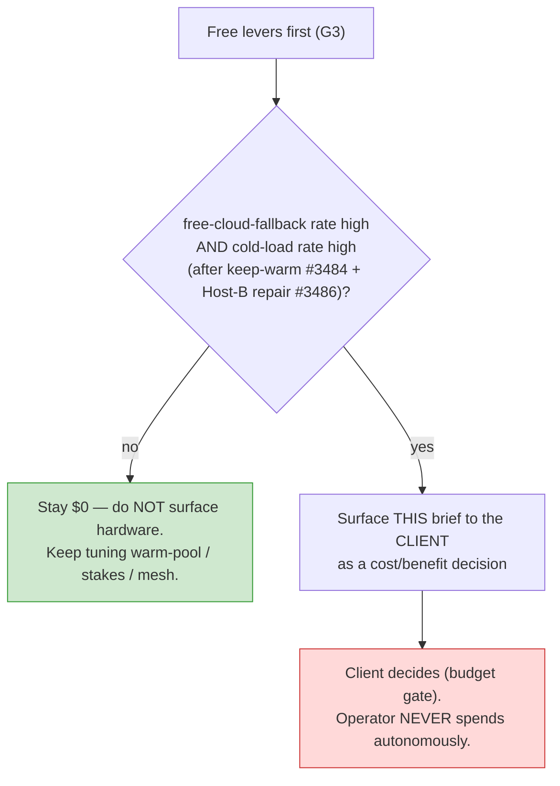

# Fleet hardware cost/benefit brief — Class C (client decision only)

> **Brief version:** v1.0 · **Generated:** 2026-07-01 · **Volatility:** HIGH — GPU pricing moves weekly;
> every figure below is order-of-magnitude and must be re-checked at decision time.
> **Authority:** this is a **client budget decision**, never an autonomous operator spend
> (operator-identity contract: the client owns the budget gate). Epic #3414 · Phase-0 #3415 §9 (Q7).

## When this brief becomes *actionable* (the decision rule)

Hardware is the one Fleet Advisor lever that trades money. It is surfaced as **actionable** only when the
measured signals show the **$0 levers are exhausted** and throughput is still the bottleneck:

The trigger metrics come from the #3485 observability signal (`fleet-advisor.report`): sustained
**free-cloud-fallback rate** + **cold-load rate** after the free levers (keep-warm #3484, stakes routing,
Host-B repair #3486) are in place. Until that threshold, the $0 path wins on G3 and this brief stays
informational.

## Options (2026, order-of-magnitude — RE-VERIFY AT DECISION TIME)

| Option | Rough cost (volatile) | Unlocks | Speedup vs CPU-offload 32B | tokens/sec (indicative) | Best when |
|---|---|---|---|---|---|
| Used 24 GB GPU (RTX 3090/4090-class) | ~$1,100–2,300 | 32B GPU-resident on Host A | order-of-magnitude (resident-vs-offload cliff) | 32B Q4 ~30–50 tok/s resident vs ~2–5 offloaded | cold-load + fallback both high; single strong host |
| New 32 GB GPU (RTX 5090) | FE ~$2,000 MSRP; AIB ~$2,900–5,000+ | 32B Q4–Q5 long-context + spec-decode headroom (+~78% bandwidth) | order-of-magnitude + higher tok/s | 32B Q4 ~50–80 tok/s; draft-model spec-decode on top | want headroom + concurrency |
| Mac 128 GB unified (M3/M4 Max) | ~$1,799 → flagship | 70B Q4 resident (~14 tok/s); silent, low idle power | large (capacity play) | 70B Q4 ~10–14 tok/s single-stream | want 70B-class quality, single-stream, low power |
| Dedicated host + CUDA GPU + vLLM | GPU + box (varies) | always-on F3/F4; continuous batching | large + availability | 10–20× aggregate under concurrent agentic load | many parallel agentic calls / multi-agent |

**The dominant variable is fit-in-fast-memory** — the GPU-resident-vs-CPU-offload cliff (§4 of the Phase-0
design) outweighs raw chip choice. A model that fits VRAM runs ~10–20× faster than the same model spilled
to system RAM; that cliff, not the headline TFLOPS, is what this spend buys.

*Sources (re-check — volatile):*
[4090 price history](https://bestvaluegpu.com/history/new-and-used-rtx-4090-price-history-and-specs/) ·
[5090 used tracker](https://www.pcprice.watch/gpu-buying-guide/rtx-5090-price-used-and-specs) ·
[Mac AI buying guide](https://localaimaster.com/blog/apple-silicon-ai-buying-guide) ·
[M3 Max vs 4090 local-LLM benchmark](https://www.sitepoint.com/mac-m3-max-vs-rtx-4090-local-llm-benchmark/).

## Keeping this brief current (no calendar staleness)

The figures are refreshed by the Fleet Advisor **AI-research pass** (#3481), which dispatches the detected
hardware + current price/benchmark queries to the free panel and stamps each finding with an `as_of` date.
A figure older than its freshness tier is auto-demoted (never silently trusted) — the harness's standing
"replay-eval over calendar" / no-stale-advice rule applied to the advice itself. This brief therefore
carries a **version + generated stamp** at the top and is regenerated, not hand-maintained on a schedule.

## Non-negotiables

- **Never an autonomous spend.** The operator surfaces this brief; the client decides. (4 retained human
  touchpoints — this is the "irreversible / budget" one.)
- **$0 first (G3).** Do not surface hardware until the free levers are measurably exhausted.
- **Volatility disclaimer travels with every figure.** Re-verify prices/benchmarks at decision time.

## Related
- Free levers that must be exhausted first: keep-warm + stakes routing (#3484), Host-B repair + F3 selector (#3486).
- Trigger metrics: observability signal (#3485).
- Currency mechanism: AI-research pass freshness controls (#3481).
