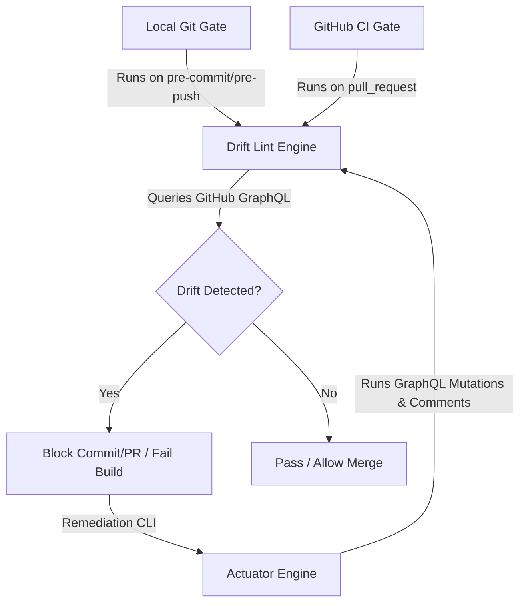

# Governance Research & Specification: Impassible Ticket Drift Guardrail
## Scoping Phase-0 Research and Technical Design for Epic #2024

> **Status**: Scoped & Spec Completed
> **Author Role**: Collaborator (Research & Scoping)
> **Baton Alignment**: `lane:docs-research`

---

## 1. Context and Problem Statement

As highlighted in the critical audit of **Epic #1956**, multi-agent and multi-team collaborative software developments are prone to **Ticket Governance Drift**. Specifically, while engineering and implementation child tickets are moved through the standard Agile workflows, the coordinating parent Epics are frequently left in stale states (`backlog`, `triage`, or `in-progress`). 

Because there is no active compile-time or push-time validator blocking development when this drift occurs, manual human oversight is currently the only check. To eliminate this class of human-error and maintain robust workflow hygiene across model fleets, we need an **impassible, compile-time governance guardrail**.

---

## 2. Web Research & 2026 Best Practices

Based on research of large-scale GitHub project management models and the GraphQL Sub-issues schema:
1. **Sub-Issue Hierarchy**: GitHub's native GraphQL `Sub-issues` feature provides robust mutations (`addSubIssue`, `removeSubIssue`) and query fields (`subIssuesSummary`, `parent`) under the `GraphQL-Features: sub_issues` header.
2. **Built-in rollup vs Custom logic**: While GitHub rolls up a progress bar on the parent issue body, it does *not* automatically transition issue labels or roles (e.g. `status:review`, `role:consultant`).
3. **Webhook propagation**: Repository webhooks trigger on `sub_issue_added` and `sub_issue_removed`, enabling live serverless actuators.
4. **Pre-push blocking**: Combining a local pre-commit/pre-push check that queries the GitHub API with CI-level actions creates a dual-layer "impassible" gate.

---

## 3. Technical Architecture of the Guardrail

The proposed guardrail system consists of three primary components:



### Component 1: The Drift Lint Engine (`scripts/global/lint-epic-drift.js`)
An automated node script that uses the GraphQL API to scan active parent Epics and their sub-issues. It detects three key classes of drift:

| Drift Class | Definition | Verification Condition | Severity |
| :--- | :--- | :--- | :--- |
| **Class A: Status Sync** | Parent Epic status does not match child tickets. | If all sub-issues are closed, Epic must be `status:review` or `status:done`. | **HIGH** (Blocks PR) |
| **Class B: Linkage Drift** | Prose-only mentions without native GraphQL linking. | Any issue containing `Parent Epic: #N` must have a native `Sub-issue` link. | **MEDIUM** (Advisory) |
| **Class C: Logging Drift** | Missing progress update comments on parent Epic. | Closed sub-issues must be cited in `## Epic Progress Update` comments. | **LOW** (Warning) |

### Component 2: The Automating Actuator (`scripts/global/actuator-epic-sync.js`)
An interactive CLI and GitHub Action runner that can be executed via:
```bash
npm run epic:sync -- --epic <number>
```
The actuator programmatically repairs drift by:
1. Converting prose mentions to native Sub-issues via GraphQL `addSubIssue` mutations.
2. Promoting the parent Epic status to `status:review` or `status:done` as appropriate.
3. Automatically posting progress update comments detailing closed children.

### Component 3: Build & Gate Integration
* **Local Hooks**: Integrated into `pre-push-gates.js` and `.git/hooks/pre-push`.
* **CI Integration**: Added as a step in `.github/workflows/megalint.yml` or within `pre-pr-gate.js`.
* **Self-Test Suite**: Registered in `inventory/harness-self-test-registry.json` and tested under `tests/validate-epic-drift.spec.js` so that `npm run test` verifies the local environment has zero drifted tickets.

---

## 4. Emergency Bypass Escape Hatch

To prevent blocking critical repository hotfixes when GitHub API outages or rate limits occur:
1. An environment variable `SKIP_DRIFT_LINT=true` can be passed to bypass the check.
2. Every bypass event prints a warning and records an incident event to `~/.megingjord/incidents.jsonl` with `pattern_id=ticket-drift-lint-bypass` for auditability.
