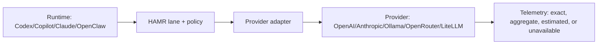

# Provider Adapter Matrix

**Ticket**: #1485  
**Parent**: #1480  
**Date**: 2026-05-14  
**Scope**: Research/docs only; no implementation files changed.

## Visual Summary

## Decision

Keep runtimes and providers separate. A runtime owns instructions, tools,
hooks, approvals, and worktree behavior. A provider owns model IDs, wire API,
usage fields, caching, budgets, and rate limits. HAMR should remain the bridge
that maps a lane to a provider adapter without making any runtime canonical.

## Capability Matrix

| Surface | Role | Tools/MCP | Hooks | Agents/skills | Cost/telemetry | Evidence |
|---|---|---:|---:|---:|---|---|
| Codex | runtime | yes | yes | yes | OTel + provider usage | OpenAI docs |
| Claude Code | runtime | yes | yes | yes | Anthropic + hooks | Anthropic docs |
| Copilot coding agent | runtime | tools only | yes | yes | plan-limited | GitHub docs |
| OpenClaw/fleet | runtime/provider | custom | harness | no | local logs | local scripts |
| HAMR | policy bridge | MCP-capable | harness | no | signed JSONL/KV | local docs |
| OpenAI-compatible | provider | API tools | no | no | usage when exposed | OpenAI/HAMR |
| Anthropic | provider | API tools | no | no | messages/cache usage | Anthropic docs |
| Ollama | provider | API tools | no | no | local usage objects | Ollama docs |
| OpenRouter | provider | API tools | no | no | key limits/usage | OpenRouter docs |
| LiteLLM | proxy | proxy tools | callbacks | no | budget/spend tracking | LiteLLM docs |

## Adapter Gaps

1. **Registry gap**: `routing-provider-adapters.json` covers lanes, but not the
   full runtime/provider capability matrix or citation-backed feature flags.
2. **Telemetry confidence gap**: exact per-call usage, aggregate usage, local
   session metadata, and estimates need an enforced confidence label.
3. **Copilot MCP gap**: Copilot coding agent supports MCP tools, but not MCP
   resources/prompts, so wiki adapters must expose retrieval as tools.
4. **OpenRouter quota gap**: free-model limits require runtime-visible backoff
   before OpenRouter can be a dependable free default.
5. **LiteLLM proxy gap**: spend tracking is strong, but harness policy still
   needs generated docs/tests before using it as the primary adapter registry.

## Follow-Up

Created #1523 to turn this matrix into a generated, linted provider capability
registry. Existing telemetry work (#1484/#1375) covers the confidence-label
path; do not duplicate it here.

## Sources

- OpenAI Codex config, subagents, and sandbox docs:
  <https://developers.openai.com/codex/config-reference>
- Claude Code hooks, MCP, settings, and subagents:
  <https://docs.anthropic.com/en/docs/claude-code/hooks>
- GitHub Copilot coding agent MCP and customization:
  <https://docs.github.com/en/copilot/concepts/coding-agent/mcp-and-coding-agent>
- Anthropic Messages and prompt caching:
  <https://docs.anthropic.com/en/api/messages-examples>
- LiteLLM proxy docs: <https://docs.litellm.ai/>
- OpenRouter limits: <https://openrouter.ai/docs/api-reference/api-reference/limits>
- Ollama OpenAI compatibility: <https://docs.ollama.com/openai>
- Local: `docs/provider-neutral-routing.md`,
  `scripts/global/routing-provider-adapters.json`,
  `scripts/global/hamr-provider-wrapper.js`, `config/litellm-config.yaml`,
  `scripts/global/ollama-direct.js`, `instructions/hamr-routing.instructions.md`.

Signed-by: Quill Harper  
Team&Model: codex:gpt-5.4@local  
Role: collaborator
