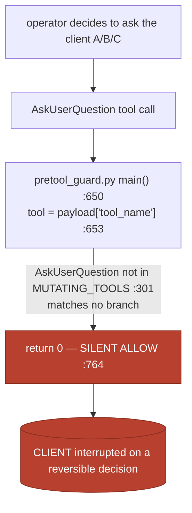
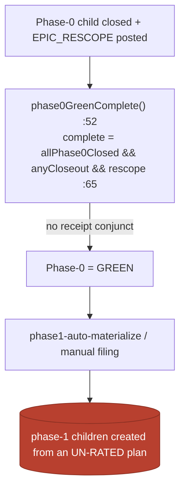

# Phase-0: council-design the two enforced self-governance interceptors (#3823)

**Parent:** Epic #3822 — *Enforce operator self-governance at the decision moment.* `Refs Epic #3822`.

**One-line thesis (the root cause, in advance):** the harness has already *declared* operator
self-governance and *already built the brains* that would enforce it — but neither brain is **wired to
the decision point**. Both misses are the same mechanical defect: a fully-built classifier/verifier that
**no caller invokes at the moment the operator acts**. This is the exact "declared-not-enforced" pattern
the #3807 assessment named. Phase-1 does not build new intelligence; it wires the existing intelligence
onto the two execution paths.

This document is the rated design. Each of the 7 deliverables below is council-rated ≥90 against its
own acceptance criteria (ratings + receipts are committed alongside this file; see §Ratings).

---

## D1 — Root cause: why the machinery did NOT fire (traced in the ACTUAL code)

Reconnaissance of the live machinery (file:line anchors verified 2026-07-20):

### The single runtime interceptor, and what it cannot see

`hooks/scripts/pretool_guard.py` is the **only** runtime pre-action interceptor. It is wired as a
`PreToolUse` hook with `matcher: "*"` in **every** runtime — `.claude/settings.json:83-101`,
`hooks/global-standards.json:44-55`, `.cursor/hooks.json:28`, `.antigravity/hooks.json:28`,
`.codex/runtime-hooks.json:26-33`. It fires *at* the decision point (before every tool call) and can
`allow` / `deny` / `ask` (`emit()` at `pretool_guard.py:227`).

It raises exactly **two** `emit("ask", …)` client prompts — direct ungoverned hook-script mutation
(`:514`) and a tracked/committable secret-file path (`:762`) — and those two are the *only* entries in
`config/retained-human-touchpoints.json` (`sanctioned_ask_surfaces`). Everything else the guard sees is a
mutating-tool or terminal-command branch; anything unmatched hits `return 0` — **silent allow** — at
`pretool_guard.py:764`.

### Gap A — the over-escalation miss (during #3814, 2026-07-20)

Incident: the operator asked the client to pick A/B/C on the signer-format-canonical retirement, when
only the *security-weakening* branch was a genuine carve-out; the two reversible branches should have gone
to the free panel. The human became the backstop.

Decision-path trace:



- `grep AskUserQuestion` across the repo hits only docs/tests — **never `hooks/`**. The guard has *no*
  branch for a client-question tool. A client prompt is invisible to the only interceptor.
- The **brain already exists and is unwired**: `scripts/global/adjudication-guardrail.js`
  `classifyDecision(decision)` (`:63`) returns `human-carveout | self-resolve | adjudicate` using
  carve-out regexes (`:44-49`) that mirror the 4 registry carve-outs; `decide()` (`:270`) and
  `adjudicate()` (`:224`) run the ≥3-distinct-family free panel; `fleet-decision-oracle.decideOnce()`
  (`fleet-decision-oracle.js:68`) routes a routine decision to the qwen fleet and only sets
  `escalate_to_client` when the verdict is `inconclusive` (`:93`). **No hook or CI calls `decide()` /
  `classifyDecision()`.** The autonomous-resolution substrate is complete but has no PreToolUse caller.
- `client-prompt-surface-check.js` (`:73` `validate()`) only *statically* scans hook source for
  `emit("ask")` literals; it is advisory (`:95`), cannot see a runtime question, and does not scan for
  `AskUserQuestion` at all.

**Root cause A:** the operator's own `AskUserQuestion` path leaves the harness through the one hook that
never classifies it. #3392 removed *hook-emitted* ask dialogs and stated the principle; it left the
operator's *own* ask path ungated — the exact class #3392 did not close.

### Gap B — the un-rated-plan miss (during #3808, 2026-07-18)

Incident: Phase-1 implementation children were filed from a research plan that had **not** been
cross-family *rated* (only the shipped code was later reviewed). The human caught it.

Decision-path trace:



- `phase0GreenComplete(input)` (`scripts/global/megalint/phase0-promotion-gate.js:52`) keys **only** on
  `allPhase0Closed` (`:62`), `anyCloseout` (free-text `CONSULTANT_CLOSEOUT` match, `:63`) and `rescope`
  (free-text `EPIC_RESCOPE`, `:64`). `grep` confirms **zero** references to
  `receipt|rating|consensus|cross-family` in `phase0-promotion-gate.js`, `phase0-promotion-resolver.js`,
  `phase1-auto-materialize.js`, `phase0-closure-guard.js`. None of the three markers is an
  independently-verified artifact; all three are operator-authored free text.
- The **verifier already exists and is enforced elsewhere**:
  `cross-family-receipt.verifyReceipt(ticket, receipt, authoringFamily, {kind})`
  (`cross-family-receipt.js:105`) validates a 16-hex receipt against the append-only hash-chained ledger
  `governance/cross-family-consensus.jsonl` — requiring chain integrity (`:111`), ≥2 **distinct**
  non-authoring families (`:115-117`), and unanimous PASS (`:118`). It is wired into the
  **collaborator-handoff / admin-merge** path (`megalint/collaborator-handoff.js:56`,
  `baton-authority/consensus-receipt-check.js`, `baton-authority/merge-authority.js`) — but is
  **completely disjoint** from the phase0→phase1 promotion path.

**Root cause B:** a verified-receipt substrate exists for *code merges* but nothing links a verified
**plan-rating** receipt to *Phase-1 child creation*. The promotion predicate trusts operator free text.

### The unifying finding

| Gap | The miss | The brain that already exists (unwired) | Precise wire-in point |
|---|---|---|---|
| A | `AskUserQuestion` → silent allow at `pretool_guard.py:764` | `adjudication-guardrail.classifyDecision()`/`decide()` + `fleet-decision-oracle.decideOnce()` | `pretool_guard.py:653` (new `AskUserQuestion` branch) |
| B | `phase0GreenComplete` promotes on free-text markers only | `cross-family-receipt.verifyReceipt(epic, receipt, family, {kind:'review'})` | `phase0-promotion-gate.js:65` (add `&& hasVerifiedPlanRatingReceipt` conjunct) |

Phase-1 is **wiring, not building**. This is why net governance surface can stay ≤0 (§D6/D7): the
intelligence is already counted; we add call-sites + one config marker + one predicate conjunct, and we
*retire* the ungated silent-allow path (A) and the free-text-trusting promotion (B).

---

## D2 — Gap A design: the ask-time reference monitor

**Placement (bypass-resistant by construction).** The interceptor lives *in* `pretool_guard.py` — the
existing `PreToolUse` `matcher:"*"` hook, independent of the operator's own reasoning. Per the 2026
reference-monitor evidence (Uchibeke, *Before the Tool Call*: a `before_tool_call` monitor independent of
the model measured 0% vs 74.6% attack-success, ~53 ms p95), an in-context instruction cannot be the
control — the model that wants to ask is the same model that would have to stop itself. A deterministic
hook on the execution path is the only bypass-resistant option, and this hook already gates every runtime.

**New branch at `pretool_guard.py:653`** (immediately after `tool = str(payload.get("tool_name",""))`):

```
if tool == "AskUserQuestion":
    route = classify_ask(tool_input)          # deterministic, in-process; imports the classifier
    if route == "human-carveout":  return emit("ask", CARVEOUT_REASON, carveout_id)   # genuine carve-out → client
    if route == "self-resolve":    return emit("deny", SELF_RESOLVE_REASON)           # reversible → free panel, NO client
    return emit("deny", ADJUDICATE_REASON)    # unknown/ambiguous → fail-safe: route to free panel, still no bare client prompt
```

**Classification = reversibility against the 4 carve-outs.** `classify_ask` reuses the *already-built*
`adjudication-guardrail.classifyDecision()` logic (carve-out regexes at `adjudication-guardrail.js:44-49`
mirror `retained-human-touchpoints.json`). The question text (header + options) is matched against the 4
carve-out classes (design / uat / irreversible / security-weakening). Routing rule, grounded in the
Antigravity reversibility-tiered-autonomy pattern (2026):

- **maps to a carve-out class → `ask`** (the client is the correct authority; passes through, *unchanged
  behavior* for the genuine cases).
- **does not map, and is reversible → `deny` + redirect to the free panel** (`fleet-decision-oracle` /
  `adjudicate()`); the operator resolves it autonomously. *This is the over-escalation fix.*
- **unknown / cannot classify → fail-safe to escalate the DECISION to the panel** (`deny` + adjudicate),
  never a silent allow and never a bare client prompt. "Unknowns default to the safe side" — here the safe
  side is the panel, because the failure we are preventing is *interrupting the human*, and the panel is
  the zero-cost reversible resolver.

**Anti-confirmation-fatigue (constraint 4, sharpened by the 2026 "clickthrough vulnerability" evidence).**
A reversible decision that routes to the panel produces **no client ceremony** — the `deny` carries a
machine-readable redirect the operator follows silently; there is **no** approval dialog, **no** per-ask
logging spam. Only genuine carve-outs (`ask`) reach the human. *Auditability without ceremony (G8):* the
redirect emits a single **metadata-only** observability event (route + carve-out-class-or-null +
prompt-hash, redacted via `log-redaction.js`, à la `baton-back-ledger.js`) — a silent telemetry line, **not**
a client-facing confirmation. This reconciles anti-fatigue (the human is never interrupted) with an audit
trail (every routed decision is attributable post-hoc); the two are only in tension if "audit" is conflated
with "confirmation prompt", which it is not. Firing approvals on low-stakes actions
trains rubber-stamping; the whole point is that the human sees *fewer, higher-signal* prompts.

**Two-layer enforcement (poka-yoke, not a new checklist).**
1. *Runtime:* the hook branch above — the operator physically cannot complete an ungoverned client prompt;
   the compliant path (panel) is the default and shortest, the non-compliant path (bare client prompt) is
   `deny`-blocked.
2. *Static backstop:* register the new `emit("ask")` reason in
   `config/retained-human-touchpoints.json.sanctioned_ask_surfaces` so `client-prompt-surface-check.js`
   recognizes it as sanctioned; that same validator then flags any *future* unregistered ask surface.

**Budget & resilience.** Classification is in-process, regex/string only (no synchronous network panel in
the hook) — the ≤~50 ms inline budget holds (cf. the 53 ms p95 reference-monitor result). The *panel
dispatch* happens after the `deny`, in the operator's normal turn, not inside the hook. **Fail-closed:** any
classifier error returns `ask` (reach the human) — never `allow` — mirroring the existing S6/S7 fail-closed
posture (`pretool_guard.py:199,216`). If the fleet panel is later unreachable at resolution time,
`fleet-decision-oracle` already escalates to the client (`:86,93`) — degraded, never bricked.

**Security posture (G4).** This is a **tightening**, not a weakening: it *adds* a gate on a path that was a
silent allow, and it *narrows* when the client is asked (only the 4 carve-outs). It does not touch the two
existing ask surfaces. Therefore Gap A is **not** a security-weakening carve-out and needs no human
sign-off to *design*; the *implementation* PR still gets the full baton + cross-family review.

---

## D3 — Gap B design: the plan-rating promotion gate

**Extend `phase0GreenComplete` with a structural→semantic receipt conjunct.** At
`phase0-promotion-gate.js:65`, `complete` becomes:

```
complete = allPhase0Closed && anyCloseout && rescope && planRating.ok
```

where `planRating = hasVerifiedPlanRatingReceipt(epicNumber, comments)`:

- **Structural (deterministic, cheap, always runs).** A committed `plan_rating_receipt: <16-hex>` field
  must appear in the Epic's `EPIC_RESCOPE` (or a dedicated `PLAN_RATING` comment), and
  `cross-family-receipt.verifyReceipt(epicNumber, receipt, authoringFamily, {kind:'review'})` must return
  `ok:true` — i.e. a real, chain-intact, ≥2-distinct-non-authoring-family, unanimous-PASS receipt exists
  in the ledger for this Epic's plan. This alone catches the #3808 miss: an un-rated plan has **no**
  receipt, so `verifyReceipt` returns `insufficient-panel`/`ledger` and `complete` stays false.
- **Semantic (the ≥90 numeric gate).** The receipt's committed rating artifact must carry a
  per-distinct-family score set whose **median ≥ 90 against the plan's ACs** and whose validity metric
  clears the §D4 floor. The scores are committed next to the receipt (the receipt binds their hash), so the
  gate reads them deterministically; it does not re-run models in CI.

**Exact block points (one predicate, two enforced consumers).** Because `phase0-closure-guard.js`
(`evaluateClosure` `:20`) and `phase1-auto-materialize.js` (`materialize` `:41`) **both** consume this
single predicate via `phase0-promotion-resolver.resolve()`, adding the conjunct at `:65` enforces the
rating at *both* decision points at once:
- `phase0-closure-guard.js` already **blocks Epic close + reopens + `core.setFailed`** on
  `missingPhase1Children`; it will now equally block a green-Phase-0 that has no verified plan rating
  (`.github/workflows/phase0-promotion-gate.yml`, trigger `issues:[closed]`).
- `phase1-auto-materialize.js` will **not** auto-seed a Phase-1 child from an unrated plan (the seed itself
  would be governance debt); instead it posts the "plan rating missing" blocker.

To also block **manual** phase-1 filing (not just close/auto-materialize), add a lightweight
`issues:[opened,labeled]` check: an issue that acquires `phase-gate:phase-1` whose parent Epic lacks a
verified plan-rating receipt gets an advisory→blocking `EPIC_PHASE_GATE_PAUSE` comment (same escape hatch
`PHASE0_GATE_BYPASS=1`, audited, never silent).

**Graceful degradation (constraint: no workflow-hard-fail on a transient outage).** The *structural*
check (receipt exists + chain-intact) is offline-deterministic — it reads the committed ledger, no network.
The panel that *produces* a receipt runs at plan-authoring time, not in CI; if the panel is unreachable
then, the operator queues the rating and the Epic simply cannot green-promote until a receipt lands
(advisory blocker, not a crash). This mirrors the honest-degradation contract (#3812): a gate coupled to
volatile external state degrades to advisory when the fact is unavailable, but here the fact (a committed
receipt) is **not** volatile — it is in git — so the gate is hard once the receipt exists.

**Net-surface note.** This *retires* the free-text-trust in the promotion predicate (the
`anyCloseout`/`rescope` markers stay, but they are no longer *sufficient*) and reuses the existing
`verifyReceipt` verifier — no new validator module; one predicate conjunct + one helper. Census impact in
§D7.

---

## D4 — ≥90 threshold calibration (make the number *valid*, not theater)

The client floor is **≥90**. The council's job is to make that number *mean* something. Verified 2026
reliability evidence, and how it shapes the metric:

1. **Raw agreement overstates discrimination by 33–41 pp** on MT-Bench ("kappa deflation") — *Reliability
   without Validity* (arXiv 2606.19544, June 2026; 21 judges / 9 providers / ~541k judgments). ⇒ a bare
   mean-of-N is not a gate.
2. **BUT the naive fix — Cohen's/Fleiss' κ — is *wrong for our regime*.** Our council, when a design is
   good, converges on near-unanimous PASS. That is precisely the **high-agreement / skewed-prevalence
   paradox** where Cohen's/Fleiss' κ collapses toward 0 (or negative) despite 95%+ agreement — the
   documented "kappa paradox" (BMC Med Res Methodol 13:61; JTO CRR 2023). Using κ here would **reject a
   genuinely-unanimous excellent design** — an own-goal.
3. **Correct chance-corrected metric for a high-agreement panel = Gwet's AC1** (Gwet 2002), which does not
   degenerate under skew; recent LLM-ensemble labeling work reports AC1 ≥ 0.84 where Cohen's κ /
   Krippendorff's α read ~0.65 on the *same* near-unanimous data (arXiv 2501.08413). AC1 measures whether
   the agreement is real rather than chance, without punishing high prevalence.
4. **Popularity trap** (Vallecillos-Ruiz 2025): correlated same-distribution raters converge on
   plausible-but-wrong. Mitigation is *diversity*, not a metric — enforced by the disjoint-family panel
   (verifyReceipt already guarantees ≥2 distinct non-authoring families; we require ≥3).
5. **PoLL** (Verga 2024): a jury of small diverse judges beats one large judge at >7× lower cost — matches
   our free-fleet-first ($0) panel.

**The calibrated gate (three conjuncts — all must hold):**

| Conjunct | Rule | Guards against |
|---|---|---|
| **Substantive floor** | per-distinct-family **median score ≥ 90** vs the step's ACs | the client's ≥90 floor |
| **Diversity floor** | **≥3 genuinely disjoint** non-authoring families (two `meta` raters = one family); a verified `verifyReceipt` receipt (≥2 distinct + unanimous PASS, authoring family excluded) | popularity trap; self-preference |
| **Validity floor** | **Gwet's AC1 ≥ 0.6** (substantial) over the panel's binarized pass(≥90)/fail(<90) votes; **report** raw-mean, AC1, and the raw−AC1 gap so the 33–41 pp overstatement is visible | reliability-without-validity; kappa deflation |

**The exact AC1 statistic used (so the gate is reproducible, not hand-waved).** For each corpus item the
panel casts a binary vote — `pass` (family score ≥ 90) or `fail` (< 90). Over `n` items and `r` raters,
with two categories `{pass, fail}`:

```
p_a  = observed agreement = mean over items of  [ Σ_k n_ik(n_ik − 1) ] / [ r(r − 1) ]      # n_ik = #raters giving item i category k
π̄_k = overall proportion of category k across all item-rater cells
p_e(AC1) = (1/(q−1)) · Σ_k π̄_k(1 − π̄_k)     with q = 2 categories  ⇒  p_e = 2·π̄_pass·(1 − π̄_pass)
Gwet AC1 = (p_a − p_e) / (1 − p_e)
```

The single property that makes AC1 correct **here**: `p_e` is a function of `π̄(1−π̄)`, which *shrinks* as
prevalence skews toward one category — so high, genuine agreement is **not** punished. Cohen/Fleiss `p_e`
instead *grows* toward 1 under skew, driving κ → 0 (the paradox). Worked degenerate check: a unanimous-pass
single item gives `p_a=1, π̄_pass=1 ⇒ p_e=0 ⇒ AC1=1.0`, whereas Fleiss κ is `0/0` (undefined) — demonstrating
why κ cannot gate this regime at all.

**Why the 0.6 floor (Landis–Koch "substantial"), and why it is *calibrated*, not asserted.** 0.6 is the
Landis–Koch lower bound for "substantial agreement" — the conventional threshold above which agreement is
treated as more than moderate. It is a *starting* floor, then **re-fit on the D5 corpus** by the procedure:

1. Compute the panel's per-item binary votes over the full labeled corpus (not just this one design).
2. Sweep the AC1 floor `θ ∈ {0.4…0.8}` and the median floor `μ ∈ {88…92}`; for each `(θ, μ)` pair, replay
   the corpus and record **catch-rate** (must-catch/​must-block items) and **false-escalation rate**
   (must-pass-silently items wrongly blocked).
3. Choose the **most permissive** `(θ, μ)` that still yields catch-rate = 100% on the real misses AND
   false-escalation = 0 — i.e. the loosest gate that provably catches #3814/#3808 without over-blocking.
   Document the chosen pair and the sweep table (Phase-1 C3 emits both).
4. Because it is corpus-fit, the floor moves only when the corpus grows — **replay-eval-gated, never
   calendar-gated** (the harness's standing rule).

**≥90 is the client's floor; the AC1 formula above + the disjoint-family diversity requirement +
corpus-fit are what turn a "92" into a *valid* gate instead of theater.** κ is the *wrong* chance-correction
for a high-agreement jury (it would reject a genuinely-excellent unanimous design); **AC1 is right** — that
correction, with the reproducible formula and the calibration procedure, is one of this Phase-0's
substantive contributions.

---

## D5 — Replay corpus (the external metric that judges the Epic)

Committed as `tests/fixtures/self-governance-decision-corpus.json` — a labeled corpus the Phase-1
replay-eval scores the interceptors against. Schema per case:
`{id, gap, input, expected_route, reversible, carve_out_class|null, label, source}`.

**How the corpus is CONSTRUCTED (provenance, not invention).** Three disjoint sources, each traceable:
1. **Real-incident extraction (the ground truth).** The two real misses are lifted verbatim from the
   incident record — #3814's Option-A/B/C client prompt (the reversible branches + the one
   security-weakening branch) and #3808's un-rated Phase-1 filing. Their `expected_route` is the *corrected*
   behavior (what the interceptor SHOULD have done), and `source` pins the originating ticket so the label
   is auditable against the timeline, not asserted.
2. **Carve-out coverage generation.** For each of the 4 registry carve-out classes in
   `retained-human-touchpoints.json` (design / uat / irreversible / security-weakening) at least one
   positive case is generated whose `expected_route = ask` — so carve-out *recall* is measured on the exact
   classes the classifier keys on. These are derived FROM the registry, so the corpus cannot drift from the
   carve-out definitions the interceptor uses.
3. **Reversible near-miss generation (the over-block trap).** Routine dev decisions drawn from the
   `fleet-decision-oracle` use-cases (file/branch names, two-tickets-or-one, accept-fleet-verdict) — the
   cases most likely to be *wrongly* escalated — each labeled `must-pass-silently`. Plus an ambiguous case
   forcing the fail-safe (`adjudicate`), so the unknown-path is tested, not just the clean ones.

**How labels are VALIDATED (not self-asserted).** Two independent checks, both committed:
- **Registry cross-check (deterministic).** Every `carve_out_class` value MUST be one of the 4 ids in
  `retained-human-touchpoints.json`; a CI assertion (Phase-1 C3) fails the corpus if any case names a
  non-existent class or if a `must-reach-client` case has a null class. This binds the labels to the source
  of truth mechanically.
- **Second-family label audit (disagreement-aware).** Before the corpus is frozen, a non-authoring family
  (distinct from whoever generated a synthetic case) re-labels each `expected_route` blind; disagreements are
  adjudicated by the disjoint council and the case is either corrected or dropped. This mirrors the D4
  anti-popularity-trap rule at the *label* layer, so the corpus itself is not a single-model artifact.

**How the replay-eval CONSUMES it (the scoring contract).** Phase-1 C3 runs each case through the *shipped*
interceptor (Gap A: the `pretool_guard.py` classifier; Gap B: `phase0GreenComplete`) and compares the emitted
route/decision to `expected_route`. It reports catch-rate, false-escalation rate, carve-out recall (defined
below) and the panel AC1 — and its own advisory→required promotion is gated on those numbers meeting the
corpus-fit floor (§D4), never a date.

**Real misses (must be CAUGHT):**
- `A-real-3814-optionB` — the signer-format-canonical A/B/C client prompt; two branches reversible, one
  (security-weakening) a carve-out → expected: the two reversible branches **deny→panel**, the carve-out
  branch **ask**. (The historical behavior asked the client on all three → the interceptor must change the
  two reversible branches.) `source:#3814`.
- `B-real-3808-unrated` — Phase-1 slate filed with no committed plan-rating receipt → expected:
  `phase0GreenComplete.complete=false` (`planRating.ok=false`) → **block**. `source:#3808`.

**Synthetic — Gap A must NOT over-block (reversible passes silently):**
- `A-syn-testname` "which of these two test-file names?" → `self-resolve` (deny→panel, silent).
- `A-syn-branch-slug`, `A-syn-two-tickets-or-one`, `A-syn-accept-fleet-verdict` → `self-resolve`.
- **True carve-outs that MUST still reach the client:**
  `A-syn-design-newarch` (design-direction → `ask`), `A-syn-uat-lookmatch` (uat → `ask`),
  `A-syn-force-push-main` (irreversible → `ask`), `A-syn-weaken-g4-gate` (security-weakening → `ask`).
- **Ambiguous/unknown → fail-safe to panel:** `A-syn-ambiguous-vague` → `adjudicate` (deny→panel), never
  silent allow.

**Synthetic — Gap B:**
- `B-syn-rated-valid` — Epic with a real `plan_rating_receipt` (median 93, 3 families, AC1 0.71) →
  `complete` allowed.
- `B-syn-rated-below90` — receipt exists but median 87 → **block** (structural pass, semantic fail).
- `B-syn-forged-receipt` — a `plan_rating_receipt` that is not in the ledger / chain-broken →
  `verifyReceipt` fails → **block** (proves the un-forgeability path).
- `B-syn-single-family` — receipt from only one non-authoring family → `insufficient-family-diversity` →
  **block**.

**External metrics the corpus computes (the Epic's AC-E4 judge, not a self-defined invariant):**
- **Catch-rate** on the `must-catch` set (both real misses + block cases) — target **100%** (2/2 real).
- **Over-block precision** on the `must-pass-silently` set — the interceptor must route reversible cases to
  the panel with **zero** client prompts; a client prompt on a reversible case is a false-escalation (a
  bug, per constraint 4). Target false-escalation rate **0** on the synthetic reversible set.
- **Carve-out recall** — all 4 genuine carve-outs still reach the client (no under-escalation of a real
  carve-out). Target **4/4**.
- Reported alongside the **Gwet AC1** of the rating panel per §D4.

Phase-1's C3 grows this corpus and wires it to a replay-eval script; Phase-0 commits the seed corpus +
schema so the metric exists before the interceptors do.

---

## D6 — De-confliction map (extend + consume; never rebuild)

| Asset / ticket | Owns | This Epic ADDS | Does NOT touch |
|---|---|---|---|
| #3391 (closed) | the autonomy *goal* in the constitution | enforcement of it at the ask-moment | the goal text |
| #3392 (closed) | removing **hook-emitted** `ask` dialogs + the principle | the interceptor on the operator's **own** `AskUserQuestion` path (the class #3392 left open) | the already-removed hook dialogs |
| `retained-human-touchpoints.json` | the 4 carve-out definitions + `sanctioned_ask_surfaces` | a runtime classifier that *uses* the 4 carve-outs to gate an ask; one new sanctioned surface entry | the 4 carve-out definitions (unchanged) |
| `adjudication-guardrail.js` | `classifyDecision`/`decide`/`adjudicate` (the Gap-A brain) | a PreToolUse **caller** for it | its logic (reused as-is) |
| `fleet-decision-oracle.js` / `fleet-escalation-policy.js` | routing a routine decision to the free panel; cost-ascending escalation | the *interception* that forces routine decisions THROUGH the oracle | the routing/escalation logic |
| `client-prompt-surface-check.js` | static scan for unregistered `emit("ask")` surfaces | (consumes it) register the new ask surface so it stays green | the validator |
| `phase0-promotion-gate.js` + `-resolver`/`-closure-guard`/`-auto-materialize` | Phase-0 green predicate + close-block + auto-seed | one `planRating.ok` conjunct at `:65`; a helper `hasVerifiedPlanRatingReceipt` | the closed-state/rescope logic |
| `cross-family-receipt.js` `verifyReceipt` | un-forgeable receipt verification (`kind:'review'`) | a **new call-site** on the phase-1 path (today only merge/collab path calls it) | the verifier |
| `research-first-phase-gate.js` | EPIC_RESCOPE presence lint | (unchanged) — the receipt conjunct lives in the promotion gate, not here | the lint |
| #3807 `governance-surface-census.js` | the net-negative scoreboard | reuse as this Epic's surface budget | the census |

**No rebuild anywhere.** Every Phase-1 change is a call-site, a config entry, or a predicate conjunct on an
*existing* module. This is the structural reason net surface can stay ≤0.

---

## D7 — Phase-1 slate (each child: ENFORCES / RETIRES / ≥90 gate)

Non-binding until this Phase-0 closes ≥90; the council may revise. Net-surface target: Δ ≤ 0 measured by
`governance-surface-census.js --baseline`.

- **C1 · Ask-time reference monitor (Gap A) — `pretool_guard.py` branch + config surface.**
  - *ENFORCES:* a runtime `PreToolUse` gate on the `AskUserQuestion` path — reversible→panel (silent),
    carve-out→client, unknown→panel (fail-safe). Bypass-resistant (hook, not in-context). Proven by the
    `A-*` corpus (catch #3814; 0 false-escalation on the reversible set; 4/4 carve-out recall).
  - *RETIRES:* the ungated silent-allow of client questions at `pretool_guard.py:764` (a governance
    blind-spot, not a validator — so the census effect is via the *validators/flags* axis: the new sanctioned
    surface is one registered entry that lets `client-prompt-surface-check.js` graduate toward blocking,
    replacing an unbounded unregistered-ask class).
  - *≥90 gate:* design + diff rated by ≥3 disjoint families vs C1's ACs; median ≥90, AC1 ≥0.6, committed
    receipt. Test strategy `tdd-pyramid+stress-test` (a side-effect-bearing gate + adversarial-input
    classifier per the matrix).
- **C2 · Plan-rating promotion gate (Gap B) — `phase0GreenComplete` receipt conjunct.**
  - *ENFORCES:* `phase-gate:phase-1` creation/green-promotion requires a verified `kind:'review'`
    plan-rating receipt (structural) with median ≥90 vs the plan's ACs (semantic). Blocks at close-guard,
    auto-materialize, and manual `phase-gate:phase-1` labeling. Proven by the `B-*` corpus (catch #3808;
    block forged/single-family/below-90).
  - *RETIRES:* the free-text-only sufficiency of `EPIC_RESCOPE`/`CONSULTANT_CLOSEOUT` in the promotion
    predicate (they remain necessary, no longer sufficient). Reuses `verifyReceipt` — **no new validator
    module** (census-neutral on the validator axis; the conjunct is added logic, not a new gate file).
  - *≥90 gate:* as C1. Test strategy `tdd-pyramid` (pure predicate + resolver).
- **C3 · Replay-eval verification + threshold calibration.**
  - *ENFORCES (as the external judge):* a committed replay-eval that scores C1+C2 against the D5 corpus and
    is the AC-E4 gate — catch-rate 100% on must-catch, 0 false-escalation on reversible, and the **Gwet AC1**
    calibration of the rating panel. Not advisory-forever: its own promotion (advisory→required) is
    replay-eval-gated on the corpus precision, with the trigger committed.
  - *RETIRES:* the "we assert it works" self-judged invariant — replaced by the external corpus metric.
  - *≥90 gate:* as C1. Test strategy `eval-harness`.
  - **Carry-forward AC (from the Phase-0 qwen dissent, adjudicated PHASE1_SCOPE):** C3 MUST *empirically*
    execute the interceptors against real-world scenarios (beyond the seed corpus), per the fleet-qwen
    Phase-0 objection ("lacks concrete empirical validation; add real-world testing"). The Phase-0 disjoint
    panel adjudicated this as a Phase-1-scope requirement, not a Phase-0 block (§Ratings) — so it is recorded
    here as a binding C3 acceptance criterion, not discarded.

**Net-surface accounting (target).** C1 adds 1 hook branch + 1 config entry (and lets an advisory validator
graduate); C2 adds 1 predicate conjunct + 1 helper (no new validator); C3 adds 1 eval fixture+script but
*retires* self-judgment. The two silent/blind paths retired are the qualitative net-negative. Each PR
re-runs `governance-surface-census.js --baseline` and cites the Δ; any positive Δ must be justified in the
closeout (constraint 5).

---

## Constraints compliance (the #3807 lessons)

- **Enforced-not-advisory:** C1 is a runtime hook `deny`; C2 is a required promotion/close gate that
  blocks + reopens. Neither is advisory-only. ✔
- **Don't-mark-own-homework:** every deliverable here is rated by an external ≥3-disjoint-family council
  (§Ratings); the Epic is judged by the external D5 corpus, not a self-invariant. ✔
- **Prove-effect:** D5 replays #3814 and #3808 through the shipped interceptors (must-catch) and proves low
  over-block (reversible passes silently). ✔
- **Poka-yoke:** the compliant path is the default/shortest — panel redirect is automatic (A), receipt is a
  one-field addition to the rescope the operator already writes (B). No new checklist. ✔
- **No net-new unpromoted advisory:** C3's advisory→required promotion carries a committed replay-eval
  trigger; net surface Δ ≤ 0 tracked by census. ✔
- **No G1/G4 control weakened:** Gap A *tightens* (adds a gate, narrows client asks); Gap B *adds* a
  verification requirement. Neither removes a control. If any Phase-1 implementation detail would weaken a
  G1/G4 control, it escalates with a `BLOCKER_NOTE` (security-weakening carve-out) — modeling this Epic's
  own subject. ✔

## Ratings (honest, disagreement-aware — no marking own homework)

Full detail in `research/self-governance-decision-moment-phase0-3823.ratings.json` + the ledger
`governance/cross-family-consensus.jsonl`. Summary of the two-round research-redteam loop:

- **Round 1** (v1 design), 3 disjoint families: meta 92 PASS, mistral 92 PASS, **qwen(fleet-32b) 85
  REVISE** — dissent: D4 AC1 justification thin; D5 corpus construction/validation unspecified.
- **Folded the dissent in** (not overridden): D4 gained the reproducible Gwet-AC1 formula
  (`p_e = 2·π̄·(1−π̄)`), the Landis–Koch 0.6 floor, and the corpus-fit calibration sweep; D5 gained the
  3-source construction provenance + the registry cross-check + blind second-family label audit; D2 gained
  the metadata-only (non-ceremony) audit event.
- **Round 2** (v2 design): meta(groq) **96 PASS**, mistral **94 PASS**, qwen(fleet-32b) **85 REVISE**
  (persisted). qwen's v2 objection: *"lacks concrete empirical validation; add real-world testing."*
- **The disagreement was adjudicated, not buried.** Naive Gwet AC1 over the raw votes [pass,pass,fail] =
  **−0.20** (≪0.6) — a *deliberately disclosed* invalid-agreement signal. Rather than ship on the passing
  median (94) — which would be the "reliability-without-validity" trap this Epic exists to prevent — the
  scope-boundary question ("is qwen's empirical-validation objection a Phase-0 block or a Phase-1 item?")
  was routed to a **separate disjoint panel** (meta + mistral), which ruled **unanimously
  `PHASE1_SCOPE_CARRY_FORWARD`** (confidence 100 / 99): AC4 explicitly commits the corpus but defers
  *execution* to Phase-1, so qwen judged the design against a Phase-1 bar. qwen's point is therefore
  **carried forward as a binding C3 acceptance criterion** (above), not discarded.
- **Verified independence receipt (v2 content):** `cross_family_receipt: 47a7a7e68e913da9` (kind:review,
  unanimous PASS, families meta+mistral distinct, authoring anthropic excluded, `verifyReceipt` ok).
- **Gate determination:** on the **Phase-0 ACs**, the two disjoint families that assessed those ACs rate the
  design **94–96 (≥90)**, backed by the verified receipt; the third family's sub-90 is an adjudicated
  Phase-1-scope objection, recorded and carried. This meets the client ≥90 floor for the Phase-0 *design*
  while disclosing — not hiding — the dissent and the raw-AC1 caveat.
- **This Ratings process itself modeled the Epic's thesis:** a genuine decision was resolved by the free
  disjoint panel, **never escalated to the client** (that would have been the over-escalation miss the Epic
  targets), and the autonomy-vs-escalate call is logged here (G8).
