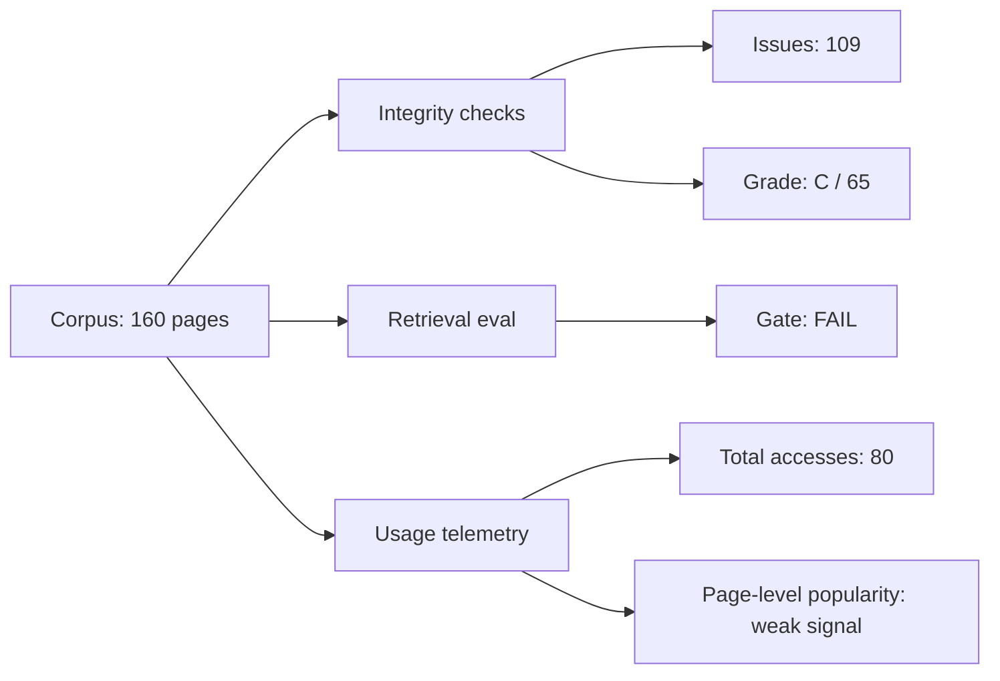

# #1625 — epic(knowledge): karpathy wiki critical analysis + hardening research

> **Source**: github:issue/1625 | **state: CLOSED** | **Labels**: type:epic, priority:P1, area:knowledge, status:cancelled, lane:research, resolution:duplicate
> Mirror of `gh issue view 1625` (derived; edit the GitHub item, not this page).

## Body

## Objective
Investigate and harden the Karpathy LLM Wiki as a governed knowledge substrate for the harness, based on measured usage, measured quality, and tooling gap analysis.

## Initial critical analysis (baseline, completed)
Date: 2026-05-15

### 1) Frequency of use (measured)
| Signal | Measured value | Interpretation |
|---|---:|---|
| Wiki operations logged | 61 entries | Active operational use over time |
| Wiki pages (markdown) | 160 pages | Large enough corpus for structure/quality drift risk |
| Git touches to wiki paths (90d) | 300 path touches across 168 distinct files | High churn and broad surface area |
| Dashboard access events (`logs/wiki-metrics.json`) | 80 total accesses | Moderate observed reader usage |
| Last recorded wiki access | 2026-05-13 | Usage exists, but recent activity is not continuous daily |

### 2) Measurable benefits to the harness
| Benefit | Evidence | Measurable implication |
|---|---|---|
| Shared memory substrate across workflows | 160-page wiki corpus and 61 operation log entries | Reduced rediscovery effort and faster context carryover |
| Governance observability integration | Dashboard/wiki metrics + health endpoints in active use | Health can be monitored and trended |
| Retrieval quality floor exists | `scripts/wiki/eval-harness.js` reports quality metrics with explicit gate | Objective pass/fail framework exists (not subjective-only) |
| Structural linting exists | `wiki:lint` detects broken/orphan/frontmatter/index drift | Detectability of integrity defects is present |

### 3) Wiki health (measured now)
| Health metric | Value |
|---|---:|
| Pages scanned | 160 |
| Total issues (dashboard health model) | 109 |
| Broken links | 0 |
| Orphans (dashboard model) | 31 |
| Frontmatter issues (dashboard model) | 4 |
| Index sync misses | 74 |
| Computed grade | C (score 65) |
| Hygiene stale count | 18 |
| Hygiene weak-link pages | 46 |
| Retrieval eval gate | FAIL (mean_precision 0.12, mean_recall 0.5; floor 0.4) |

### 4) Tooling gaps identified
1. **Health model inconsistency**: dashboard health and wiki lint/hygiene use different criteria and produce divergent orphan/frontmatter counts.
2. **Index drift at scale**: 74 pages missing from index indicates index maintenance is not keeping pace with growth.
3. **Frontmatter parser fragility**: simplistic YAML-ish parsing is susceptible to schema mismatch and partial metadata loss.
4. **Usage telemetry under-specification**: section-level counts exist, but no reliable page-level popularity signal (`pages` map remains empty).
5. **Retrieval benchmark quality gap**: eval gate fails; expected slugs are missing from corpus and/or retrieval weighting is underperforming.
6. **Schema/tooling drift**: schema in wiki docs is richer than what runtime checks enforce.
7. **Timestamp integrity anomaly**: future-dated entry (`2026-07-14`) appears in wiki log; chronology guard is missing.

### Visual — risk matrix
| Gap | Likelihood | Impact | Risk |
|---|---:|---:|---:|
| Index drift | High | High | 🔴 |
| Retrieval eval fail | High | High | 🔴 |
| Health-model inconsistency | High | Medium | 🟠 |
| Frontmatter parser fragility | Medium | High | 🟠 |
| Weak usage telemetry granularity | High | Medium | 🟠 |
| Chronology anomaly detection missing | Medium | Medium | 🟡 |

### Visual — current health snapshot

## Scope of this Epic
- Research and design hardening of wiki quality, usage telemetry, and retrieval quality governance.
- Define a unified health contract and enforcement strategy.
- Define measurable improvement targets and evidence model.

## Explicit hold (per directive)
- No AC checklist defined in this Epic yet.
- No child tickets defined from this Epic yet.
- Child decomposition deferred until initial research ticket is completed optimally.

Signed-by: Quill Mason
Team&Model: codex:gpt-5.4@openai
Role: manager

