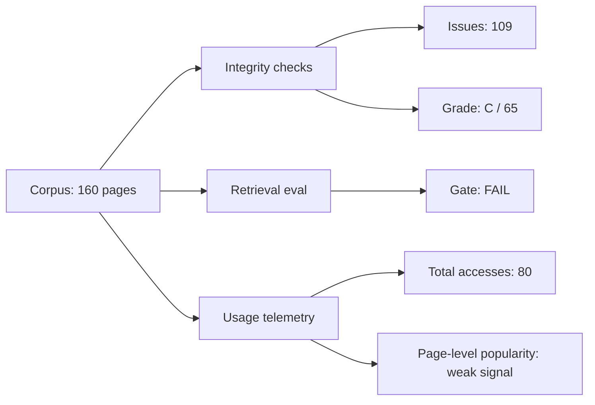

# #1626 — epic(knowledge): karpathy wiki critical analysis + hardening research

> **Source**: github:issue/1626 | **state: CLOSED** | **Labels**: type:epic, status:done, priority:P1, area:knowledge, lane:research
> Mirror of `gh issue view 1626` (derived; edit the GitHub item, not this page).

## Body

## Objective
Investigate and harden the Karpathy LLM Wiki as a governed knowledge substrate for the harness, based on measured usage, measured quality, and tooling gap analysis.

## Initial critical analysis (baseline, completed)
Date: 2026-05-15

### 1) Frequency of use (measured)
| Signal | Measured value | Interpretation |
|---|---:|---|
| Wiki operations logged | 61 entries | Active operational use over time |
| Wiki pages (markdown) | 160 pages | Large enough corpus for structure/quality drift risk |
| Git touches to wiki paths (90d) | 300 path touches across 168 distinct files | High churn and broad surface area |
| Dashboard access events (`logs/wiki-metrics.json`) | 80 total accesses | Moderate observed reader usage |
| Last recorded wiki access | 2026-05-13 | Usage exists, but recent activity is not continuous daily |

### 2) Measurable benefits to the harness
| Benefit | Evidence | Measurable implication |
|---|---|---|
| Shared memory substrate across workflows | 160-page wiki corpus and 61 operation log entries | Reduced rediscovery effort and faster context carryover |
| Governance observability integration | Dashboard/wiki metrics + health endpoints in active use | Health can be monitored and trended |
| Retrieval quality floor exists | `scripts/wiki/eval-harness.js` reports quality metrics with explicit gate | Objective pass/fail framework exists (not subjective-only) |
| Structural linting exists | `wiki:lint` detects broken/orphan/frontmatter/index drift | Detectability of integrity defects is present |

### 3) Wiki health (measured now)
| Health metric | Value |
|---|---:|
| Pages scanned | 160 |
| Total issues (dashboard health model) | 109 |
| Broken links | 0 |
| Orphans (dashboard model) | 31 |
| Frontmatter issues (dashboard model) | 4 |
| Index sync misses | 74 |
| Computed grade | C (score 65) |
| Hygiene stale count | 18 |
| Hygiene weak-link pages | 46 |
| Retrieval eval gate | FAIL (mean_precision 0.12, mean_recall 0.5; floor 0.4) |

### 4) Tooling gaps identified
1. **Health model inconsistency**: dashboard health and wiki lint/hygiene use different criteria and produce divergent orphan/frontmatter counts.
2. **Index drift at scale**: 74 pages missing from index indicates index maintenance is not keeping pace with growth.
3. **Frontmatter parser fragility**: simplistic YAML-ish parsing is susceptible to schema mismatch and partial metadata loss.
4. **Usage telemetry under-specification**: section-level counts exist, but no reliable page-level popularity signal (`pages` map remains empty).
5. **Retrieval benchmark quality gap**: eval gate fails; expected slugs are missing from corpus and/or retrieval weighting is underperforming.
6. **Schema/tooling drift**: schema in wiki docs is richer than what runtime checks enforce.
7. **Timestamp integrity anomaly**: future-dated entry (`2026-07-14`) appears in wiki log; chronology guard is missing.

### Visual — risk matrix
| Gap | Likelihood | Impact | Risk |
|---|---:|---:|---:|
| Index drift | High | High | 🔴 |
| Retrieval eval fail | High | High | 🔴 |
| Health-model inconsistency | High | Medium | 🟠 |
| Frontmatter parser fragility | Medium | High | 🟠 |
| Weak usage telemetry granularity | High | Medium | 🟠 |
| Chronology anomaly detection missing | Medium | Medium | 🟡 |

### Visual — current health snapshot


## Scope of this Epic
- Research and design hardening of wiki quality, usage telemetry, and retrieval quality governance.
- Define a unified health contract and enforcement strategy.
- Define measurable improvement targets and evidence model.


## Acceptance criteria (Epic complete when ALL are green)

- [ ] **AC-1** — A single unified health contract module (`scripts/wiki/health-contract.js`) is defined and adopted by `lint.js`, `hygiene.js`, and `dashboard-wiki.js`. All three tools produce identical orphan and frontmatter counts for the same input.
- [ ] **AC-2** — Wiki index sync miss count is ≤ 5 pages (currently 74) after automated index maintenance lands in `ingest.js` and a `wiki:reindex` sweep command is available.
- [ ] **AC-3** — Frontmatter parsing in `scripts/wiki/wiki-io.js` uses `gray-matter` (or equivalent standard YAML library). The colon-in-value breakage is confirmed eliminated by a targeted test.
- [ ] **AC-4** — `logs/wiki-metrics.json` `pages` map is non-empty during normal read operations. Page-level popularity data is observable in the dashboard wiki panel.
- [ ] **AC-5** — Retrieval eval gate passes: `mean_precision ≥ 0.40` per `scripts/wiki/eval-harness.js`. The 2 missing corpus slugs (`fleet-portable-config`, `anthropic-batch-routing`) are present, and ground truth is brought current.
- [ ] **AC-6** — `scripts/wiki/wiki-io.js` `appendLog()` rejects entries with a future `date` field (> today ± 1d tolerance) with a clear error message.
- [ ] **AC-7** — Wiki health grade improves from **C (65)** to **B (≥ 75)** as computed by the unified health model.
- [ ] **AC-8** — All 7 child tickets are closed and merged into main.

## Child tickets

| # | Title | Lane | Gap addressed |
|---|-------|------|---------------|
| #1673 | `research(knowledge): define unified wiki health contract` | lane:research | Gap 1 — health model inconsistency |
| #1675 | `feat(knowledge): unify wiki health model across lint/hygiene/dashboard` | lane:code-change | Gap 1 (implementation) |
| #1676 | `feat(knowledge): automate wiki index maintenance` | lane:code-change | Gap 2 — index drift |
| #1677 | `fix(knowledge): harden frontmatter parser with gray-matter` | lane:code-change | Gap 3 — parser fragility |
| #1683 | `feat(knowledge): instrument page-level wiki access telemetry` | lane:code-change | Gap 4 — telemetry under-specification |
| #1680 | `fix(knowledge): repair retrieval eval corpus and improve BM25 quality` | lane:code-change | Gap 5 — retrieval benchmark fail |
| #1681 | `fix(knowledge): add chronology guard to wiki log appendLog` | lane:code-change | Gap 7 — timestamp anomaly |

## Dependency graph

```
[#1673 research/health-contract]
        │
        ▼
[#1675 unify health model] ──▶ [#1676 index automation]
                      (independent)
[#1677 frontmatter parser]
[#1683 page telemetry]
[#1680 retrieval repair]
[#1681 timestamp guard]
```

Signed-by: Quill Mason
Team&Model: codex:gpt-5.4@openai
Role: manager

## Acceptance criteria (Epic complete when ALL are green)

- [ ] **AC-1** — A single unified health contract module (`scripts/wiki/health-contract.js`) is defined and adopted by `lint.js`, `hygiene.js`, and `dashboard-wiki.js`. All three tools produce identical orphan and frontmatter counts for the same input.
- [ ] **AC-2** — Wiki index sync miss count is ≤ 5 pages (currently 74) after automated index maintenance lands in `ingest.js` and a `wiki:reindex` sweep command is available.
- [ ] **AC-3** — Frontmatter parsing in `scripts/wiki/wiki-io.js` uses `gray-matter` (or equivalent standard YAML library). The colon-in-value breakage is confirmed eliminated by a targeted test.
- [ ] **AC-4** — `logs/wiki-metrics.json` `pages` map is non-empty during normal read operations. Page-level popularity data is observable in the dashboard wiki panel.
- [ ] **AC-5** — Retrieval eval gate passes: `mean_precision ≥ 0.40` per `scripts/wiki/eval-harness.js`. The 2 missing corpus slugs (`fleet-portable-config`, `anthropic-batch-routing`) are present, and ground truth is brought current.
- [ ] **AC-6** — `scripts/wiki/wiki-io.js` `appendLog()` rejects entries with a future `date` field (> today ± 1d tolerance) with a clear error message.
- [ ] **AC-7** — Wiki health grade improves from **C (65)** to **B (≥ 75)** as computed by the unified health model.
- [ ] **AC-8** — All 7 child tickets are closed and merged into main.

## Child tickets

| # | Title | Lane | Gap addressed |
|---|-------|------|---------------|
| #1673 | `research(knowledge): define unified wiki health contract` | lane:research | Gap 1 — health model inconsistency |
| #1675 | `feat(knowledge): unify wiki health model across lint/hygiene/dashboard` | lane:code-change | Gap 1 (implementation) |
| #1676 | `feat(knowledge): automate wiki index maintenance` | lane:code-change | Gap 2 — index drift |
| #1677 | `fix(knowledge): harden frontmatter parser with gray-matter` | lane:code-change | Gap 3 — parser fragility |
| #1683 | `feat(knowledge): instrument page-level wiki access telemetry` | lane:code-change | Gap 4 — telemetry under-specification |
| #1680 | `fix(knowledge): repair retrieval eval corpus and improve BM25 quality` | lane:code-change | Gap 5 — retrieval benchmark fail |
| #1681 | `fix(knowledge): add chronology guard to wiki log appendLog` | lane:code-change | Gap 7 — timestamp anomaly |

## Dependency graph

```
[#1673 research/health-contract]
        │
        ▼
[#1675 unify health model] ──▶ [#1676 index automation]
                      (independent)
[#1677 frontmatter parser]
[#1683 page telemetry]
[#1680 retrieval repair]
[#1681 timestamp guard]
```

Signed-by: Quill Mason
Team&Model: codex:gpt-5.4@openai
Role: manager

## Acceptance criteria (Epic complete when ALL are green)

- [ ] **AC-1** — A single unified health contract module (`scripts/wiki/health-contract.js`) is defined and adopted by `lint.js`, `hygiene.js`, and `dashboard-wiki.js`. All three tools produce identical orphan and frontmatter counts for the same input.
- [ ] **AC-2** — Wiki index sync miss count is ≤ 5 pages (currently 74) after automated index maintenance lands in `ingest.js` and a `wiki:reindex` sweep command is available.
- [ ] **AC-3** — Frontmatter parsing in `scripts/wiki/wiki-io.js` uses `gray-matter` (or equivalent standard YAML library). The colon-in-value breakage is confirmed eliminated by a targeted test.
- [ ] **AC-4** — `logs/wiki-metrics.json` `pages` map is non-empty during normal read operations. Page-level popularity data is observable in the dashboard wiki panel.
- [ ] **AC-5** — Retrieval eval gate passes: `mean_precision ≥ 0.40` per `scripts/wiki/eval-harness.js`. The 2 missing corpus slugs (`fleet-portable-config`, `anthropic-batch-routing`) are present, and ground truth is brought current.
- [ ] **AC-6** — `scripts/wiki/wiki-io.js` `appendLog()` rejects entries with a future `date` field (> today ± 1d tolerance) with a clear error message.
- [ ] **AC-7** — Wiki health grade improves from **C (65)** to **B (≥ 75)** as computed by the unified health model.
- [ ] **AC-8** — All 7 child tickets are closed and merged into main.

## Child tickets

| # | Title | Lane | Gap addressed |
|---|-------|------|---------------|
| #1673 | `research(knowledge): define unified wiki health contract` | lane:research | Gap 1 — health model inconsistency |
| #1675 | `feat(knowledge): unify wiki health model across lint/hygiene/dashboard` | lane:code-change | Gap 1 (implementation) |
| #1676 | `feat(knowledge): automate wiki index maintenance` | lane:code-change | Gap 2 — index drift |
| #1677 | `fix(knowledge): harden frontmatter parser with gray-matter` | lane:code-change | Gap 3 — parser fragility |
| #1683 | `feat(knowledge): instrument page-level wiki access telemetry` | lane:code-change | Gap 4 — telemetry under-specification |
| #1680 | `fix(knowledge): repair retrieval eval corpus and improve BM25 quality` | lane:code-change | Gap 5 — retrieval benchmark fail |
| #1681 | `fix(knowledge): add chronology guard to wiki log appendLog` | lane:code-change | Gap 7 — timestamp anomaly |

## Dependency graph

```
[#1673 research/health-contract]
        │
        ▼
[#1675 unify health model] ──▶ [#1676 index automation]
                      (independent)
[#1677 frontmatter parser]
[#1683 page telemetry]
[#1680 retrieval repair]
[#1681 timestamp guard]
```

Signed-by: Quill Mason
Team&Model: codex:gpt-5.4@openai
Role: manager

