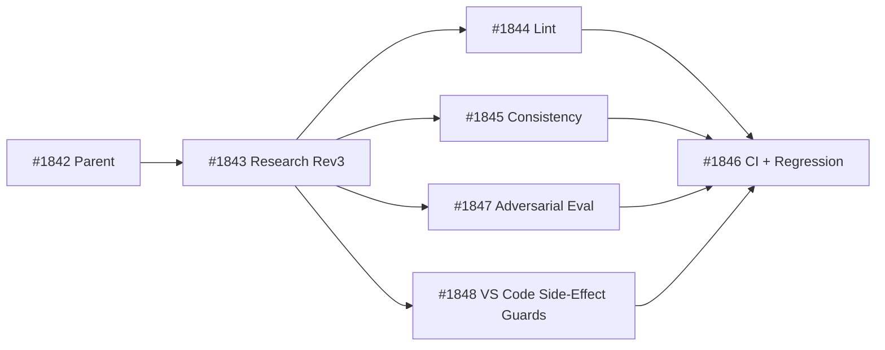
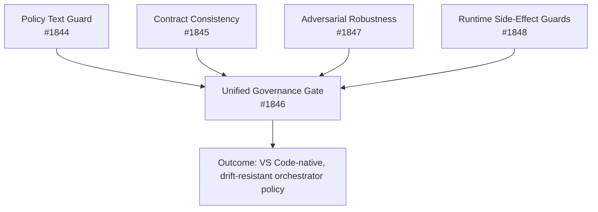

# #1843 — Research: operator-ownership contract drift map and enforcement plan

> **Source**: github:issue/1843 | **state: CLOSED** | **Labels**: type:research, status:done, priority:P2, area:instructions, governance:close-without-merge
> Mirror of `gh issue view 1843` (derived; edit the GitHub item, not this page).

## Body

## Research Scope

Perform independent research for #1842 to harden the operator-ownership contract across orchestrators so execution remains agent-owned and user involvement is constrained to design direction + rare UAT.

## Additional Work Completed (Revision 3: VS Code Orchestrator Focus)

### A1: Internal + external evidence synthesis
- Internal scan: 35 instruction/adapter surfaces.
- External references incorporated:
  - VS Code AI Extensibility Overview + Chat + Language Model guides (updated May 2026).
  - OpenAI guardrails/approvals + eval/observability guides.
  - OWASP GenAI Top 10 2025.
  - NIST AI RMF Playbook.

### A2: VS Code-specific risk discovery
- Beyond policy text drift, VS Code orchestrator harnesses must guard:
  - command URI trust boundaries (`MarkdownString.isTrusted` allowlist discipline)
  - explicit consent before costly/irreversible actions in chat-driven workflows
  - action-local validation (tool/command boundary checks, not prompt-only checks)

### A3: Plan refinement
- Prior revised plan (#1844/#1845/#1847/#1846) lacked explicit extension-host side-effect guardrails.
- Added #1848 to enforce VS Code runtime-specific control boundaries.

## Key Findings

### F1: Control placement matters for VS Code orchestrators
Validation must run near side effects (commands/tools/shell actions), not only as top-level text policy checks.

### F2: Command-link trust is a concrete attack surface
VS Code chat response guidance highlights trusted command allowlists for command URIs; this needs explicit governance enforcement in harness code.

### F3: Consent policy must be codified
VS Code guidance explicitly recommends user consent for costly/irreversible operations. Harness checks should enforce this in orchestrated action paths.

## Drift Assessment

- Severity: **Moderate**
- Primary risk class: cross-file synchronization drift
- Secondary risk class: bypass via obfuscated phrasing
- Tertiary risk class: extension-host side-effect boundary violations

## Revised Final Plan (VS Code-optimized)

### Phase 1 — Deterministic text and contract controls
- #1844 Delegation-phrase lint
- #1845 Cross-adapter consistency verifier

### Phase 2 — Robustness and runtime boundary controls
- #1847 Adversarial eval harness
- #1848 VS Code extension-host side-effect guardrails

### Phase 3 — CI integration
- #1846 integrates and gates outputs from #1844, #1845, #1847, #1848

## Child Ticket Mapping (Revision 3)

| Ticket | Focus | Depends On |
|---|---|---|
| #1844 | Delegation-phrase lint gate | none |
| #1845 | Cross-adapter consistency verifier | none |
| #1847 | Adversarial policy-eval harness | none |
| #1848 | VS Code side-effect guardrails | none (composes with #1844/#1845/#1847) |
| #1846 | CI + regression integration | #1844, #1845, #1847, #1848 |

## Visual: VS Code-Orchestrator Dependency Graph

## Visual: Control Layers for VS Code Harness

Refs #1842

