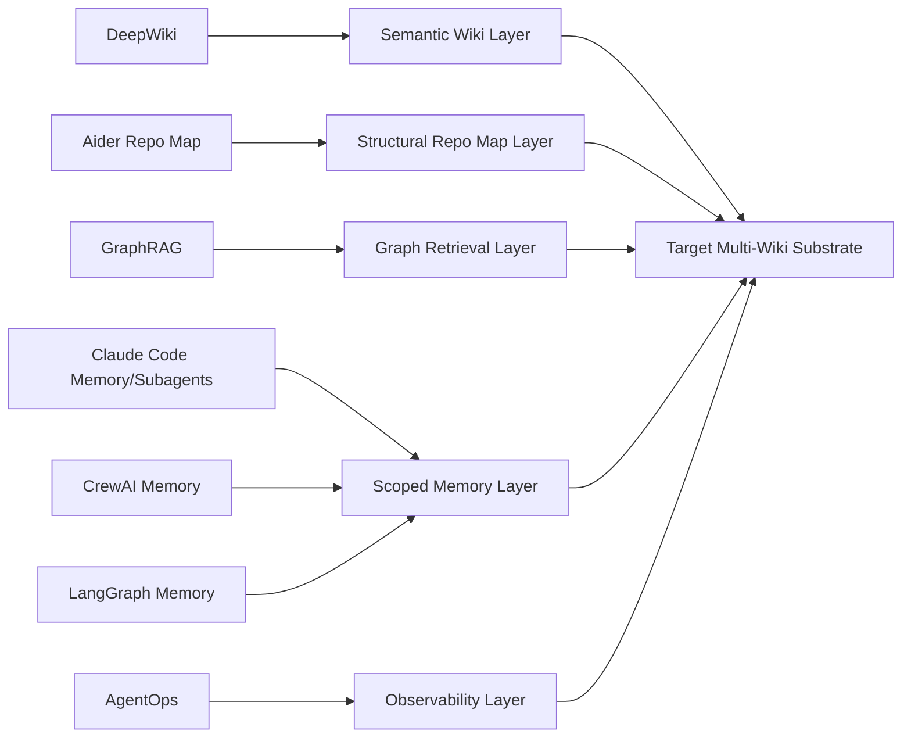
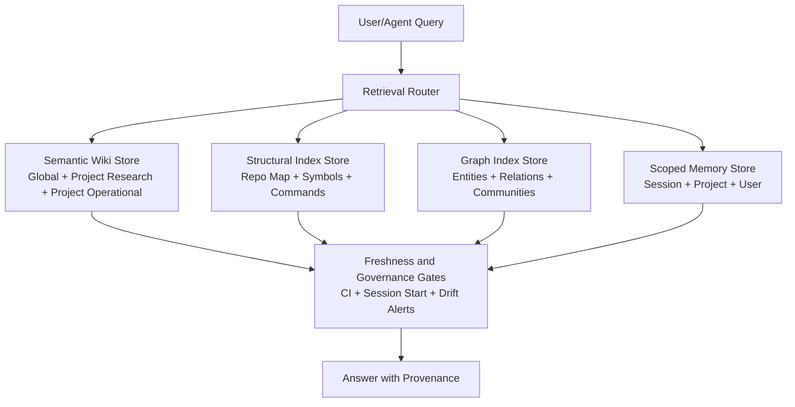
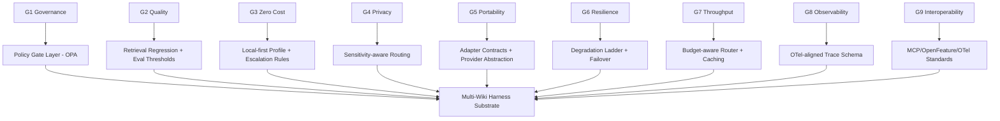
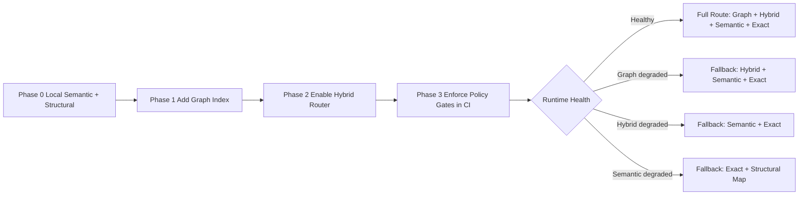

# #1858 — Research and planning: multi-wiki architecture for fleet model availability

> **Source**: github:issue/1858 | **state: CLOSED** | **Labels**: type:research, status:done, priority:P1, area:knowledge, lane:docs-research
> Mirror of `gh issue view 1858` (derived; edit the GitHub item, not this page).

## Body

## Purpose
Capture research synthesis and initial planning for the Epic, and iterate here until user approval for development decomposition.

Refs #1857

## Research Synthesis (Current)
### R1: Wiki-only is insufficient for codebase QA
High-quality model answers require both semantic wiki content and structural code context.

### R2: Repo maps are critical for coding-context retrieval
State-of-practice emphasizes compact file+symbol+signature maps so models navigate code intentionally before deep reads.

### R3: Graph-backed retrieval improves cross-cutting reasoning
Knowledge graph + community summaries outperform baseline snippet retrieval for "connect-the-dots" and holistic questions.

### R4: Memory hierarchy must separate stable vs episodic knowledge
Project systems should separate always-on procedural context from long-term semantic memory and short-term thread/session context.

### R5: Freshness must be enforced, not aspirational
Knowledge systems need drift detection, provenance, and CI/session gates to keep docs/indexes synchronized with code evolution.

## Initial Plan (Iteration 0)
1. Define canonical multi-wiki topology and ownership boundaries.
2. Define retrieval router policy (semantic wiki vs symbol map vs graph vs exact lookup).
3. Define freshness SLO + failure gates (stale index, stale wiki, missing provenance).
4. Define minimal generated artifacts for every project (repo map, command map, relationship edges, staleness manifest).
5. Draft rollout strategy for existing repositories and bootstrap flow for new repositories.

## Open Questions for Iteration
- What freshness SLO should be mandatory per wiki scope?
- Which generated artifacts are required vs optional at bootstrap?
- What minimum query coverage tests should gate CI?
- How should project-specific exceptions be declared without violating portability?

## Deliverable for Next Iteration
- Refined architecture proposal with explicit schema, routing policy, and gate definitions.

## Iteration 1 — External Market Scan (Harnesses / AgentOps / Orchestrators)
Verification date: 2026-05-17

### Scope
Identify systems that already implement all or part of a multi-wiki, multi-store model-accessible knowledge substrate (semantic wiki + structural index + graph retrieval + scoped memory + freshness/observability).

### Capability Matrix
| System | Closest Capability to Target | Evidence Snapshot | Gap vs Target Multi-Wiki Substrate |
|---|---|---|---|
| DeepWiki | Repo-native, talkable documentation at scale | Positions itself as up-to-date docs you can query for repos | Strong for repo-doc layer; not a full harness control-plane for scoped global+project wiki governance |
| Aider Repo Map | Compact structural code map (files, key symbols, signatures) | Sends repo map with key identifiers and graph-ranked token budgeting | Excellent structural index pattern; not a wiki governance/freshness system by itself |
| Microsoft GraphRAG | Graph + community summary retrieval for holistic QA | TextUnits -> entities/relations/claims -> clustering -> global/local/DRIFT search | Strong graph reasoning layer; does not define wiki scope governance alone |
| Claude Code (memory + subagents) | Layered project/user/org instruction + scoped memory + isolated subagent contexts | CLAUDE.md scope tiers, .claude/rules path scoping, auto-memory index/topic split, subagent memory scopes | Very close on scoped memory/orchestration; no explicit multi-wiki freshness gate contract |
| CrewAI Unified Memory | Hierarchical scopes/slices, composite recall scoring, dedup/consolidation, memory events | Unified memory API with scope tree, recall depth routing, provenance/privacy fields, non-blocking save + drain barrier | Strong memory substrate semantics; not a first-class multi-wiki markdown architecture |
| LangGraph Memory | Thread short-term + namespace long-term stores | Explicit thread vs namespace memory model and store API | Strong conceptual memory layering; requires custom wiki/index architecture around it |
| AgentOps | Agent observability + session waterfall and tracing | Two-line instrumentation, traces, session drilldown/waterfall | Complements freshness/observability; not knowledge substrate storage/retrieval layer |
| AutoGPT Platform | Multi-agent workflow orchestration and deployment | Continuous agents, blocks/workflows, monitoring/analytics | Workflow orchestration present; no explicit public multi-wiki substrate pattern in reviewed docs |
| OpenHands | Multi-surface agent runtime (SDK/CLI/GUI/cloud) | Emphasizes composable agent SDK and operational deployment surfaces | Runtime/orchestration strength; no explicit public multi-wiki substrate pattern in reviewed overview docs |

### Key Findings (Additions)
- F6: No single mainstream system currently presents the full target as one integrated product primitive.
- F7: The strongest practical pattern is compositional:
  - semantic wiki/doc layer (DeepWiki-like),
  - structural symbol/repo map layer (Aider-like),
  - graph reasoning layer (GraphRAG-like),
  - scoped memory and agent context layer (Claude Code/CrewAI/LangGraph-like),
  - observability/freshness instrumentation (AgentOps-like).
- F8: This validates the harness strategy: build a first-class multi-wiki contract and plug specialized retrieval/indexing backends under one governance/freshness policy.

### Plan Revisions (Iteration 1.1)
1. Add explicit “composable substrate” requirement to architecture plan:
   - semantic wiki,
   - structural index,
   - graph index,
   - scoped memory,
   - observability/freshness gates.
2. Define minimum required generated artifacts per project:
   - repo-map summary,
   - symbol/command index,
   - relationship edge manifest,
   - staleness/provenance manifest.
3. Add freshness policy draft with enforceable gates:
   - stale artifact detection,
   - source-to-page provenance checks,
   - session-start drift warnings,
   - CI fail conditions for critical drift.
4. Add retrieval router policy draft:
   - exact/symbol lookup first for code-location questions,
   - semantic wiki for concept/process questions,
   - graph/community retrieval for cross-cutting reasoning questions.
5. Keep ticket in research/planning mode until user go-ahead; do not decompose development children yet.

### Visual 1 — Market Landscape by Capability

### Visual 2 — Recommended Composable Harness Pattern

### Research Integrity Notes
- Evidence gathered from public docs pages for GraphRAG, Aider repo map, DeepWiki, Claude Code memory/subagents, CrewAI memory, LangGraph memory, AgentOps docs, AutoGPT platform docs, and OpenHands docs.
- Interpretation: convergence exists at the capability level, but not yet as a single unified, governance-first multi-wiki harness contract.

## Iteration 2 — Goal-Lens Fit Research (G1–G9)
Verification date: 2026-05-17

### Research Additions (Cutting-Edge)
- OTel GenAI semantic conventions now include standardized agent/framework spans, model spans, events, exceptions, metrics, and MCP conventions.
- MCP continues to solidify as the interoperability standard for tool/data/workflow connectivity across major clients.
- OpenFeature provides vendor-agnostic runtime control (providers/hooks/events) suitable for progressive rollout and safe degradation patterns.
- OPA remains the leading policy-as-code engine for decoupled, enforceable governance decisions over structured inputs.
- LiteLLM provides provider abstraction with retry/fallback routing, cost controls, and gateway-style policy surfaces.
- Qdrant documentation now highlights offline-capable Qdrant Edge and hybrid retrieval capabilities (dense/sparse/multi-vector + filtering).
- Pinecone docs emphasize hybrid retrieval building blocks: full-text + semantic + metadata filtering + reranking.
- Langfuse provides integrated observability + prompt/version + evaluation loops, with OpenTelemetry compatibility.
- OWASP GenAI Security and NIST AI RMF remain key references for security/risk controls and trustworthy AI operations.

### Goal-by-Goal Fit Matrix
| Harness Goal | Evidence-Informed Control | Plan Revision |
|---|---|---|
| G1 Governance | OPA policy-as-code + OpenFeature conformance-style contracts | Add policy decision points for freshness, provenance, and publish eligibility (deny-by-default on critical drift) |
| G2 Quality | Langfuse eval loops + retrieval quality testing patterns from vector DB ecosystems | Add mandatory retrieval regression suite (exact, semantic, graph, hybrid) with acceptance thresholds |
| G3 Zero Cost | Local-first pathways (Qdrant Edge, local embeddings/models via LiteLLM/Ollama) | Add default local profile and explicit cloud escalation criteria |
| G4 Privacy | OWASP GenAI guidance + NIST AI RMF + local/offline retrieval options | Add data-classification-aware routing (sensitive scopes never leave local stores by default) |
| G5 Portability | MCP + LiteLLM provider abstraction + OpenFeature provider model | Require pluggable adapters for wiki/index backends and model providers |
| G6 Resilience | Retry/fallback routing + feature-flag controlled degradations | Add graded degradation ladder: graph unavailable -> hybrid -> semantic -> exact |
| G7 Throughput | Token-aware structural context (repo-map style), quantization/hybrid index ops | Add query router budget policy and cached artifact refresh windows |
| G8 Observability | OTel GenAI semconv + Langfuse/AgentOps-compatible traces | Add normalized trace schema for retrieval route decisions, latency, cost, and confidence |
| G9 Interoperability | Open standards stack (MCP, OTel, OpenFeature) | Make standards-first interfaces a non-negotiable architecture constraint |

### Plan Revisions (Iteration 2.1)
1. Add a **Goal Compliance Contract** section to architecture draft:
   - each subsystem must declare G1–G9 controls and measurable checks.
2. Add **Policy Gate Layer**:
   - OPA-evaluable JSON policy input assembled from staleness/provenance/eval signals.
3. Add **Progressive Delivery Layer**:
   - OpenFeature-style flags for staged rollout by scope (global wiki, project research wiki, project operational wiki, graph index, router mode).
4. Add **Observability Contract**:
   - OTel-compatible event/span taxonomy for retrieval decisions, fallback causes, and quality outcomes.
5. Add **Privacy Routing Rules**:
   - sensitivity labels on wiki/index scopes; local-only enforcement for restricted classes.
6. Add **Retrieval Degradation Ladder** and SLO-backed failover behavior.
7. Add **Portable Backend Adapter Contract**:
   - semantic store adapter,
   - structural index adapter,
   - graph adapter,
   - memory adapter,
   - trace/eval adapter.
8. Keep scope as research/planning only until explicit user go-ahead.

### Visual 3 — G1–G9 Control Coverage

### Visual 4 — Progressive Rollout and Fallback

### Research Integrity Notes (Iteration 2)
- Evidence base includes OpenTelemetry GenAI semantic conventions, MCP docs, OpenFeature docs/specification, OPA docs, LiteLLM docs, Qdrant docs/articles, Pinecone docs, Langfuse docs, OWASP GenAI project resources, and NIST AI RMF resources.
- Conclusion: the plan is viable when treated as a standards-first composition problem with enforceable policy and observability gates, not as a single datastore feature.

## Iteration 3.2 — Implementation Decomposition (Approved Draft)

This converts adversarial findings into executable work.

- [ ] #1861 Harden ingestion content trust and poisoning resistance for multi-wiki substrate
- [ ] #1862 Add GraphRAG adversarial defenses and anomaly scanning gates
- [ ] #1863 Secure MCP integration with metadata validation and CVE watch loop
- [ ] #1864 Enforce multi-scope isolation and side-channel-safe retrieval routing
- [ ] #1865 Add structural-index trust controls for repo-map ingestion
- [ ] #1866 Implement two-layer policy enforcement and retrieval-time provenance checks
- [ ] #1867 Build adversarial retrieval regression suite and release gates
- [ ] #1868 Implement progressive delivery controls for multi-wiki security rollout

Execution gate: No merge-to-done on Epic #1857 until A..H (#1861-#1868) are terminal and adversarial regression gate passes

